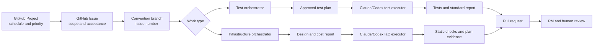
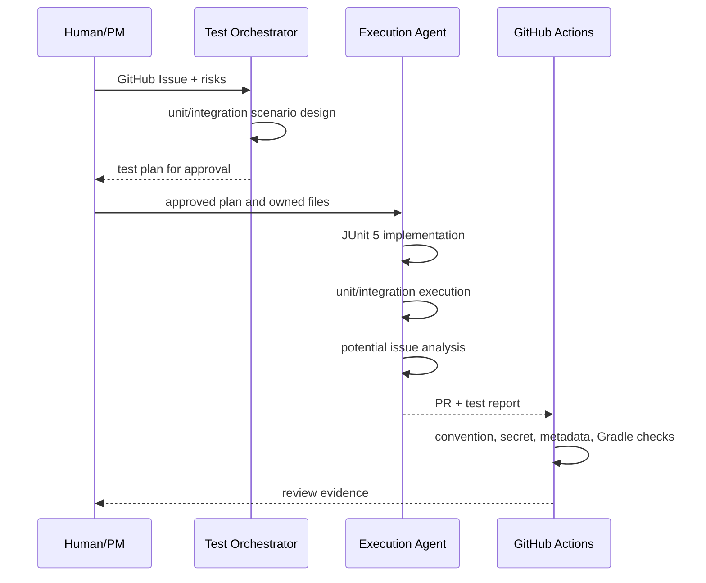
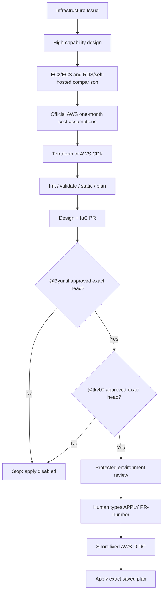

# Harness Architecture

## 전체 구조

GitHub Project는 일정과 우선순위의 원본이고 GitHub Issue는 범위와 완료 조건의
원본이다. 에이전트 모델은 도구에 종속되지 않은 논리 프로필로 선택한다.

## 테스트 경로

오케스트레이터가 설계를, 실행 에이전트가 테스트 코드를 담당한다. 테스트 보고서
생성 실패는 테스트 결과를 바꾸지 않지만 PR 완료 조건은 충족하지 못한다.

## 인프라 경로

`CODEOWNERS`는 리뷰를 요청한다. 실제 적용 workflow는 GitHub API로 두 사용자가
현재 PR head를 승인했는지 다시 확인한다.

## 신뢰 경계

| 경계 | 안쪽에 허용 | 밖으로 노출 금지 |
| --- | --- | --- |
| Repository | 코드, 템플릿, 논리 변수명 | 실제 secret, endpoint, account/IAM ID |
| Local machine | 개인 모델 프로필, 인증 세션 | Git tracked file |
| GitHub Actions | OIDC 단기 토큰, Environment variable | workflow log와 artifact |
| AWS | 실제 리소스 ID와 상태 | PR, Issue, 보고서 |

## 실패 격리

- 알림/보고서 생성 실패가 핵심 테스트 또는 plan 결과를 변경하지 않는다.
- 비밀정보 검사가 실패하면 이후 CI가 진행되지 않는다.
- apply는 별도 workflow라 일반 PR/CI에서 우발적으로 실행되지 않는다.
- 동일 PR의 head가 변경되면 기존 승인을 적용 승인으로 인정하지 않는다.
- plan과 apply는 같은 workflow의 동일 파일을 사용한다.
