# Husky Git Hooks

## 목적

커밋 컨벤션과 안전 검사를 개발자가 외워서 실행하는 대신 Git 동작 직전에
자동으로 실행한다. Husky는 빠른 로컬 피드백을 제공하고 GitHub Actions는
우회할 수 없는 최종 검사를 담당한다.

공식 설치 방식인 `prepare: husky`와 `.husky/<hook>` 파일 구성을 사용한다.

## 설치

```bash
npm ci
npm run hooks:validate
```

`npm ci`는 `package-lock.json`에 고정된 Husky를 설치하고 `prepare`를 실행한다.

확인:

```bash
git config --get core.hooksPath
```

Husky가 설치된 저장소에서는 일반적으로 `.husky/_`를 가리킨다. 이 값은
개발자의 로컬 `.git/config`에만 저장되고 커밋하지 않는다.

## Hook 구조

```mermaid
flowchart LR
    Stage["git add"] --> PreCommit["pre-commit"]
    PreCommit --> Branch["Branch convention"]
    Branch --> Diff["Staged whitespace"]
    Diff --> Secret["Staged secret scan"]
    Secret --> Metadata["Changed test/workflow metadata"]
    Metadata --> Prepare["prepare-commit-msg"]
    Prepare --> Auto["Branch context auto-format"]
    Auto --> Message["commit-msg"]
    Message --> Format["Jira + Issue validation"]
    Format --> Commit["Commit created"]
    Commit --> Push["pre-push"]
    Push --> Full["Harness checks + Gradle check"]
    Full --> Remote["Remote push"]
```



### pre-commit

빠르게 끝나야 하므로 staged 파일만 대상으로 한다.

- 현재 branch 규칙
- `git diff --cached --check`
- staged blob의 `.env`와 명백한 secret 패턴
- 변경된 JUnit 테스트의 timestamp, scenario ID, `@DisplayName`
- 변경된 GitHub workflow의 안전 규칙
- Husky 파일 변경 시 자체 구성 검증

staged 내용은 working tree가 아니라 Git index blob에서 읽는다.

### prepare-commit-msg

개발자가 작성한 짧은 제목을 현재 branch 문맥으로 자동 조립한다.

```bash
git commit -m "기능1 개발"
```

현재 branch가 `feat/PAY-314-gh-42-order-feature`이면 실제 제목은 다음과 같다.

```text
feat: [PAY-314] 기능1 개발 (#42)
```

type과 scope만 직접 선택할 수도 있다.

```bash
git commit -m "test(order): 예약 테스트 추가"
```

결과:

```text
test(order): [PAY-314] 예약 테스트 추가 (#42)
```

- plain summary의 type은 branch 앞부분에서 가져온다.
- scope는 추측하지 않으며 필요한 경우 개발자가 입력한다.
- 이미 완성된 규칙형 메시지는 변경하지 않는다.
- 일부 Jira/Issue만 직접 적은 모호한 메시지는 자동 수정하지 않고 실패한다.
- 커밋 본문과 Git comment는 그대로 유지한다.
- `git commit`으로 편집기를 여는 경우 빈 템플릿은 통과시키고, 편집이 끝난 뒤
  `commit-msg`에서 같은 자동 조립을 수행한다.

### commit-msg

`prepare-commit-msg`가 처리한 결과를 다시 확인한다. 편집기에서 작성한 plain
summary는 이 단계에서 자동 조립한 다음 형식을 검증한다.

형식:

```text
<type>(<scope>): [<JIRA-KEY>] <summary> (#<ISSUE>)
```

예:

```text
chore(hooks): [PAY-314] add Husky convention gates (#42)
```

`PAY-314`와 `#42`는 예시다. 실제 값은 현재 branch
`<type>/<JIRA-KEY>-gh-<ISSUE>-<slug>`에서 파생하며 서로 다르면 commit이
거부된다.

### pre-push

```bash
python3 scripts/harness.py pr-ready --project-tests
```

전체 비밀정보, 테스트 메타데이터, 컨벤션, workflow, Husky 구성과 Gradle
`check`를 실행한다. 시간이 필요한 검사는 commit보다 push 직전에 배치한다.

## 수동 실행

```bash
npm run hooks:pre-commit
npm run hooks:prepare-commit-msg
npm run hooks:commit-msg
npm run hooks:pre-push
```

`hooks:prepare-commit-msg`는 실제 메시지 파일을 변경하지 않고 formatter
self-test를 실행한다. `hooks:commit-msg`는 기본 `.git/COMMIT_EDITMSG`를
읽으므로 실제 commit 도중이 아니면 별도 테스트 파일을 사용하는 편이 안전하다.

## GUI와 버전 관리자

Git GUI는 `.zshrc`를 읽지 않을 수 있다. Node 또는 Python이 없다고 나오면
Husky가 공식적으로 읽는 `~/.config/husky/init.sh`에 최소 PATH 초기화를 넣는다.
토큰이나 `.env` 값을 이 파일에 넣지 않는다.

## 우회 정책

Git 자체가 제공하는 `--no-verify`는 `pre-commit`과 `commit-msg`를 우회할 수
있고 Husky의 `HUSKY=0`은 Husky 전체를 비활성화할 수 있다. 이를 저장소
파일만으로 완전히 막을 수는 없다.

- 일상 개발에서는 사용하지 않는다.
- 장애 복구 등 긴급 우회 시 PR에 이유를 기록한다.
- `hpr`의 수동 실행 결과를 첨부한다.
- GitHub Actions 필수 검사는 항상 통과해야 한다.

Hook은 편의 기능이고 CI와 branch protection이 최종 강제 장치다.

## 업데이트

Husky 버전을 바꿀 때:

1. 공식 release와 migration 문서를 확인한다.
2. `package.json`과 lockfile을 함께 갱신한다.
3. 네 Hook을 모두 로컬에서 실행한다.
4. `npm run hooks:validate`와 GitHub Actions를 통과한다.
5. Hook 실행 시간과 개발자 환경 영향을 PR에 기록한다.
