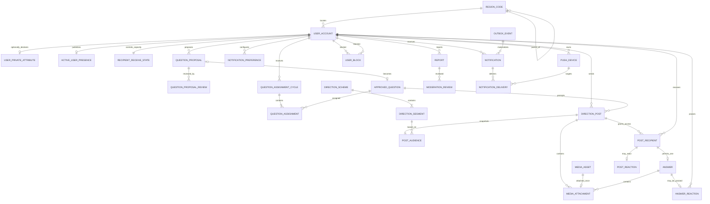
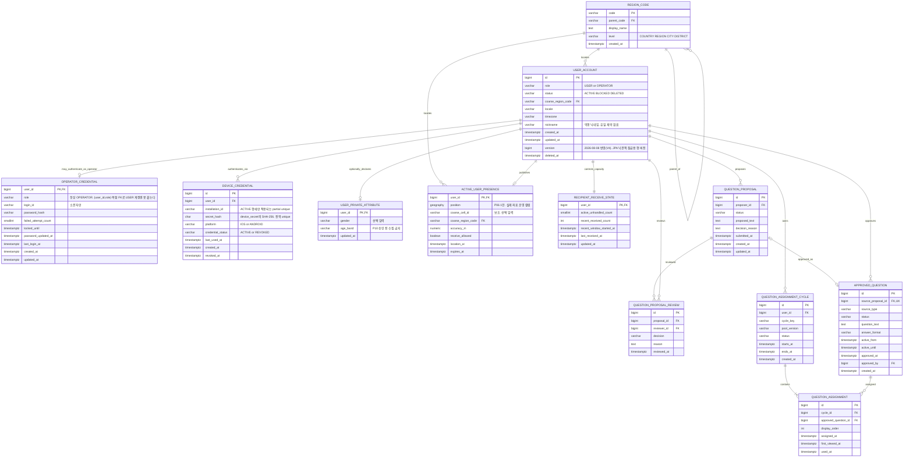
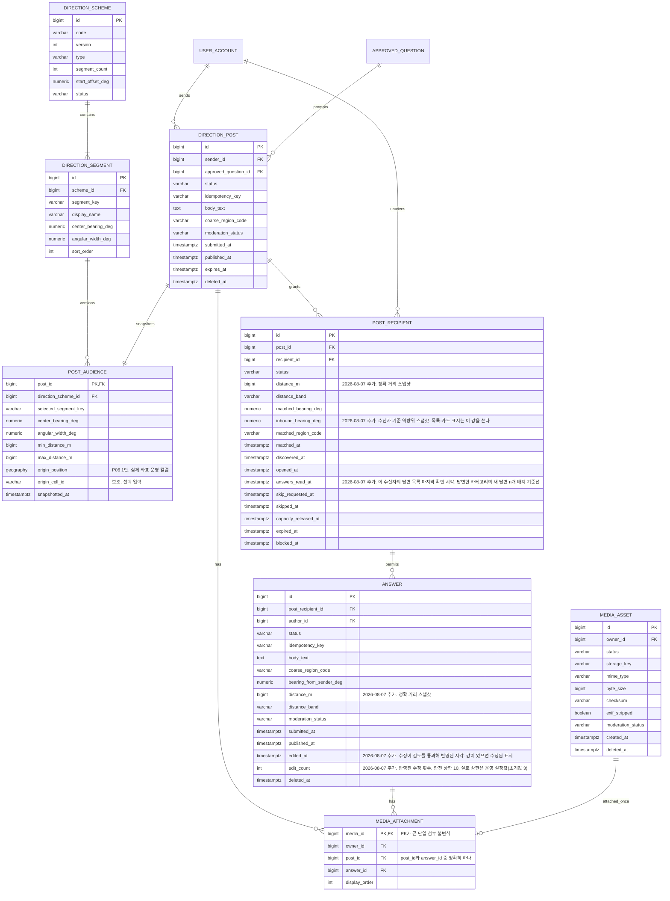
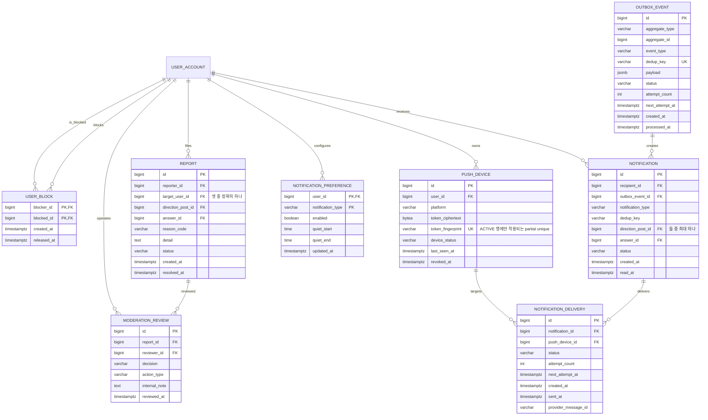
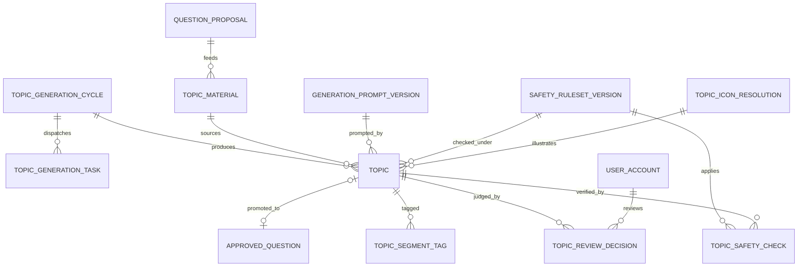

# 방향으로 연결되는 소통 — MVP 데이터 모델·ERD

## 0. 문서 상태와 기준

- 상태: 구현 전 논리·물리 데이터 모델 초안.
- 작성일: 2026-08-02. 최종 갱신: **2026-08-07**.
- DB 기준: PostgreSQL 16+ / PostGIS 3+.
- 제품 정본: `.omx/plans/prd-direction-connected-communication.md`.
- 기능 정본: **`docs/2. 기능-명세서.md` (2026-08-07 개정)**.
- 용어 정본: **`CONTEXT.md`**.
- 정책 정본: `.omx/plans/policy-decision-register-direction-connected-communication.md`.
- 매칭 설계: `docs/설계/1. 방향-기반-수신자-매칭-백엔드-설계.md`.
- 이 문서는 현재 MVP인 `질문 추천 → 질문글 발송 → 수신자 확정 → 답변/공감/만료 → 신고·차단·알림`을 모델링한다.
- 현재 저장소에는 실제 Spring/PostgreSQL 백엔드가 없다. 아래 내용은 구현 완료 상태가 아니라 구현 계약 제안이다.

> **2026-08-07 개정의 핵심**: 답변은 **그 질문글의 수신 자격자와 질문자 전원**에게 보인다. 근거는 `docs/adr/0002-답변은-질문글을-받은-사람-모두에게-공개된다.md`다. 열람 범위는 DB 제약이 아니라 **조회 계층에서 강제**하므로, 스키마만 보고 열람 범위를 추론하면 안 된다.
>
> ~~**2026-08-04 개정의 핵심**: 답변은 질문글 작성자 한 명에게만 도달한다.~~ (`docs/adr/0001` — superseded)

### 스키마 기준 파일

**스키마의 단일 기준(source of truth)은 `docs/dbml/direction_communication.dbml`이다.** 스키마를 바꿀 때는 DBML을 먼저 고치고, 아래 DDL과 이 문서를 거기에 맞춘다.

| 파일 | 역할 | 상태 |
|---|---|---|
| `dbml/direction_communication.dbml` | 스키마 기준. 제품 논리 테이블 **28개** + 백엔드 인증 부록 **2개**(`operator_credential`, `device_credential`) | 기준 |
| `sql/direction_communication_ddl.sql` | DBML에서 파생한 독립 실행형 기준 DDL | 기준과 동기화됨 |
| `sql/001~004_*.sql` | 이전 증분 계보. 아래 "폐기된 계보" 참고 | **더 이상 기준이 아님** |

#### 폐기된 계보 (`sql/001`~`004`)

`sql/001`~`004`는 팀 1차 ERD를 교정하던 중간 산출물이고, 현재 기준 DDL과 테이블 구성이 다르다. 참고용으로 남겨두되 새 작업의 기준으로 쓰지 않는다. 주요 차이는 다음과 같다.

| 항목 | `sql/001`~`004` 계보 | 현재 기준 (26 테이블) |
|---|---|---|
| 프로필 | `user_profile` 별도 테이블 | 폐지. `user_account.nickname`으로 인라인 |
| 민감 속성 | `user_demographic` (004) | `user_private_attribute` |
| 질문 태그 | `question_tag`, `approved_question_tag` | 제외. MVP 범위 아님 |
| 지역 마스터 | 003에서 뒤늦게 추가 | `region_code`가 기준 DDL에 포함 |
| 미디어 첨부 | `post_media` + `answer_media` | `media_attachment` 한 테이블 |
| 푸시 상태 컬럼 | `push_device.status` | `push_device.device_status` |
| 신고 대상 | 4종(`question_proposal` 포함) | 3종(사용자·질문글·답변) |
| 주제 자동 생성 | 002에 12개 테이블 | 제외. §11·§13 참고 |

### 2026-08-03 스키마 변경

기준 DDL을 PostgreSQL 16.4 + PostGIS 3.4에서 실행하고 검증한 결과에 따라 네 가지를 고쳤다. 상세는 §14.

1. `post_media` + `answer_media` → `media_attachment` 한 테이블로 통합. 기존 count 기반 constraint trigger가 동시 커밋에서 뚫리는 것을 실측으로 확인했다.
2. FK 컬럼 인덱스 일괄 추가.
3. `direction_scheme`에 `status = 'ACTIVE'` partial unique 추가.
4. `post_recipient`에 상태–타임스탬프 CHECK와 용량 해제 constraint trigger 추가.

### 2026-08-04 스키마 변경 (기능 명세서 개정 반영)

기능 명세서가 전면 개정되면서 확정된 규칙 여섯 가지를 스키마에 반영했다. 전부 PostgreSQL 16 + PostGIS 3.4에서 실행·행동 검증했다. 상세는 §14.

| # | 변경 | 왜 |
|---|---|---|
| 1 | **`post_reaction`, `answer_reaction` 신설** | 공감(화면 문구 `좋아요`)이 확정 MVP 기능이 됐다. §11이 `like`를 Non-goal로 제외했던 판단을 뒤집는다 |
| 2 | **`post_recipient.status`에 `SKIP_PENDING` 추가, `skip_requested_at` 컬럼 추가** | 스와이프 넘김에 5초 되돌리기가 생겼다. 되돌릴 수 있는 동안 용량을 해제하면 안 된다 |
| 3 | **`recipient_receive_state`의 상한 5 하드코딩 제거** | 수신 상한이 고정 상수가 아니라 운영 설정값이 됐다 |
| 4 | **`direction_post.answers_read_at` 추가** | `내가 쓴 질문` 카드의 `새로운 답변 n개` 배지 기준선 |
| 5 | **`answer`에 수신 권한당 1건 partial unique 추가** | "한 질문글에 답변은 1회"가 확정됐다. §4가 예고해둔 제약을 실제로 걸었다 |
| 6 | **알림·Outbox 종류 갱신** | `DAILY_QUESTION_ASSIGNED` → `QUESTION_RECOMMENDED`, `ANSWER_REACTED`·`SKIP_CONFIRMATION_DUE` 추가 |

**공감을 두 테이블로 나눈 이유**는 누를 수 있는 사람이 서로 다르고, 그 차이를 **키로 강제할 수 있기** 때문이다.

- `post_reaction`은 `(post_id, reactor_id)`가 `post_recipient(post_id, recipient_id)`를 참조한다. "수신 자격이 있는 사용자만 공감할 수 있다"가 트리거 없이 성립하고, 질문글 작성자는 자기 글의 수신자가 될 수 없으므로(`ct_post_recipient_not_sender`) 자기 글 공감도 함께 막힌다.
- `answer_reaction`은 `answer_id`가 PK다. 공감할 수 있는 사람이 질문자 한 명뿐이라 "답변당 공감 1건"이 키로 성립한다. 다만 `answer`가 `post_id`를 직접 갖지 않고 `post_recipient`를 거쳐 도달하므로, "누른 사람이 질문자인가"만 `ct_answer_reaction_reactor_is_sender` 트리거가 판정한다.

**`SKIP_PENDING`이 용량 해제 트리거를 건드리지 않는 이유**: `ct_post_recipient_capacity_release`는 `ANSWERED`·`SKIPPED`·`EXPIRED`·`BLOCKED`만 해제 대상으로 본다. `SKIP_PENDING`은 그 목록에 없으므로 트리거를 고치지 않고도 되돌릴 수 있는 동안 용량을 자연히 붙잡는다.

**댓글 테이블은 여전히 만들지 않는다.** 이전에는 Non-goal이라 제외했지만, 이제는 답변을 볼 수 있는 사람이 질문자 한 명뿐이라 **댓글이 놓일 자리 자체가 없다.**

> **2026-08-07 주의**: 위 문단의 근거는 폐기됐다. 답변을 볼 수 있는 사람이 수신 자격자 전원으로 늘어났으므로 "자리가 없다"는 논리는 더 이상 성립하지 않는다. **그럼에도 댓글 테이블은 만들지 않는다.** 이유가 구조적 불가능에서 **제품 결정**으로 바뀌었을 뿐이다. 아래 절 참고.

### 2026-08-07 스키마 영향 (답변 격리 폐기)

기능 명세서 2026-08-07 개정으로 **답변이 질문자 전용에서 수신 자격자 전원 공개로 바뀌었다.** 근거는 `docs/adr/0002-답변은-질문글을-받은-사람-모두에게-공개된다.md`.

스키마의 단일 기준은 `dbml/direction_communication.dbml`이므로, 적용할 때는 DBML을 먼저 고치고 DDL과 이 문서를 맞춘다.

#### 반드시 고쳐야 하는 것

| # | 상태 | 대상 | 현재 | 바뀌어야 하는 것 | 왜 |
|---|---|---|---|---|---|
| 1 | **반영됨** | **`answer_reaction`** | ~~`answer_id`가 PK~~ → **`(answer_id, reactor_id)` 복합 PK** | — | 공감할 수 있는 사람이 질문자 한 명뿐이라 "답변당 1건"이 키로 성립했다. 이제 **볼 수 있는 사람 전원**이 누르므로 그대로 두면 두 번째 사람의 공감이 PK 충돌로 실패한다. **이번 개정에서 가장 확실히 깨지는 지점이었다** |
| 2 | **반영됨** | ~~`ct_answer_reaction_reactor_is_sender`~~ → **`ct_answer_reaction_reactor_can_view`** | — | — | 누를 수 있는 사람이 질문자 + 수신 자격자로 넓어졌고, 자기 답변 공감 금지가 새로 생겼다. 넘김·만료로 인한 자격 상실은 시간에 따라 변하므로 트리거가 아니라 조회 계층이 강제한다 |
| 3 | **반영됨** | **`post_recipient.inbound_bearing_deg`** (신설) | — | — | 목록·카드의 방향은 **보는 사람 기준**이다. 구면에서 역방위는 `+180°`가 아니라 별도 계산이므로 매칭 시점에 스냅샷으로 박는다. **구간 키는 저장하지 않는다** — 라벨은 조회 시점에 현재 ACTIVE 스킴으로 파생시켜야 스킴이 8→16으로 바뀔 때 마이그레이션 없이 재분류된다 |
| 4 | **반영됨** | **`post_recipient.answers_read_at`** (신설) | — | — | `direction_post.answers_read_at`은 **질문자용**이다. `답변한` 카테고리의 `새 답변 n개` 배지는 수신자마다 마지막으로 본 시점이 달라 별도 기준선이 필요하다 |
| 5 | **반영됨** | **`post_recipient.distance_m`, `answer.distance_m`** (신설) | ~~`distance_band`만 존재~~ | — | **정확 거리를 표시하기로 했는데 스키마에 정확 거리가 없었다.** 수신자 좌표는 `active_user_presence`에 TTL로만 남아 나중에 재계산할 수 없으므로 방위와 똑같이 스냅샷이 필요하다. `distance_band`는 근거리 하한(10km) 미만 표시용으로 남는다 |
| 6 | **반영됨** | **`answer.edited_at`** (신설) | — | — | 재검토 큐 투입과, 신고 시점의 내용 특정에 필요하다. `수정됨` 표시의 근거이기도 하다 |
| 7 | **반영됨** | **`uq_answer_one_per_recipient`** | ~~`status NOT IN ('REJECTED','DELETED')`~~ → **`status <> 'REJECTED'`** | — | "삭제 후 재작성 불가"가 확정됐다. 열어두면 삭제→재작성이 사실상 무제한 수정이 되어 수정 정책이 무의미해진다. `REJECTED`만 자리를 비켜주는 이유는 운영이 거절한 것은 사용자 잘못이 아니기 때문이다 |
| 8 | **스키마 변경 불필요** | **답변 수정 중 처리** | — | 기존 `status`·`moderation_status`로 충분 | 아래 "답변 수정" 절 참고 |
| 8-1 | **반영됨** | **`answer.edit_count`** (신설) | — | — | 공감이 수정에도 승계되므로 무제한이면 "공감을 모은 뒤 반복 교체"가 기능이 된다. 수정마다 재검토가 돌아가 모더레이션 큐 비용도 늘어난다. **실효 상한 3은 DB에 고정하지 않고** 운영 설정값으로 두며 DB에는 안전 상한 10만 건다 — `recipient_receive_state`의 수신 상한 5를 하드코딩에서 뺀 것과 같은 방식이다 |
| 9 | 미반영 | **`post_recipient` 조회 경로** | 상태 기준 단일 목록 | **`답변 안 한` / `답변한` 두 카테고리 + 방향 집계** | 목록 API가 방향별 개수를 함께 내려줘야 한다. 페이지네이션 때문에 클라이언트가 칩을 만들 수 없다. 스키마 변경은 필요 없다 — 카테고리는 `answer` 존재 여부로 유도되고 방향 집계는 `inbound_bearing_deg`로 계산한다 |

#### 검증

`docs/sql/direction_communication_ddl.sql`을 PostgreSQL 16 + PostGIS 3.4에서 실행하고(테이블 31개 생성) 아래 동작을 확인했다.

| 검증 | 결과 |
|---|---|
| 질문자와 다른 수신자가 같은 답변에 공감 | 둘 다 성공 (구 스키마에서는 PK 충돌) |
| 답변자가 자기 답변에 공감 | 거부 |
| 수신 자격 없는 사용자가 공감 | 거부 |
| 같은 사람이 같은 답변에 두 번 공감 | 거부 (`pk_answer_reaction`) |
| `inbound_bearing_deg = 360` | 거부 |
| `distance_m` 음수 | 거부 |
| `answers_read_at < matched_at` | 거부 |
| 공개되지 않은 답변에 `edited_at` | 거부 |
| 공개 후 수정 → 공감 승계 | 2건 그대로 유지 |
| 삭제 후 같은 수신 권한으로 재작성 | 거부 (`uq_answer_one_per_recipient`) |
| `PUBLISHED → SAFETY_CHECKING` 전이 + 같은 트랜잭션에서 첨부 교체 | 커밋 성공. `published_at` 유지, 공감 2건 유지 |
| 수정 검토 중 같은 수신 권한으로 새 답변 삽입 | 거부 |
| `SAFETY_CHECKING → PUBLISHED` 복귀 | 성공. 본문·첨부 모두 교체된 상태로, 공감 2건 그대로 |
| 질문글 `EXPIRED` 상태에서 답변 수정 → 검토 → 반영 | 성공 (만료는 새 `answer` 행 생성만 막는다) |
| `edit_count`와 `edited_at`이 어긋난 조합 (한쪽만 채움) | 양방향 모두 거부 |
| `edit_count = 11` (안전 상한 초과) | 거부 |
| `edit_count = 10` | 성공 — 실효 상한 3은 DB가 아니라 애플리케이션이 막는다 |

> 만료 후 **새 공감**이 가능한지는 픽스처 중복 때문에 재실행하지 못했다. 다만 `ct_answer_reaction_reactor_can_view`는 작성자 여부와 수신 자격만 판정하고 만료를 보지 않으므로 **DB 레벨에서 막는 제약은 없다.** 실제 차단 여부는 조회·쓰기 계층의 책임이다.

#### 답변 수정 — 새 컬럼 없이 기존 상태로 표현한다

**검토 중인 답변은 다른 사람에게 감춘다.** 따라서 대기 중인 본문을 따로 보관할 필요가 없고, 기존 컬럼만으로 표현된다.

```
수정 제출 → status = 'SAFETY_CHECKING', moderation_status = 'PENDING'
           body_text와 media_attachment를 즉시 교체
           조회 계층은 status = 'PUBLISHED'만 노출 → 다른 사람 화면에서 빠짐
           (작성자 본인에게는 노출하고 `검토 중` 배지를 붙인다)
검토 통과 → status = 'PUBLISHED', edited_at = now()
```

**`pending_body_text`도 `answer_edit` 테이블도 두지 않는다.** 검토 중에 기존 내용을 계속 보여주려면 공개본과 대기본을 동시에 보관해야 하는데, `media_attachment`는 `(answer_id, display_order)` unique이고 대상 컬럼이 `post_id`/`answer_id` 둘 중 하나(`num_nonnulls = 1`)라 **대기 중인 미디어를 붙일 세 번째 대상이 없다.** 그 길로 가면 텍스트만 수정 가능으로 축소되거나 `ck_media_attachment_exactly_one_target`을 손대야 한다.

답변 전체를 감추면 그 동안 `media_attachment`를 떼고 붙여도 중간 상태가 아무에게도 노출되지 않는다. `ct_media_attachment_preserves_content`도 `PUBLISHED` 답변만 검사하므로 `SAFETY_CHECKING` 중에는 걸리지 않는다. **사진 수정이 텍스트 수정과 같은 규칙으로 처리된다.**

기존 제약과의 관계도 확인했다.

| 제약 | 수정 중 상태에서 |
|---|---|
| `ck_answer_published_at` | `status <> 'PUBLISHED'`일 때는 `published_at`을 요구하지 않으므로 값이 남아 있어도 통과 |
| `ck_answer_edited_at` | `published_at`이 남아 있고 `edited_at >= published_at`이면 통과 |
| `ct_answer_has_content` | `PUBLISHED`만 검사하므로 교체 중간에 첨부가 비어도 통과 |
| `uq_answer_one_per_recipient` | `status <> 'REJECTED'`이므로 `SAFETY_CHECKING`도 자리를 점유한다. 수정 중에 새 답변을 끼워 넣을 수 없다 |
| `answer_reaction` | 행이 그대로 남아 있다가 복귀할 때 함께 돌아온다 |

**만료 후에 검토가 끝나도 반영한다.** 만료는 새 `answer` 행 생성만 막지 기존 행의 상태 전이를 막지 않는다.

#### 확인만 하면 되는 것 (구조 변경 불필요)

| 대상 | 판단 |
|---|---|
| `post_recipient.status` 전이 | **그대로 쓴다.** `ANSWERED`·`SKIPPED`·`EXPIRED`는 유지되고, 바뀐 것은 **그 상태를 어느 목록에 태우느냐**뿐이다. 상태 기계를 건드리지 않는다 |
| `ct_post_recipient_capacity_release` | **그대로 쓴다.** 슬롯 해제 조건(답변·넘김·만료)이 바뀌지 않았다. `ANSWERED`가 여전히 해제 대상이고, 다만 해제 후에도 행이 화면에 남을 뿐이다 |
| `direction_scheme` / `direction_segment` | **그대로 쓴다.** `segment_count`와 `start_offset_deg`가 이미 N방향을 수용한다. 8은 구조가 아니라 데이터다 |
| `post_audience.selected_segment_key` | **스냅샷 유지.** 발신자가 고른 구간은 사용자의 의사 표시이자 매칭 판정의 근거라 스킴이 바뀌어도 변하지 않는다. 수신 측만 파생값을 쓴다(의도된 비대칭) |
| `post_reaction` | **키 구조는 그대로 쓴다.** `(post_id, reactor_id)`가 `post_recipient`를 참조하는 구조가 "수신 자격자만 질문글에 공감" + "작성자는 자기 글에 공감 불가"를 이미 키로 강제한다. 다만 **공감 개수를 보는 범위는 바뀐다** — 기능 명세서 08-07판(§F06 공감 표)은 "개수를 보는 사람"을 질문자 한정에서 **볼 수 있는 사람 전원**으로 넓혔다. 이 절을 처음 정리할 때 이 부분을 놓쳐 DBML·DDL·이 문서 모두에 "질문자에게만 노출"이 한동안 남아 있었다(2026-08-08 발견, 정정) |
| `answer.bearing_from_sender_deg`, `answer.distance_band` | **컬럼은 유지, 노출 규칙만 바뀐다.** 질문자 기준 고정값이며 보는 사람마다 재계산하지 않는다. 재계산하면 여러 관측을 모아 답변자 위치를 삼각측량할 수 있다 |
| 댓글 테이블 | **만들지 않는다.** 근거가 "자리가 없다"에서 "제품 결정"으로 바뀌었다 |

#### 불변식 13이 약해진다

> 정확 좌표는 API 응답, 로그, 분석 이벤트, Outbox payload에 넣지 않는다. 외부에는 `distance_band`와 `coarse_region_code`만 나간다.

**기능 명세서 2026-08-07 개정으로 카드와 답변에 `distance_band`가 아닌 정확 거리를 노출하기로 했다.** 좌표 자체를 내보내는 것은 아니므로 불변식의 문자는 지켜지지만, 취지는 약해진다.

이 결정이 성립하는 근거는 **방향 구간이 45°라서 방향 ∩ 거리의 교집합이 점이 아니라 긴 호가 되기 때문**이다. 그리고 이 안전 마진은 두 조건에 의존한다.

1. **구간 폭 45°** — 16방향(22.5°)이 되면 호가 절반, 32방향(11.25°)이면 4분의 1로 짧아진다
2. **근거리 하한 10km** — 호 길이는 거리에 비례하므로 가까울수록 좁아진다. 지역 라벨이 광역권으로 확정되면서 광역권 내부에 하한 위 구간(예: 15km)이 남지만, 그 반경에 실제로 사용자가 들어올 빈도가 낮다고 보아 감수한 값이다. 실사용 데이터에서 근거리 매칭 빈도가 예상보다 높으면 재검토 대상이다

**따라서 불변식 13에 조건을 덧붙여야 한다**: *외부에 정확 거리를 내보내는 것은 방향 구간이 45° 이상이고 근거리 하한이 적용될 때만 허용한다.* `distance_band` 컬럼은 하한 구간 표시에 계속 사용하므로 폐기하지 않는다.

### 2026-08-08 문서 정정

두 가지를 뒤늦게 발견해 DBML·DDL·이 문서 세 파일 모두 고쳤다.

1. **`post_reaction` 공감 개수 노출 범위 누락.** 기능 명세서 §F06 공감 표는 "개수를 보는 사람"을 질문글·답변 모두 질문자 한정에서 **볼 수 있는 사람 전원**으로 넓혔는데(2026-08-07), 위 "2026-08-07 스키마 영향" 절을 정리할 때 답변 쪽(`answer_reaction`)만 반영하고 `post_reaction`은 "그대로다"로 잘못 분류했다. 키 구조(`pk_post_reaction`, `fk_post_reaction_recipient`)는 실제로 안 바뀌어 스키마 변경은 없다 — DBML Note, DDL 주석·`COMMENT`, 이 문서 §6·§8·§9·§11의 서술만 정정했다.
2. **`operator_credential`(V5, `#72`)·`device_credential`(V7, `#73`)·`user_account.version`(V4, `#48`) 반영.** 팀원이 DBML에 추가한 뒤 DDL과 이 문서에는 옮기지 않은 상태였다. §12가 미결로 남겨뒀던 "인증·신원 수단" 항목을 이 두 테이블이 실제로 채운다. 제품 논리 테이블 28개와는 출처가 다른 **백엔드 인증 부록**이라 따로 센다 — DBML §"백엔드 인증 부록" 참고. 기준 문서로 적힌 `docs/product/AUTH_DESIGN.md`, `docs/adr/0006-split-operator-and-device-authentication.md`는 **이 저장소에는 없다.** 실제 백엔드 저장소 문서로 추정되며, 이 문서에서는 열어보고 대조하지 못했다. 병합 중 `operator_credential.login_id`에 유니크 인덱스(`uq_operator_credential_login_id`)가 DBML에는 있는데 DDL엔 빠져 있던 것도 발견해 추가했다 — 로그인 시스템에 중복 로그인ID를 막는 제약이 없었던 실제 버그였다. `spring_session`/`spring_session_attributes`(V6)는 프레임워크 소유 테이블이라 애초에 이 문서 범위 밖이다.

### P06 위치 정책 (2026-08-03 확정: 1안)

**짧은 TTL의 정확 좌표를 `active_user_presence`에 저장하고 외부에는 흐린 값만 제공한다.**

- `active_user_presence.position`과 `post_audience.origin_position`은 실제 사용자 좌표를 담는 **운영 컬럼**이다. 더 이상 합성 데이터 전용이 아니다.
- `active_user_presence`가 서비스 전체에서 정확 좌표를 보관하는 유일한 곳이며, 접근 경로를 매칭 워커로 제한한다.
- 정확 좌표는 API 응답, 로그, 분석 이벤트, Outbox payload에 넣지 않는다. 외부에는 `distance_band`와 `coarse_region_code`만 나간다(불변식 13).
- `expires_at`이 지난 좌표는 후보 탐색에서 제외한다. 실제 보존·삭제 기간은 P07에서 확정한다.
- 2안(coarse cell만 저장)과 3안(위치 참조 토큰)은 채택하지 않았다. `coarse_cell_id`와 `origin_cell_id`는 폐기하지 않고 선택적 보조 컬럼으로 남긴다.

이 결정으로 매칭 파이프라인이 정확 좌표를 전제해도 되는 것이 확정됐다. 다만 실제 사용자 좌표를 수집하기 전에 데이터 흐름·접근 권한·로그 제외·암호화·삭제 작업에 대한 Security/Privacy 승인은 여전히 필요하다.

### 용어 정규화

기존 백엔드 설계의 `QUESTION`은 실제로 사용자가 승인 질문을 골라 방향으로 보낸 콘텐츠를 뜻했다. 질문 공급과 발송 콘텐츠를 구분하기 위해 다음 이름을 사용한다.

| 제품 용어 | 테이블 | 의미 |
|---|---|---|
| 승인 질문 | `approved_question` | 검토를 통과해 작성 주제로 쓸 수 있는 질문. 문구는 생성 후 수정하지 않음 |
| 추천 질문 | `question_assignment` | 특정 사용자·추천 주기에 고정된 승인 질문. **배정이 아니라 추천이므로 사용자는 고르지 않아도 된다** |
| 질문 제안 | `question_proposal` | 사용자가 검토를 요청한 질문 후보. 승인 전에는 발행되지 않음 |
| **질문글** | `direction_post` | 승인 질문에 사진·글을 붙여 한 방향으로 보낸 것 |
| 수신 자격 | `post_recipient` | 발송 시점 매칭 결과로 확정한 열람·답변 권한 |
| 수신 용량 | `recipient_receive_state` | 활성 미처리 질문글이 설정된 수신 상한을 넘지 않도록 동시성 아래에서 지키는 사용자별 용량 투영값 |
| 답변 | `answer` | 수신자가 **질문자에게만** 남기는 사진 또는 짧은 글 |
| 공감 | `post_reaction`, `answer_reaction` | 질문글 또는 답변에 남기는 가벼운 반응. 화면 문구는 `좋아요` |

`direction_post`를 단순히 `question`이라고 부르지 않는다. 그래야 질문 검토·추천과 콘텐츠 발송 상태가 섞이지 않는다. 테이블명은 `direction_post`를 유지하되, **제품 문서와 화면에서는 `질문글` 하나로 부른다.** 보낸 것과 받은 것에 서로 다른 이름을 쓰지 않는다.

**폐기된 제품 용어**: `방향 글`(→ `질문글`), `수신 질문`(→ `질문글`), `오늘의 질문`(→ `추천 질문`), `방향 피드`(공동 피드 개념 자체가 폐기), `댓글`(기능 없음).

### 질문 문구 불변 정책 (2026-08-03 확정)

질문은 한번 만들면 수정하지 않는다. 이 결정에 따라 초안에 있던 문구 버전 테이블 두 개를 제거했다.

| 제거한 테이블 | 원래 목적 | 대체 |
|---|---|---|
| `question_proposal_revision` | 검토 반려 후 사용자가 문구를 고쳐 재제출하는 루프 | `question_proposal`이 문구를 직접 보관. 고치려면 새 제안을 만든다 |
| `question_template_version` | 운영자가 승인 질문 문구를 고쳐도 과거 발송 글의 원문을 보존 | `approved_question`이 문구를 직접 보관. 고치려면 `INACTIVE` 처리 후 새 질문을 만든다 |

`question_template`은 버전 테이블과 짝을 이루던 이름이므로 `approved_question`으로 바꿨다. 연쇄 변경은 다음과 같다.

| 이전 | 이후 |
|---|---|
| `question_template` | `approved_question` |
| `question_template_tag` | `approved_question_tag` |
| `question_template_version_id` (in `question_assignment`, `direction_post`, 태그 테이블) | `approved_question_id` |

부수 결정:
- 제안 상태와 리뷰 판정에서 `REVISION_REQUESTED`를 제거했다. 재제출 경로가 없으므로 도달해도 처리할 수 없는 상태다.
- 승인 질문은 다국어를 구분하지 않는다(`language_code` 제거). 다국어가 확정되면 컬럼을 추가한다.
- 버전 참조가 사라져 "비활성 질문으로 새 글을 쓰는" 경로가 열리므로, `direction_post` 생성 시 `approved_question.status = 'ACTIVE'`를 확인하는 제약 트리거를 추가했다.

## 1. 애그리거트와 데이터 소유권

| 애그리거트 | 루트                                          | 함께 일관성을 지키는 데이터                     | 다른 애그리거트와의 연결                  |
| ----- | ------------------------------------------- | ----------------------------------- | ------------------------------ |
| 계정    | `user_account`                              | 닉네임, 계정 상태, 알림 설정, 푸시 기기, 수신 용량 투영값 | 다른 도메인은 `user_id`만 참조          |
| 인증(2026-08-08) | `operator_credential`, `device_credential` | 운영자 로그인 자격증명, 기기 인증 자격증명 | 둘 다 `user_id`로 계정을 참조하되 생명주기가 계정과 독립적이라 분리 |
| 질문 제안 | `question_proposal`                         | 제안 문구, 현재 상태, 검토 이력        | 승인 시 별도 `approved_question` 생성 |
| 질문 풀  | `approved_question`                         | 승인 질문 문구, 활성 기간            | 배정은 승인 질문 ID를 참조              |
| 질문 추천 | `question_assignment_cycle`                 | 사용자·주기별 고정 질문 목록                    | 승인 질문을 읽어 추천 스냅샷 생성              |
| 질문글  | `direction_post`                            | 본문, 방향·거리 스냅샷, 만료 시각, 미디어, 답변 읽음 기준선           | 수신자 확정은 별도 트랜잭션                |
| 수신·답변 | `post_recipient`                            | 수신 상태, 발견·열람·넘김 유예 상태, 답변                 | 답변은 유효 수신자만 작성. **답변 열람은 질문자 + 그 질문글의 수신 자격자 전원**(ADR 0002, 조회 계층에서 강제) |
| 공감 | `post_reaction`, `answer_reaction` | 질문글 공감과 답변 공감 | 질문글 공감은 수신자만, **답변 공감은 그 답변을 볼 수 있는 사람(질문자+수신 자격자, 자기 답변 제외)** |
| 안전    | `user_block`, `report`, `moderation_review` | 차단 관계, 신고 사건, 운영 판정                 | 조회·매칭·알림에서 현재 상태 재확인           |
| 알림    | `notification`, `outbox_event`              | 앱 내 알림과 외부 전달 작업                    | 푸시는 접근 권한의 진실의 원천이 아님          |

## 2. 전체 관계 요약



복수 FK 역할 때문에 Mermaid 선만으로 드러나지 않는 관계는 다음과 같다.

- `question_proposal_review.reviewer_id → user_account.id`: 운영자 계정.
- `approved_question.approved_by → user_account.id`: 승인을 수행한 운영자.
- `region_code`는 `user_account`, `active_user_presence`, `direction_post`, `answer`, `post_recipient` 다섯 곳의 지역 컬럼이 참조한다.
- `media_attachment`는 `post_id`와 `answer_id` 중 정확히 하나만 값을 갖는다. `media_id`가 PK이므로 한 미디어는 최대 한 콘텐츠에만 붙는다.
- `media_attachment`는 소유권 검증을 위해 복합 FK 세 개를 갖는다. `(media_id, owner_id) → media_asset(id, owner_id)`, `(post_id, owner_id) → direction_post(id, sender_id)`, `(answer_id, owner_id) → answer(id, author_id)`.
- `answer`는 `(post_recipient_id, author_id) → post_recipient(id, recipient_id)` 복합 FK로 "답변 작성자 = 수신자"를 강제한다. 한 수신 권한당 답변은 `uq_answer_one_per_recipient` partial unique로 1건이다.
- `post_reaction`은 `(post_id, reactor_id) → post_recipient(post_id, recipient_id)` 복합 FK로 "질문글 공감은 수신자만"을 강제한다. 별도 트리거가 없다.
- `answer_reaction`은 `(answer_id, reactor_id)` 복합 PK다. "한 사람이 한 답변에 한 번만"은 키가 보장하고, "누른 사람이 그 답변을 볼 수 있는가(질문자 또는 수신 자격자) + 자기 답변이 아닌가"는 `ct_answer_reaction_reactor_can_view` 트리거가 판정한다. `answer`가 `post_id`를 직접 갖지 않아 복합 FK로 표현할 수 없기 때문이다.
- `report`는 `direction_post`, `answer`, `user_account` 중 정확히 하나를 신고 대상으로 갖는다. 질문 제안은 현재 신고 대상이 아니다.
- `moderation_review`는 신고 사건과 연결되며 조치 대상의 현재 상태를 갱신한다.
- `notification`은 대상 종류에 따라 질문글 또는 답변을 가리킬 수 있고, 둘 다 없을 수도 있다.

## 3. 계정·질문 공급 ERD



**인증(2026-08-08 반영, 백엔드 인증 부록)**: `operator_credential`은 `(user_id, role)` 복합 FK로 `user_account(id, role)`을 참조한다. `role`이 항상 `'OPERATOR'`로 고정된 쪽과 `user_account.role`이 실제로 `OPERATOR`인 행만 매칭되므로, `USER` 역할 계정에는 이 자격증명이 붙을 수 없다는 규칙이 트리거 없이 키로 성립한다 — `answer`가 `(post_recipient_id, author_id)` 복합 FK로 "답변 작성자 = 수신자"를 강제하는 것과 같은 패턴이다. `login_id`에는 별도로 `uq_operator_credential_login_id` 유니크 인덱스를 건다. 원래 `user_account.password_hash`(V3)로 계정에 직접 붙어 있던 것을 V5에서 분리했다. `device_credential`은 클라이언트가 만든 `installation_id`를 인증에 쓰지 않는다 — 서버가 발급한 32바이트 랜덤 `device_secret`의 SHA-256 해시(`secret_hash`)만 전역 unique로 걸어, 그 해시를 아는 클라이언트만 재인증할 수 있게 한다. salt 없는 SHA-256을 쓰는 이유는 이 값이 조회 경로이기 때문이다 — 256bit 랜덤 값이라 무차별 대입이 성립하지 않아 salt 없이도 안전하다. `installation_id`는 `credential_status = 'ACTIVE'`인 행에만 적용되는 partial unique라 해지된 자격증명은 같은 기기 식별자를 다시 쓸 수 있다. `push_device`와 물리적으로 같은 기기를 가리키지만, 푸시 토큰은 FCM/APNs가 소유하고 수시로 갱신되는 반면 이 자격증명은 서버가 발급·해지하는 값이라 생명주기가 독립적이라 테이블을 나눴다.

### 질문 공급 상태

```text
question_proposal
DRAFT → SUBMITTED → UNDER_REVIEW
                    ├→ APPROVED
                    └→ REJECTED
APPROVED → ARCHIVED

approved_question
PENDING_REVIEW → ACTIVE → INACTIVE → ARCHIVED
```

- 제안 승인과 승인 질문 생성은 같은 트랜잭션에서 처리한다.
- `APPROVED` 제안 한 건은 최대 하나의 `approved_question`만 만든다.
- 제출된 `question_proposal.proposed_text`는 수정하지 않는다. 다른 문구가 필요하면 새 제안을 만든다.
- `approved_question.question_text`도 수정하지 않는다. 문구를 바꾸려면 기존 질문을 `INACTIVE`로 내리고 새 질문을 만든다. 이미 발송된 글은 원래 질문 행을 계속 참조한다.
- `REVISION_REQUESTED`는 상태 집합에 없다. 재제출 경로가 없으므로 반려는 `REJECTED` 하나로 표현하고 사유는 `decision_reason`에 남긴다.
- 배정 주기 길이와 한 번에 보여줄 개수는 P15 미정이므로 `starts_at`, `ends_at`, 행 개수로 표현하고 숫자를 고정하지 않는다.

## 4. 방향 발송·수신·답변 ERD



`media_attachment`는 질문글과 답변의 첨부를 함께 담는다. `media_id`가 기본키이므로 "한 미디어는 한 콘텐츠에만 붙는다"는 불변식이 트리거 없이 성립하고, 동시에 서로 다른 콘텐츠에 붙이려는 두 트랜잭션 중 하나는 기본키 충돌로 실패한다. `answer`의 작성자는 `(post_recipient_id, author_id)` 복합 FK로 수신자와 같음이 강제되므로, 별도의 `user_account → answer` 선은 그리지 않는다.

### 상태 전이

```text
direction_post
SUBMITTED → SAFETY_CHECKING → MATCHING → ACTIVE → EXPIRED
                          ├→ REVIEW_HELD
                          ├→ REJECTED
                          └→ MATCH_FAILED → MATCHING
ACTIVE → HIDDEN | DELETED

post_recipient
AVAILABLE → DISCOVERED → OPENED
AVAILABLE | DISCOVERED | OPENED → ANSWERED | EXPIRED | BLOCKED
AVAILABLE | DISCOVERED | OPENED → SKIP_PENDING → SKIPPED
SKIP_PENDING → AVAILABLE | DISCOVERED | OPENED     (되돌리기)

answer
SUBMITTED → SAFETY_CHECKING → PUBLISHED
                          ├→ REVIEW_HELD
                          └→ REJECTED
PUBLISHED → HIDDEN | DELETED
```

`ANSWERED`, `SKIPPED`, `EXPIRED`, `BLOCKED` 네 개가 종결 상태이며, 이 네 상태와 `capacity_released_at`이 채워진 것은 서로 동치다. 이 동치는 `ct_post_recipient_capacity_release` 지연 제약 트리거가 커밋 시점에 강제한다.

슬롯을 해제하지 **않는** 것이 둘 있다.

| 행동 | 상태 | 슬롯 | 왜 |
|---|---|---|---|
| 열람만 함 | `OPENED` | 유지 | 열어봤다고 처리한 것은 아니다 (불변식 19) |
| **공감만 남김** | `OPENED` 유지 + `post_reaction` 행 생성 | **유지** | 어쨌든 답변을 한 것은 아니다 (불변식 19-1) |
| **넘김 유예 중** | `SKIP_PENDING` | **유지** | 되돌릴 수 있는 동안 자리를 비우면 그 사이 새 질문글이 들어와 상한을 넘는다 |

`SKIP_PENDING`이 종결 상태 목록에 없다는 사실 자체가 유예 중 용량 점유를 만든다. 트리거를 따로 고치지 않았다.

상태별 타임스탬프 대응은 `ck_post_recipient_status_timestamps`가 즉시 검사한다.

| 규칙 | 내용 |
|---|---|
| `SKIP_PENDING` ⟺ (`skip_requested_at` 있음 AND `skipped_at` 없음) | 넘김을 요청했지만 아직 확정되지 않은 상태. `ck_post_recipient_skip_pending`이 검사한다 |
| `SKIPPED` ⟺ `skipped_at` | 넘김 확정은 시각 기록과 동치. 확정된 행은 두 시각을 모두 갖는다 |
| `skipped_at` ≥ `skip_requested_at` | 확정은 요청보다 앞설 수 없다 |
| `EXPIRED` ⟺ `expired_at` | 만료도 마찬가지 |
| `BLOCKED` ⟺ `blocked_at` | 차단도 마찬가지 |
| `DISCOVERED` → `discovered_at` 필수 | 이후 상태에서도 값은 남는다 |
| `OPENED` → `opened_at` 필수 | 이후 상태에서도 값은 남는다 |
| `AVAILABLE` → `discovered_at`·`opened_at` 모두 비어 있어야 함 | 아직 열람 흔적이 없는 상태 |

`ANSWERED`에는 `opened_at`을 요구하지 않는다. 알림에서 바로 답변으로 들어오는 경로가 있을 수 있기 때문이다.

**한 수신자당 답변 개수는 1개로 확정됐다(2026-08-04).** 이 문서가 예고해둔 `UNIQUE(post_recipient_id) WHERE status NOT IN ('REJECTED','DELETED')`를 `uq_answer_one_per_recipient`라는 이름으로 실제로 걸었다. 거절되거나 삭제된 답변은 자리를 비켜주므로 다시 쓸 수 있다.

되돌리기 되돌림 경로에는 별도 컬럼을 두지 않는다. `SKIP_PENDING`에서 되돌릴 때의 복귀 상태는 `opened_at`이 있으면 `OPENED`, `discovered_at`만 있으면 `DISCOVERED`, 둘 다 없으면 `AVAILABLE`로 **유도**한다. 이전 상태를 저장하는 컬럼은 되돌리기 창이 5초뿐이라 값을 유지할 이유가 없다.

### 발송 시점 스냅샷

발송 후 다음 값은 수정하지 않는다.

- 승인 질문(`approved_question_id`). 승인 질문 문구가 불변이므로 버전 참조 없이 ID 고정만으로 원문이 보존된다.
- 방향 정책 버전과 선택 구간.
- 중심 방위, 각도 폭, 최소·최대 거리.
- 서버가 확정한 `expires_at`.
- 발송 시점에 확정한 수신자 집합.

사용자가 이동해도 기존 `post_recipient`를 다시 계산하지 않는다. 차단·계정 정지·운영 숨김은 별도의 현재 접근 조건으로 다시 확인한다.

## 5. 안전·알림 ERD



- 차단은 삭제하지 않고 `released_at`으로 해제 이력을 남길 수 있다. 현재 차단 여부는 `released_at IS NULL`이다.
- 신고 대상 FK인 `direction_post_id`, `answer_id`, `target_user_id` 중 정확히 하나만 값이 있어야 한다. 질문 제안은 현재 신고 대상이 아니다.
- `notification`의 이동 대상은 `direction_post_id`와 `answer_id` 중 **최대** 하나다. `QUESTION_RECOMMENDED`처럼 이동 대상이 없는 종류가 있어 "정확히 하나"가 아니다.

알림 종류는 여섯이다(2026-08-04 기준).

| `notification_type` | 받는 사람 | 이동 대상 |
|---|---|---|
| `QUESTION_RECOMMENDED` | 추천을 받은 사용자 | 없음 (추천 질문 시트) |
| `DIRECTION_POST_RECEIVED` | 수신 자격이 생긴 사용자 | `direction_post_id` |
| `ANSWER_RECEIVED` | **질문글 작성자만** | `direction_post_id` + `answer_id` |
| `ANSWER_REACTED` | **답변 작성자** | `answer_id` |
| `QUESTION_PROPOSAL_REVIEWED` | 제안자 | 없음 |
| `REPORT_RESOLVED` | 신고자 | 없음 |

`ANSWER_REACTED`는 답변자가 받는 **유일한 반응 신호**다. 이것이 없으면 답변자는 자기 답변이 읽혔는지조차 알 수 없다. 이제 공감을 줄 수 있는 사람이 질문자와 수신 자격자 전원으로 늘었고, 그중 누구든 만료 뒤에 처음 열어볼 수 있으므로 **답변한 지 하루가 지나 도착할 수 있다.** 이는 지연이 아니라 정상 동작이므로 "오래된 이벤트는 버린다" 같은 TTL을 이 종류에 적용하면 안 된다.

`ANSWER_RECEIVED`의 수신자는 질문글 작성자 한 명뿐이다. 답변을 **볼 수 있는** 사람은 2026-08-07 개정으로 수신 자격자 전원까지 늘었지만, 그들 모두에게 푸시를 보내지는 않는다 — 수신자 M명 × 답변 N개만큼 알림이 불어나기 때문이다(ADR 0002). 다른 수신자는 대신 `post_recipient.answers_read_at` 기준의 인앱 `새 답변 n개` 배지로만 새 답변을 안다.
- Outbox payload에는 정확 좌표, 푸시 토큰 원문, 신고 상세 같은 민감 정보를 넣지 않는다.
- `notification`은 앱 내 알림의 진실의 원천이다. 푸시 실패가 수신 권한이나 알림 행을 지우지 않는다.
- 푸시 토큰은 복호화 가능한 암호문으로 제한 저장하고, 중복 확인에는 비가역 fingerprint를 사용한다. 단순 해시만 저장하면 실제 푸시 발송에 사용할 수 없다.

## 6. PK·FK·유일 제약·CHECK

### 계정과 질문 공급

아래는 설계 의도를 설명하기 위한 발췌다. 실행 가능한 정본은 `sql/direction_communication_ddl.sql`이며, 제약 이름과 정확한 표현은 그쪽을 따른다.

```sql
ALTER TABLE approved_question
    ADD CONSTRAINT uq_approved_question_source_proposal
    UNIQUE (source_proposal_id),
    ADD CONSTRAINT ck_approved_question_approval
    CHECK (
        status <> 'ACTIVE'
        OR (approved_at IS NOT NULL AND approved_by IS NOT NULL AND active_from IS NOT NULL)
    );

ALTER TABLE question_proposal
    ADD CONSTRAINT ck_question_proposal_submitted_at
    CHECK (status = 'DRAFT' OR submitted_at IS NOT NULL);

ALTER TABLE question_assignment_cycle
    ADD CONSTRAINT uq_assignment_cycle_user_key
    UNIQUE (user_id, cycle_key);

ALTER TABLE question_assignment
    ADD CONSTRAINT uq_assignment_cycle_question
    UNIQUE (cycle_id, approved_question_id),
    ADD CONSTRAINT uq_assignment_cycle_order
    UNIQUE (cycle_id, display_order);
```

- 닉네임은 `user_account.nickname`에 직접 두고 유일 제약을 걸지 않는다. P09가 익명 닉네임으로 확정됐고 같은 닉네임이 겹쳐도 문제가 없기 때문이다. 정규화 규칙과 변경 주기는 §12의 미결 항목으로 남아 있다.
- `approved_question.source_proposal_id`는 운영자 작성 질문이면 `NULL`일 수 있다. PostgreSQL의 일반 `UNIQUE`는 여러 `NULL`을 허용한다.
- 승인 처리 시 `question_proposal.status = 'APPROVED'`와 해당 승인 질문 생성을 한 트랜잭션으로 묶는다.
- `approved_question.status = 'ACTIVE'`인 질문만 새 질문글의 주제로 쓸 수 있다. 다른 테이블을 읽어야 하므로 `CHECK`가 아니라 지연 제약 트리거(`ct_direction_post_question_active`)로 강제한다.

### 방향과 발송

```sql
ALTER TABLE direction_scheme
    ADD CONSTRAINT uq_direction_scheme_code_version
    UNIQUE (code, version),
    ADD CONSTRAINT ck_direction_scheme_segment_count
    CHECK (
        (type = 'EQUAL_SEGMENTS' AND segment_count > 0)
        OR (type = 'CONTINUOUS' AND segment_count IS NULL)
    );

-- 같은 code의 두 버전이 동시에 ACTIVE가 되면 애플리케이션이 현재 방향 정책을
-- 모호하지 않게 고를 수 없다. INACTIVE·ARCHIVED 버전은 code가 겹쳐도 된다.
CREATE UNIQUE INDEX uq_direction_scheme_active
    ON direction_scheme (code) WHERE status = 'ACTIVE';

ALTER TABLE direction_segment
    ADD CONSTRAINT uq_direction_segment_key
    UNIQUE (scheme_id, segment_key),
    ADD CONSTRAINT uq_direction_segment_order
    UNIQUE (scheme_id, sort_order),
    ADD CONSTRAINT ck_direction_segment_center
    CHECK (center_bearing_deg >= 0 AND center_bearing_deg < 360),
    ADD CONSTRAINT ck_direction_segment_width
    CHECK (angular_width_deg > 0 AND angular_width_deg <= 360);

ALTER TABLE direction_post
    ADD CONSTRAINT uq_direction_post_idempotency
    UNIQUE (sender_id, idempotency_key);

ALTER TABLE post_audience
    ADD CONSTRAINT fk_post_audience_segment
    FOREIGN KEY (direction_scheme_id, selected_segment_key)
    REFERENCES direction_segment (scheme_id, segment_key),
    ADD CONSTRAINT ck_post_audience_distance
    CHECK (
        min_distance_m >= 0
        AND max_distance_m > min_distance_m
    );

ALTER TABLE post_recipient
    ADD CONSTRAINT uq_post_recipient
    UNIQUE (post_id, recipient_id),
    ADD CONSTRAINT uq_post_recipient_id_user
    UNIQUE (id, recipient_id),
    -- 상태와 그 상태의 타임스탬프는 같은 UPDATE 문으로 기록하므로 즉시 검사한다.
    ADD CONSTRAINT ck_post_recipient_status_timestamps
    CHECK (
        (status = 'SKIPPED') = (skipped_at IS NOT NULL)
        AND (status = 'EXPIRED') = (expired_at IS NOT NULL)
        AND (status = 'BLOCKED') = (blocked_at IS NOT NULL)
        AND (status <> 'DISCOVERED' OR discovered_at IS NOT NULL)
        AND (status <> 'OPENED' OR opened_at IS NOT NULL)
        AND (status <> 'AVAILABLE' OR (discovered_at IS NULL AND opened_at IS NULL))
    );

-- 미디어 첨부. media_id가 PK인 것이 "한 미디어는 한 콘텐츠에만" 불변식 자체다.
ALTER TABLE media_attachment
    ADD CONSTRAINT ck_media_attachment_exactly_one_target
    CHECK (num_nonnulls(post_id, answer_id) = 1),
    ADD CONSTRAINT fk_media_attachment_asset_owner
    FOREIGN KEY (media_id, owner_id) REFERENCES media_asset (id, owner_id),
    ADD CONSTRAINT fk_media_attachment_post_owner
    FOREIGN KEY (post_id, owner_id) REFERENCES direction_post (id, sender_id),
    ADD CONSTRAINT fk_media_attachment_answer_owner
    FOREIGN KEY (answer_id, owner_id) REFERENCES answer (id, author_id);

ALTER TABLE recipient_receive_state
    ADD CONSTRAINT ck_receive_state_active_unhandled
    CHECK (active_unhandled_count BETWEEN 0 AND 5),
    ADD CONSTRAINT ck_receive_state_recent_count
    CHECK (recent_received_count >= 0);

ALTER TABLE answer
    ADD CONSTRAINT uq_answer_idempotency
    UNIQUE (author_id, idempotency_key),
    ADD CONSTRAINT fk_answer_recipient_author
    FOREIGN KEY (post_recipient_id, author_id)
    REFERENCES post_recipient (id, recipient_id);
```

`direction_post`와 `answer`의 “본문 또는 미디어 중 하나 이상” 규칙은 다른 테이블을 조회해야 하므로 단순 `CHECK`로 표현할 수 없다. 기준 DDL은 지연 제약 트리거로 강제한다.

- `ct_direction_post_has_content`: `status = 'ACTIVE'`인 글에 `body_text` 또는 `status = 'READY'`인 첨부 미디어가 최소 하나 있어야 커밋된다.
- `ct_answer_has_content`: `status = 'PUBLISHED'`인 답변에 같은 조건을 적용한다.
- `ct_media_attachment_preserves_content`: 첨부를 붙이거나 떼어낸 뒤에도 위 조건이 유지되는지 재검사한다. 대상이 바뀐 `UPDATE`는 원래 대상도 다시 확인한다.
- `ct_media_status_preserves_content`: 미디어 `status` 변경으로 붙어 있던 글·답변이 콘텐츠 없는 상태가 되는 것을 막는다.

넷 다 `DEFERRABLE INITIALLY DEFERRED`라 트랜잭션 커밋 시점에 검사한다. 덕분에 "글 삽입 → 미디어 첨부"처럼 중간 상태를 거치는 순서도 한 트랜잭션 안에서 자유롭게 쓸 수 있다.

### 공감 (2026-08-04 추가)

```sql
-- 질문글 공감: 수신 자격이 곧 공감 자격이다. 복합 FK 하나가 전부를 강제한다.
ALTER TABLE post_reaction
    ADD CONSTRAINT pk_post_reaction
    PRIMARY KEY (post_id, reactor_id),
    ADD CONSTRAINT fk_post_reaction_recipient
    FOREIGN KEY (post_id, reactor_id)
    REFERENCES post_recipient (post_id, recipient_id) ON DELETE CASCADE;

-- 답변 공감: (answer_id, reactor_id) 복합 PK라 "사용자당 답변 하나에 1건"이 키로 성립한다.
-- 2026-08-07: answer_id 단독 PK였다. 공감할 수 있는 사람이 질문자 한 명뿐이라는 전제로
-- 걸었던 키인데, ADR 0002로 답변이 수신 자격자 전원에게 공개되면서 두 번째 사람의
-- 공감이 PK 충돌로 실패하게 되어 복합 키로 바꿨다.
ALTER TABLE answer_reaction
    ADD CONSTRAINT pk_answer_reaction
    PRIMARY KEY (answer_id, reactor_id),
    ADD CONSTRAINT fk_answer_reaction_answer
    FOREIGN KEY (answer_id) REFERENCES answer (id) ON DELETE CASCADE,
    ADD CONSTRAINT fk_answer_reaction_user
    FOREIGN KEY (reactor_id) REFERENCES user_account (id) ON DELETE CASCADE;
```

두 테이블이 강제하는 것과 강제하지 못하는 것을 구분해야 한다.

| 규칙 | 무엇이 강제하나 |
|---|---|
| 질문글 공감은 수신자만 | `fk_post_reaction_recipient` 복합 FK |
| 질문자는 자기 질문글에 공감 불가 | 위 FK + `ct_post_recipient_not_sender` (발신자는 수신자가 될 수 없으므로 참조할 행이 없다) |
| 같은 사람이 같은 질문글에 두 번 공감 불가 | `pk_post_reaction` |
| 한 사람은 한 답변에 한 번만 공감 | `pk_answer_reaction` (복합 PK) |
| **답변 공감은 그 답변을 볼 수 있는 사람(질문자 또는 그 질문글의 수신 자격자)만, 자기 답변은 불가** | `ct_answer_reaction_reactor_can_view` **트리거** |
| **질문글 공감 수를 볼 수 있는 사람 전원에게 노출**(2026-08-07 개정) | **아무것도 강제하지 않는다. 조회 계층의 책임이다** |
| **답변을 질문자와 수신 자격자 전원에게 노출**(ADR 0002) | **아무것도 강제하지 않는다. 조회 계층의 책임이다** |

마지막 두 줄이 중요하다. 이 제품에서 가장 중요한 규칙 두 개가 DB 제약으로 표현되지 않는다. 스키마만 보고 구현하면 어긴다.

답변 공감만 트리거를 쓰는 이유는 `answer`가 `post_id`를 직접 갖지 않고 `post_recipient`를 거쳐 도달하기 때문이다. 복합 FK로 표현하려면 `answer`에 `post_id`를 비정규화해야 하는데, 그 대가가 트리거 하나보다 크다. 게다가 넘김·만료로 인한 열람 자격 상실은 시간에 따라 변하므로, 이 트리거는 "수신자 집합에 속하는가"까지만 판정하고 현재 열람 가능 여부는 조회 계층이 강제한다.

### 미디어 단일 첨부를 트리거가 아니라 키로 강제하는 이유

2026-08-03 이전에는 `post_media`와 `answer_media` 두 테이블을 두고, "한 미디어는 한 콘텐츠에만"을 두 테이블의 행 수를 세는 지연 제약 트리거로 검사했다. **이 방식은 동시성 아래에서 성립하지 않는다.** 두 트랜잭션이 같은 미디어를 각각 다른 콘텐츠에 붙이면, 각자 커밋 시점에 상대의 미커밋 행을 볼 수 없어 둘 다 `count = 1`로 통과한다.

PostgreSQL 16.4에서 두 세션의 커밋 시각을 맞춰 25쌍을 시도한 결과 **25쌍 전부가 불변식을 위반**했다. 지연 트리거는 실행 시점을 커밋으로 미룰 뿐 스냅샷 격리를 넘어서지 못한다.

`media_attachment` 한 테이블로 합치고 `media_id`를 기본키로 두면 이 불변식이 곧 기본키 제약이 되어 DB가 원자적으로 강제한다. 같은 조건으로 25쌍을 다시 시도했을 때 위반 0건, 각 쌍마다 정확히 하나만 성공했다.

일반화하면, **읽은 값을 근거로 판정하는 제약은 그 값을 잠그지 않는 한 동시성 아래에서 신뢰할 수 없다.** 유일성으로 표현할 수 있는 불변식은 트리거가 아니라 키로 표현한다.

### 신고·차단·알림

```sql
ALTER TABLE user_block
    ADD CONSTRAINT pk_user_block
    PRIMARY KEY (blocker_id, blocked_id),
    ADD CONSTRAINT ck_user_block_not_self
    CHECK (blocker_id <> blocked_id);

ALTER TABLE report
    ADD CONSTRAINT ck_report_exactly_one_target
    CHECK (num_nonnulls(
        target_user_id,
        direction_post_id,
        answer_id
    ) = 1);

ALTER TABLE notification
    ADD CONSTRAINT uq_notification_recipient_dedup
    UNIQUE (recipient_id, dedup_key),
    ADD CONSTRAINT ck_notification_target
    CHECK (num_nonnulls(direction_post_id, answer_id) <= 1);

ALTER TABLE notification_preference
    ADD CONSTRAINT pk_notification_preference
    PRIMARY KEY (notification_type, user_id);
```

동일 신고자의 같은 대상에 대한 미처리 신고 중복 방지는 대상별 partial unique index로 강제한다.

```sql
CREATE UNIQUE INDEX uq_open_report_user
    ON report (reporter_id, target_user_id)
    WHERE target_user_id IS NOT NULL
      AND status IN ('RECEIVED', 'AUTO_HIDDEN', 'UNDER_REVIEW');

CREATE UNIQUE INDEX uq_open_report_post
    ON report (reporter_id, direction_post_id)
    WHERE direction_post_id IS NOT NULL
      AND status IN ('RECEIVED', 'AUTO_HIDDEN', 'UNDER_REVIEW');

CREATE UNIQUE INDEX uq_open_report_answer
    ON report (reporter_id, answer_id)
    WHERE answer_id IS NOT NULL
      AND status IN ('RECEIVED', 'AUTO_HIDDEN', 'UNDER_REVIEW');
```

`AUTO_HIDDEN`도 미처리 상태에 포함한다. 자동 숨김만으로는 운영 판정이 끝난 것이 아니므로 중복 신고를 계속 막아야 한다.

## 7. 주요 인덱스

### 조회·작업자 인덱스

```sql
-- 매칭 쿼리는 항상 receive_allowed 후보만 본다. 부분 인덱스로 두면
-- 수신을 끈 사용자의 좌표가 인덱스에 들어가지 않는다.
CREATE INDEX active_user_presence_position_gix
    ON active_user_presence USING GIST (position)
    WHERE receive_allowed = true;

CREATE INDEX active_user_presence_expiry_idx
    ON active_user_presence (expires_at)
    WHERE receive_allowed = true;

CREATE INDEX approved_question_active_idx
    ON approved_question (active_from, active_until)
    WHERE status = 'ACTIVE';

CREATE INDEX question_assignment_history_idx
    ON question_assignment (approved_question_id, assigned_at DESC);

CREATE INDEX question_proposal_review_proposal_idx
    ON question_proposal_review (proposal_id, reviewed_at DESC);

CREATE INDEX question_proposal_review_queue_idx
    ON question_proposal (status, updated_at)
    WHERE status IN ('SUBMITTED', 'UNDER_REVIEW');

CREATE INDEX direction_post_sender_idx
    ON direction_post (sender_id, submitted_at DESC);

CREATE INDEX direction_post_expiry_idx
    ON direction_post (expires_at, id)
    WHERE status IN ('MATCHING', 'ACTIVE');

CREATE INDEX post_recipient_inbox_idx
    ON post_recipient (recipient_id, status, matched_at DESC);

CREATE INDEX post_recipient_active_capacity_idx
    ON post_recipient (recipient_id, matched_at DESC)
    WHERE capacity_released_at IS NULL;

CREATE INDEX recipient_receive_selection_idx
    ON recipient_receive_state (
        active_unhandled_count,
        recent_received_count,
        last_received_at
    );

CREATE INDEX answer_post_recipient_idx
    ON answer (post_recipient_id, published_at);

CREATE INDEX user_block_reverse_idx
    ON user_block (blocked_id, blocker_id)
    WHERE released_at IS NULL;

CREATE INDEX outbox_dispatch_idx
    ON outbox_event (status, next_attempt_at, id)
    WHERE status IN ('PENDING', 'FAILED');

CREATE INDEX notification_inbox_idx
    ON notification (recipient_id, read_at, created_at DESC);

CREATE INDEX notification_delivery_dispatch_idx
    ON notification_delivery (status, next_attempt_at, id)
    WHERE status IN ('PENDING', 'FAILED');

CREATE UNIQUE INDEX uq_active_push_token
    ON push_device (token_fingerprint)
    WHERE device_status = 'ACTIVE';
```

### FK 컬럼 인덱스

PostgreSQL은 FK에 인덱스를 자동 생성하지 않는다. 아래는 기존 PK·UNIQUE·부분 인덱스의 **선두 컬럼으로 커버되지 않아** `RESTRICT`·`CASCADE`·`SET NULL` 검사와 역방향 조회가 순차 스캔이 되는 FK다. 정확한 목록은 기준 DDL의 "FK 컬럼 인덱스" 절을 따른다.

| 테이블 | 컬럼 | 커버되지 않는 이유 |
|---|---|---|
| `media_asset` | `owner_id` | `uq(id, owner_id)`의 선두가 `id` |
| `notification_delivery` | `push_device_id` | `uq(notification_id, push_device_id)`의 선두가 다름 |
| `notification_preference` | `user_id` | PK 선두가 `notification_type` |
| `notification` | `outbox_event_id`, `direction_post_id`, `answer_id` | 인덱스 없음. 뒤 둘은 `SET NULL` 갱신 대상 탐색에 필요 |
| `moderation_review` | `report_id`, `reviewer_id` | 인덱스 없음 |
| `direction_post` | `approved_question_id`, `coarse_region_code` | 인덱스 없음 |
| `post_audience` | `(direction_scheme_id, selected_segment_key)` | PK가 `post_id` |
| `report` | `target_user_id`, `direction_post_id`, `answer_id` | 부분 유니크의 선두가 `reporter_id` |
| `question_proposal` | `proposer_id` | 인덱스 없음 |
| `question_proposal_review` | `reviewer_id` | 인덱스 선두가 `proposal_id` |
| `approved_question` | `approved_by` | 인덱스 없음 |
| `push_device` | `user_id` | 유니크 인덱스가 `token_fingerprint` 단독 |
| `user_account`, `active_user_presence`, `post_recipient`, `answer` | 각 지역 코드 컬럼 | `region_code` 삭제 시 `RESTRICT` 검사용 |

| `post_reaction` | `reactor_id` | PK 선두가 `post_id`. 사용자 삭제 시 `CASCADE` 검사와 "내가 공감한 것" 조회에 필요 |
| `answer_reaction` | `reactor_id` | 복합 PK `(answer_id, reactor_id)`의 두 번째 컬럼이라 선두로 커버되지 않음 |

`media_attachment`의 `post_id`·`answer_id`는 `uq_media_attachment_post_order`와 `uq_media_attachment_answer_order`가 선두 컬럼으로 커버하므로 별도 인덱스를 만들지 않는다. `post_reaction.post_id`와 `answer_reaction.answer_id`도 각각 PK 선두라 별도 인덱스가 필요 없다 — 공감 수를 세는 조회(`WHERE post_id = ?`, 볼 수 있는 사람 누구나 요청)가 PK를 그대로 탄다.

### 만들지 않기로 한 인덱스

`recipient_receive_selection_idx`는 현재 기준 DDL에 남아 있지만 실효성이 의심스럽다. 매칭 쿼리는 `active_user_presence`의 GiST로 공간 후보를 먼저 뽑고 `recipient_receive_state`를 조인해 정렬하는데, 이 인덱스의 선두 컬럼 `active_unhandled_count`는 카디널리티가 6이고 공간 술어와 무관하다. 조인 후 정렬은 어차피 sort 노드로 처리된다. `question_assignment_history_idx`도 실제 쿼리가 `cycle → user` 조인으로 충분하면 생략할 수 있다.

구현 후 `EXPLAIN ANALYZE` 근거 없이 중복 인덱스를 유지하지 않는다.

## 8. 트랜잭션 경계와 잠금 대상

### T0. 계정과 수신 용량 상태 생성

```text
user_account 생성(nickname 포함)
→ recipient_receive_state(active_unhandled_count = 0) 생성
→ COMMIT
```

- 활성 계정과 수신 용량 상태는 1:1이다.
- 기존 계정 backfill과 재시도는 `user_id` PK를 기준으로 멱등 처리한다.

### T1. 질문 제안 제출

```text
question_proposal 생성(proposed_text 포함) 또는 DRAFT → SUBMITTED 전이
→ submitted_at 기록
→ ProposalSubmitted outbox_event
→ COMMIT
```

- 잠금: 대상 `question_proposal` 한 행 `FOR UPDATE`.
- 제출 후 `proposed_text`를 수정하지 않는다. 다른 문구가 필요하면 새 제안을 만든다.

### T2. 질문 제안 승인

```text
question_proposal 행 잠금
→ 상태가 UNDER_REVIEW인지 확인
→ question_proposal_review 생성
→ approved_question 생성(제안 문구를 복사, status = PENDING_REVIEW 또는 ACTIVE)
→ proposal APPROVED
→ ProposalReviewed outbox_event
→ COMMIT
```

- 잠금: 대상 `question_proposal` 한 행.
- 중복 승인: `UNIQUE(source_proposal_id)`가 두 번째 승인 질문 생성을 차단한다.
- `ACTIVE`로 바로 올리려면 같은 트랜잭션에서 `approved_at`, `approved_by`, `active_from`을 함께 채워야 한다. `ck_approved_question_approval`이 이를 강제한다.

### T3. 사용자 질문 세트 배정

```text
question_assignment_cycle INSERT
→ 활성 질문 풀에서 후보 선택
→ question_assignment 일괄 INSERT
→ COMMIT
```

- `(user_id, cycle_key)` 유일 제약을 멱등성 기준으로 사용한다.
- 동시에 두 요청이 와도 한 cycle만 남고 패자는 기존 세트를 다시 조회한다.
- 질문 풀 전체를 잠그지 않는다. 배정 당시 `pool_version`을 스냅샷으로 남긴다.

### T4. 질문글 제출

```text
approved_question.status = 'ACTIVE' 확인
→ direction_post 생성
→ post_audience 스냅샷 생성
→ PostMatchRequested outbox_event
→ COMMIT
```

- 잠금: 새 행 외 별도 잠금 없음.
- 멱등 기준: `UNIQUE(sender_id, idempotency_key)`.
- 외부 안전 검사, 매칭, 푸시를 요청 트랜잭션 안에서 호출하지 않는다.

### T5. 수신자 확정

```text
PostMatchRequested 작업 FOR UPDATE SKIP LOCKED
→ 현재 presence·차단·계정 상태로 후보 계산
→ active_unhandled_count < 5 후보만 남김
→ recent_received_count, last_received_at 기준 공정 정렬
→ recipient_receive_state 슬롯 조건부 예약
→ 예약 성공 대상만 post_recipient INSERT
→ 수신자별 NotificationRequested outbox_event 생성
→ direction_post MATCHING → ACTIVE
→ COMMIT
```

- 잠금: Outbox 작업 행, 대상 `direction_post` 한 행, 슬롯 예약에 성공한 `recipient_receive_state` 행.
- 잠그지 않는 대상: `active_user_presence` 전체와 `user_account` 전체.
- 재실행 안전성: `UNIQUE(post_id, recipient_id)`, `capacity_released_at`, Outbox `dedup_key`.
- `post_recipient` 유일 제약 충돌로 삽입되지 않으면 같은 트랜잭션에서 해당 슬롯 예약도 되돌린다.
- 최초·최대 수신자 수는 P03 미정값이지만 후보 전체 일괄 삽입 금지와 활성 미처리 5개 상한은 반드시 적용한다.

### T6. 답변 제출과 만료 경합

한 트랜잭션에서 다음 조건을 다시 확인한다.

```sql
SELECT pr.id
FROM post_recipient pr
JOIN direction_post p ON p.id = pr.post_id
WHERE pr.id = :post_recipient_id
  AND pr.recipient_id = :author_id
  AND pr.status IN ('AVAILABLE', 'DISCOVERED', 'OPENED')
  AND p.status = 'ACTIVE'
  AND p.expires_at > clock_timestamp()
FOR UPDATE OF pr, p;
```

조건을 통과하면 `answer`와 안전 검사 Outbox를 저장하고, `post_recipient.status`를 `ANSWERED`로 바꾼 뒤 `capacity_released_at IS NULL`인 경우에만 이를 설정하고 `recipient_receive_state.active_unhandled_count`를 1 감소시킨다. 통과하지 못하면 `EXPIRED`, `BLOCKED`, `FORBIDDEN` 중 현재 서버 상태에 맞는 도메인 오류를 반환한다.

- 잠금: 대상 `post_recipient`, `direction_post` 각 한 행.
- 클라이언트 시각을 사용하지 않는다.
- 한 수신자당 답변 개수가 확정되지 않았으므로 현재는 멱등 키만 중복 생성을 막는다.
- **`status = 'ANSWERED'` 전이를 빠뜨리면 안 된다.** `ct_post_recipient_capacity_release`가 종결 상태와 `capacity_released_at`의 동치를 커밋 시점에 검사하므로, 해제만 하고 상태를 그대로 두면 트랜잭션이 커밋되지 않는다. 두 갱신을 서로 다른 문장으로 나누는 것은 괜찮다. 트리거는 지연 실행되고 최종 상태를 다시 읽어 판정한다.

### T6A. 스와이프 넘김 (요청 → 유예 → 확정)

넘김은 한 트랜잭션이 아니라 **세 단계**다. 5초 되돌리기가 생기면서 "넘김 요청"과 "넘김 확정"이 분리됐다.

**T6A-1. 넘김 요청 (스와이프 직후)**

```text
대상 post_recipient FOR UPDATE
→ 소유자·참여 가능 상태 확인
→ status = SKIP_PENDING, skip_requested_at 기록
→ capacity_released_at 은 건드리지 않는다        ← 핵심
→ SKIP_CONFIRMATION_DUE outbox_event 예약
→ COMMIT
```

**T6A-2. 되돌리기 (5초 안에 사용자가 취소)**

```text
대상 post_recipient FOR UPDATE
→ status = SKIP_PENDING 인지 확인. 아니면 이미 확정된 것이므로 거부
→ skip_requested_at = NULL
→ status = opened_at 있으면 OPENED, discovered_at 있으면 DISCOVERED, 아니면 AVAILABLE
→ 예약된 SKIP_CONFIRMATION_DUE 취소
→ COMMIT
```

**T6A-3. 넘김 확정 (되돌리기 시간 경과 후 워커)**

```text
대상 post_recipient FOR UPDATE
→ status = SKIP_PENDING 이고 skip_requested_at + 되돌리기 시간 <= now() 확인
→ status = SKIPPED, skipped_at 기록
→ capacity_released_at IS NULL일 때만 설정
→ recipient_receive_state.active_unhandled_count - 1
→ COMMIT
```

- **유예 중에는 슬롯이 해제되지 않는다.** 해제하면 되돌리는 사이 새 질문글이 들어와 상한을 넘는다.
- 열람만으로는, **공감만으로도** 이 트랜잭션을 호출하지 않는다.
- 재시도해도 슬롯은 한 번만 해제한다.
- 넘김 이력은 발송 권한 제한이나 이후 매칭 우선순위 하락에 사용하지 않는다.
- **질문자에게는 넘김이 전달되지 않는다.** 방치와 구별되지 않아야 거절당한 느낌을 주지 않는다.

### T6C. 공감 남기기와 취소

```text
질문글 공감:  INSERT INTO post_reaction (post_id, reactor_id)
              → FK가 수신 자격을 검사한다. 별도 조회 불필요
              → 슬롯은 건드리지 않는다
              → 취소는 DELETE

답변 공감:    INSERT INTO answer_reaction (answer_id, reactor_id)
              → 복합 PK가 "사용자당 답변 하나에 1건",
                트리거가 "누른 사람이 볼 수 있는 사람인가(질문자·수신 자격자) + 자기 답변 아닌가"를 검사한다
              → ANSWER_REACTED outbox_event
              → 취소는 DELETE. 이때 예약된 알림도 함께 취소한다
```

- 만료된 질문글의 답변에도 공감할 수 있다. 만료는 새 답변만 차단한다.
- 반복 탭은 같은 키에 대한 INSERT/DELETE이므로 결과가 누적되지 않는다.
- 질문글 공감 수는 볼 수 있는 사람 전원(질문자+수신 자격자)에게 집계해 내려보낸다(2026-08-07 개정).

### T6B. 만료 슬롯 해제

```text
만료 direction_post 배치 점유
→ capacity_released_at IS NULL인 post_recipient를
   status = EXPIRED, expired_at, capacity_released_at 을 함께 설정
→ 사용자별 해제 건수를 집계해 recipient_receive_state 감소
→ direction_post EXPIRED
→ COMMIT
```

- 답변·넘기기와 경합하면 `capacity_released_at IS NULL` 조건을 먼저 성공시킨 트랜잭션만 카운터를 감소시킨다.
- 카운터는 0보다 작아질 수 없고, 실패한 배치는 동일 조건으로 안전하게 재시도한다.
- `status = 'EXPIRED'`와 `expired_at`은 `ck_post_recipient_status_timestamps`가 동치로 묶으므로 **같은 `UPDATE` 문에서 함께** 설정해야 한다. 이 CHECK는 지연되지 않는다.
- 이미 `ANSWERED`·`SKIPPED`인 행은 `capacity_released_at`이 채워져 있어 이 배치의 대상이 아니다. 답변한 글이 만료돼도 수신자 행은 `ANSWERED`로 남는다.

### T7. 차단과 알림 경합

```text
user_block upsert
→ 아직 점유 중인(capacity_released_at IS NULL) 양방향 post_recipient를
   status = BLOCKED, blocked_at, capacity_released_at 을 함께 설정
→ 해제 건수를 사용자별로 집계해 recipient_receive_state 감소
→ 예약된 상대방 알림 취소
→ BlockCreated outbox_event
→ COMMIT
```

- 잠금 순서: 사용자 ID가 작은 쪽부터 관련 계정 또는 pair advisory lock을 잡아 교착을 예방한다.
- 알림 워커는 전송 직전 현재 차단 관계와 수신 허용 상태를 다시 확인한다.
- 수신함 조회도 현재 차단 관계를 재확인하므로 이미 큐에 들어간 푸시가 접근권을 복원하지 못한다.

## 9. 핵심 불변식

1. 승인 전 질문 제안은 질문 추천이나 질문글 작성에 사용할 수 없다.
2. 질문글은 `ACTIVE` 상태의 승인 질문을 반드시 참조한다. `ct_direction_post_question_active` 트리거가 강제한다.
3. 질문글과 답변은 각각 텍스트와 공개 가능한 미디어 중 하나 이상을 가져야 한다.
4. 한 질문글의 방향·거리·만료 스냅샷은 발송 후 수정하지 않는다. 만료 시각은 서버가 정하며 사용자가 고르지 않는다.
5. 발신자는 자기 질문글의 수신자가 될 수 없다. 따라서 자기 질문글에 공감할 수도 없다.
6. 한 질문글과 한 사용자 사이에는 최대 하나의 수신자 행만 존재한다.
7. 수신자의 발송자 기준 방위는 `[시작각, 종료각)` 규칙으로 정확히 한 구간에만 포함된다. **현재 DB는 이를 강제하지 않는다.** `direction_segment`가 원을 빈틈·겹침 없이 덮는지, `segment_count`가 실제 행 수와 맞는지 검사하는 제약이 없다. §12의 미결 항목이다.
8. 수신자가 적어도 인접 방향 구간을 자동 확장하지 않는다.
9. 답변 작성자는 반드시 해당 `post_recipient.recipient_id`와 같아야 한다. 한 수신 권한당 답변은 1건이다(`uq_answer_one_per_recipient`).
10. 서버 시각의 `expires_at` 이후에는 새 답변을 만들 수 없다. **공감은 만료 후에도 가능하다.**
10-1. **답변을 조회할 수 있는 주체는 질문글 작성자와 그 질문글의 수신 자격자 전원이다.** 수신 자격이 없는 사용자에게는 답변 내용도, 답변 개수도 노출하지 않으며, 넘겼거나(SKIPPED) 답변 없이 만료된 수신자는 열람 자격을 잃는다. DB 제약이 아니라 조회 계층에서 강제한다(ADR 0002, 2026-08-07 개정 — 이전에는 질문자와 답변 작성자 본인뿐이었다, ADR 0001 superseded).
10-2. **질문글 공감 수는 볼 수 있는 사람 전원(질문자+수신 자격자)에게 노출한다**(2026-08-07 개정 — 8/4 판까지는 질문자에게만 노출하고 수신자 응답에는 "내가 눌렀는지" 여부만 담았다).
10-3. **답변 공감을 남길 수 있는 사람은 그 답변을 볼 수 있는 사람(질문글 작성자 또는 그 질문글의 수신 자격자)이며, 자기 답변에는 남길 수 없다. 사용자당 같은 답변에 최대 1건이다.**
11. 차단 관계가 어느 방향으로든 활성 상태면 매칭·수신함·알림·재회에서 제외한다.
12. 푸시 성공 여부는 수신 자격이나 앱 내 알림의 진실의 원천이 아니다.
13. 정확 좌표는 API 응답, 로그, 분석 이벤트, Outbox payload에 포함하지 않는다.
14. 질문·글·답변·알림 생성 재시도는 각각의 멱등 키로 결과가 증가하지 않는다.
15. 방향 정책이 바뀌어도 이미 발송된 질문글의 의미와 수신자를 재해석하지 않는다. 질문 문구는 애초에 수정되지 않으므로(`question_text` 불변) 발송 글의 주제도 바뀌지 않는다.
16. 미디어 소유자는 해당 질문글 작성자 또는 답변 작성자와 같아야 하며, 한 미디어는 하나의 콘텐츠에만 연결한다. 소유권은 `media_attachment`의 복합 FK 세 개가, 단일 첨부는 `media_id` 기본키가 강제한다. §6의 "미디어 단일 첨부를 트리거가 아니라 키로 강제하는 이유" 참고.
17. 사용자별 `active_unhandled_count`는 **설정된 수신 상한** 이하이며, 상한에 도달한 사용자는 신규 수신자로 확정할 수 없다. 상한은 고정 상수가 아니라 운영 설정값이며(초기값 5) DB CHECK는 안전 상한 50만 강제한다.
18. 활성 사용자 계정은 정확히 하나의 `recipient_receive_state`를 가지며 상태 행 부재를 무제한 수신으로 해석하지 않는다.
19. `OPENED`는 활성 미처리 슬롯을 해제하지 않는다.
19-1. **공감만 남겨도 슬롯은 해제되지 않는다.** 답변을 한 것이 아니기 때문이다.
19-2. **`SKIP_PENDING`은 슬롯을 해제하지 않는다.** 되돌릴 수 있는 동안 자리를 비우면 그 사이 새 질문글이 들어와 상한을 넘는다. `SKIP_PENDING`이 종결 상태 목록에 없다는 사실이 이 성질을 만든다.
20. `ANSWERED`, `SKIPPED`, `EXPIRED`, `BLOCKED`는 `capacity_released_at`을 조건부 설정해 슬롯을 정확히 한 번 해제한다. 이 네 상태와 `capacity_released_at`이 채워진 것은 동치이며 `ct_post_recipient_capacity_release`가 강제한다. 따라서 `active_unhandled_count`는 언제든 `count(post_recipient WHERE capacity_released_at IS NULL)`로 재계산할 수 있다.
21. 방향·거리 후보 전체를 `post_recipient`로 일괄 삽입하지 않고 최근 수신이 적은 사용자부터 제한된 인원을 선정한다.
22. 푸시 전달·묶음·억제 결과는 `post_recipient` 수신 자격과 활성 슬롯 점유를 변경하지 않는다.

## 10. 정책 미정이 스키마에 미치는 영향

| 정책 | 현재 확정 범위 | ERD 처리 | 결정 후 변경 가능성 |
|---|---|---|---|
| P02 거리 | 8×45° 및 인접 구간 미확장만 확정 | `min_distance_m`, `max_distance_m` 스냅샷 필드만 둠 | 기본값·확장 단계 설정 필요 |
| P03 수신자 수 | 전체 후보 일괄 전달 금지·제한 선정 확정 | `post_recipient` 1:N과 공정 정렬 | 최초·최대 수신자 수·추가 선정 대기 시간 필요 |
| P04 만료 | 만료 존재, 만료 후 새 답변 차단, **만료 시각은 서버 지정**, **만료 후에도 공감 가능** 확정 | `direction_post.expires_at` 필수 | 기간·임박 알림 값 필요 |
| P05 수신 용량·알림 | 상한은 **운영 설정값**(초기값 5), 열람·**공감** 유지, 답변·넘김 확정·만료 해제, 넘김에 **5초 되돌리기**, 수신·푸시 분리 확정 | `recipient_receive_state`(안전 상한 50), `capacity_released_at`, `SKIP_PENDING`/`SKIPPED` | 상한 초기값, 되돌리기 시간, 즉시 푸시 상한·묶음 주기·조용한 시간대 필요 |
| ~~P06 위치~~ | **확정 (2026-08-03, 1안)** | `position`은 운영 컬럼. §0 참고 | 보존 기간은 P07에 위임 |
| P07 보관 | **현재 결정: 만료된 질문글과 답변은 질문자에게 영구 보관.** 단 바뀔 수 있는 정책이다 | soft delete와 상태 필드는 준비 | **보관 기간을 설정값으로 분리해 구현**할 것. 코드에 영구를 고정하지 않는다. 삭제·익명화·파티션 정리 작업 필요 |
| P09 닉네임 | 익명 닉네임 사용 | `user_account.nickname`. 유일 제약 없음 | 만남 단위 가명 확정 시 `encounter_alias` 추가 |
| P15 질문 추천 | 사용자별·동일 주기 안정성 확정. **강제 배정이 아니라 추천이며 고르지 않아도 된다** | cycle과 assignment 행으로 표현 | 주기·개수·반복 제외 규칙 설정 |
| P16 제안 검토 | 사람 검토·승인 전 비공개 확정 | 제안과 검토 이력 분리. 문구 수정 재제출 없음 | SLA·사유 공개 범위·승인 배정 범위 설정 |

P06은 확정됐다. P07, P10, P11, P12가 승인되기 전에는 실제 사용자 사진·신고 운영 데이터를 수집하는 Stage 3 구현에 들어가면 안 된다. 위치는 저장 **방식**이 정해졌을 뿐이므로, 실제 좌표 수집 전에 데이터 흐름·접근 권한·로그 제외·암호화·삭제 작업에 대한 Security/Privacy 승인이 여전히 필요하다.

## 11. MVP에서 제외하거나 별도 결정할 모델

정본 PRD의 Non-goal과 충돌하므로 다음 테이블은 현재 ERD에 넣지 않는다.

- ~~`like`~~: **2026-08-04에 이 제외를 철회했다.** 공감은 확정 MVP 기능이며 `post_reaction`, `answer_reaction`으로 모델링했다. 다만 무제한 공개 좋아요는 아니다 — 질문글 공감이든 답변 공감이든 그 개수는 그 질문글을 **볼 수 있는 사람 전원**(질문자·수신 자격자)에게만 보이고, 그 밖의 사람에게는 보이지 않는다(2026-08-07 개정). 공개 인기 점수와 순위는 여전히 만들지 않는다.
- `comment`: **만들지 않는다.** 이전에는 정본 PRD의 Non-goal이라 제외했고, 답변을 볼 수 있는 사람이 질문자 한 명뿐이던 시절에는 애초에 댓글이 놓일 자리 자체가 없었다(ADR 0001). 2026-08-07 개정으로 답변이 수신 자격자 전원에게 공개되면서 "자리가 없다"는 논리는 성립하지 않게 됐지만, 여전히 만들지 않는다 — 이제는 구조적 불가능이 아니라 **제품 결정**이다(ADR 0002: "답변에 답변할 수 없다", 대화가 두 겹의 스레드가 되는 것을 막는다). 질문자가 답변자에게 텍스트를 되보내는 통로는 자유 DM과 구별할 수 없어 열지 않는다.
- 공개 인기 점수: 제외한다. 공감 수를 노출 순위나 사용자 등급에 사용하지 않는다.
- `follow`, `direct_message`, `user_search_index`: 팔로우·DM·사용자 검색은 제품 Non-goal이다.
- `public_profile_feed`: 공개 프로필 피드를 만들지 않는다.
- 장기 `encounter_history`: 우연한 재회 표시는 필요하지만 P07 보관 정책과 “만남”의 집계 기준이 미정이다. MVP에서는 보관이 허용된 `direction_post → post_recipient → answer` 관계로 계산하고, 성능 증거가 생기면 비식별 pair read model을 추가한다.
- 실시간 자동 질문 생성 테이블: 자동 생성 후보는 향후 확장이고 MVP에서는 검토된 소규모 질문 풀을 사용한다. 다만 팀이 설계한 생성 파이프라인 스키마가 `sql/002`에 별도 파일로 존재한다. 적용 여부는 아직 결정되지 않았다. §13 참고.

## 12. 구현 시작 전 확인 목록

- [x] P06 위치 **저장 방식**을 결정했다 (2026-08-03, 1안). §0 참고.
- [ ] P06 1안의 실제 데이터 흐름·접근 권한·로그 제외·암호화·삭제 작업을 Security/Privacy가 승인했다.
- [ ] P04 만료 시간과 P07 보관·삭제 범위를 제품이 결정했다.
- [ ] P10 연령, P11 얼굴, P12 신고 운영 정책이 승인됐다.
- [x] **인증·신원 수단을 결정했다.** `operator_credential`(운영자 로그인)과 `device_credential`(기기 인증)로 반영했다(2026-08-08). 아래 "인증" 참고.
- [ ] `device_credential` 재발급 절차를 정했다. 기기 분실·재설치 시 새 `device_secret`을 어떻게 발급하고 이전 자격증명을 어떻게 처리할지 미정이다.
- [ ] 닉네임 정규화 규칙과 변경 주기를 결정했다.
- [ ] 답변을 수신자당 한 개로 제한할지 결정했다.
- [ ] 질문 제안 승인 주체와 운영자 계정 권한을 결정했다.
- [ ] 주제 자동 생성 라인(`sql/002`)을 MVP 범위에 포함할지 결정했다.
- [ ] `region_code`의 초기 데이터 출처와 적재 시점을 결정했다.
- [ ] 최근 제품 변경("답변을 댓글로")을 데이터 모델에 반영할지 결정했다. 현재 스키마에는 댓글 테이블이 없다.
- [ ] `distance_band`의 값 목록을 확정했다. 현재는 `VARCHAR(50)` 자유 문자열이라 표기가 갈릴 수 있다.
- [ ] `direction_segment`가 원을 빈틈·겹침 없이 덮는지 검증하는 수단을 정했다. 불변식 7이 현재 DB로도 애플리케이션으로도 강제되지 않는다.
- [ ] `updated_at` 자동 갱신 방법을 정했다. 특히 `question_proposal_review_queue_idx`가 `updated_at` 정렬에 의존한다.
- [ ] `outbox_event`의 `PROCESSED` 행 정리 주기를 정했다. P07과 무관하게 필요하다.
- [ ] PostGIS로 8개 경계값과 대척점 근방을 검증했다.
- [ ] 답변-만료, 차단-알림, 중복 발송, 중복 승인 경쟁 조건 테스트를 작성했다.
- [ ] FK 삭제 정책을 정리했다. `direction_post → post_recipient`는 `CASCADE`인데 `post_recipient → answer`는 `RESTRICT`라, 답변이 달린 글은 하드 삭제가 중간에서 막힌다.

### 인증

2026-08-08 이전에는 `user_account`에 로그인 식별자가 없어 **재방문 사용자를 식별할 방법이 스키마에 존재하지 않았다.** 팀원이 DBML에 두 테이블을 추가해 이 공백을 채웠고, 이번에 DDL과 이 문서에도 반영했다.

- **`device_credential`(V7 migration)**: 일반 사용자의 재방문 식별 수단이다. 이메일·전화번호·OAuth 없이, 클라이언트가 만든 `installation_id`가 아니라 **서버가 발급한 고엔트로피 `device_secret`의 SHA-256 해시**(`secret_hash`)로만 기기를 인증한다 — 이 제품이 익명 닉네임(P09) 기반이라는 것과 정합적인 선택이다. `push_device`와 물리적으로 같은 기기를 가리키지만 발급·해지 주체가 다르고 생명주기가 독립적이라 분리했다. `installation_id`는 `credential_status = 'ACTIVE'`인 행에만 적용되는 partial unique라, 해지된 자격증명은 같은 기기 식별자를 다시 쓸 수 있다.
- **`operator_credential`(V5 migration)**: 백오피스 운영자 전용 로그인(`login_id` + `password_hash`)과 잠금 상태다. 원래는 `user_account.password_hash`(V3)로 계정에 직접 붙어 있었으나, 일반 사용자가 운영자 때문에 존재하는 NULL 컬럼을 들고 다니는 구조라 V5에서 분리했다 — 분리하며 `user_account.password_hash`와 그 CHECK는 제거됐다. `(user_id, role)` 복합 FK가 `user_account(id, role)`을 참조하므로, `role`이 `OPERATOR`가 아닌 계정에는 이 자격증명이 붙을 수 없다 — DB가 키로 거절한다. `login_id`에는 `uq_operator_credential_login_id` 유니크 인덱스를 건다.
- **`user_account.version`(V4 migration)**: JPA 낙관적 잠금용 행 버전. 인증과 직접 관련은 없지만 같은 출처(팀원이 DBML에 먼저 추가하고 DDL 반영이 늦었던 항목)라 함께 정리했다.

**기기가 바뀌는 경우(분실·재설치)의 재인증 경로는 아직 이 문서에 없다.** `device_secret`을 다시 발급하는 절차와, 그 사이 이전 자격증명을 어떻게 처리할지가 §12 미결 목록에 남아 있다.

`spring_session` / `spring_session_attributes`(V6 migration)는 이 목록에 없다. Spring Session이 소유하는 프레임워크 테이블이라 애초에 이 스키마 문서의 범위 밖이며, 실제 DB에는 존재하지만 백엔드 저장소의 `docs/product/data-model/schema-manifest.md` §6에서 별도로 센다.

## 13. 폐기된 증분 계보 (`sql/001`~`004`)

§1~§12는 기준 DDL(`sql/direction_communication_ddl.sql`, 26 테이블)을 설명한다. 아래 네 파일은 팀 1차 ERD(Qello)를 교정하던 중간 산출물이며 **더 이상 기준이 아니다.** 기준 DDL과 함께 실행하면 안 된다. 각 파일의 설계 판단 중 살아남은 것과 버려진 것은 다음과 같다.

| 파일 | 내용 | 현재 상태 |
|---|---|---|
| `001_create_direction_communication_schema.sql` | 초기 MVP 28 테이블 | 기준 DDL로 대체. `user_profile`·`question_tag`·`approved_question_tag` 제거 |
| `002_add_topic_generation_schema.sql` | 주제 자동 생성 라인 12개 테이블 | 미적용. MVP 범위 결정 필요. §11과 충돌 |
| `003_add_region_code_master.sql` | 지역 코드 계층 마스터 | 기준 DDL에 `region_code`로 흡수됨 |
| `004_add_user_demographic.sql` | 성별·연령대 | 기준 DDL에 `user_private_attribute`로 흡수됨(이름 변경). **P10 승인 전 수집 금지** |

### 13.1 주제 자동 생성 라인 (002)



핵심 설계 결정은 다음과 같다.

- **`direction_post`는 `topic`을 직접 참조하지 않는다.** 자동 생성 주제도 `approved_question`으로 승격된 뒤에만 배정·발송된다. 기능 명세 F02의 "생성 출처와 관계없이 동일한 승인 단계"를 스키마가 강제한다.
- 승격 경로는 `approved_question.source_topic_id`(UNIQUE)로 표현하고, `source_type`에 따라 `source_proposal_id`와 배타가 되도록 `CHECK`로 묶는다. 한 주제는 최대 하나의 승인 질문만 만든다.
- 승인되지 않은 주제는 승격할 수 없다. 다른 테이블을 읽어야 하므로 `ct_approved_question_topic_approved` 지연 제약 트리거로 강제한다.
- 안전 판정에 `FAIL`이 하나라도 있으면 검토 단계로 전이할 수 없다(`ct_topic_safety_passed`).
- `topic ↔ topic_review_decision`은 원본 ERD에서 단일 컬럼 FK 양방향이라 순환이었다. `UNIQUE(id, topic_id)` 짝 키 + 지연 복합 FK로 교체해 "판정은 반드시 그 주제의 것"을 보장한다.
- 워커 동시성은 `topic_generation_task.lease_owner`/`lease_expires_at` + `FOR UPDATE SKIP LOCKED`로 처리한다. `state ∈ (LEASED, RUNNING)`이면 lease 컬럼이 채워져 있어야 한다.
- 재실행 멱등 키: `topic_generation_cycle.cycle_key`, `topic_generation_task(cycle_id, segment_key, attempt_no)`, `topic(cycle_id, segment_key, attempt_no, ordinal)`.
- 생성 상한은 `topic_generation_budget`이 보관하며 `used_count <= max_count`를 DB가 강제한다. 범위는 `CYCLE`/`DAY`/`SEGMENT` 세 가지다.
- `icon_stock_policy`는 같은 정책 버전·세그먼트 안에서 재고 구간이 겹치지 않도록 `EXCLUDE USING gist`로 막는다(`btree_gist` 확장 필요).
- `topic_icon_resolution`은 원본 ERD에 참조만 있고 정의가 없어 최소 형태로 추정했다. **컬럼 구성은 팀 확인이 필요하다.**

주제 상태 전이는 다음과 같다.

```text
topic
GENERATED → SAFETY_CHECKING → PENDING_REVIEW → APPROVED → PROMOTED
                           └→ SAFETY_FAILED   └→ REJECTED
PROMOTED → EXPIRED | ARCHIVED
```

### 13.2 지역 코드 마스터 (003 → 기준 DDL로 흡수)

003의 설계는 그대로 기준 DDL의 `region_code`가 됐다.

- `region_code(code PK, parent_code FK self, display_name, level, created_at)` 한 테이블로 계층을 표현한다.
- 1차 ERD에서는 코드 타입이 `TEXT` / `VARCHAR(35)` / `VARCHAR(100)` 세 갈래였고 어떤 지역 컬럼과도 연결되지 않았다. `VARCHAR(100)`으로 통일하고 다음 다섯 곳에 FK를 건다.
  - `user_account.coarse_region_code`
  - `active_user_presence.coarse_region_code`
  - `direction_post.coarse_region_code`
  - `answer.coarse_region_code`
  - `post_recipient.matched_region_code`
- `CHECK ((level = 'COUNTRY') = (parent_code IS NULL))`로 최상위만 부모가 없도록 고정한다. 2단계 이상의 순환은 적재 단계에서 차단한다.
- 기준 DDL은 빈 스키마에 한 번에 적용하므로 FK를 바로 건다. 운영 데이터가 있는 DB에 나중에 추가할 때는 `NOT VALID`로 걸고 별도 트랜잭션에서 `VALIDATE CONSTRAINT`를 실행해 잠금 시간을 줄인다.

### 13.3 사용자 인구통계 (004 → `user_private_attribute`)

- 기준 DDL에서는 `user_private_attribute(user_id PK,FK, gender, age_band, updated_at)`라는 이름을 쓴다. `user_account`와 1:1이며 PK가 곧 FK다.
- **P10(연령) 정책이 승인되기 전에는 `age_band`를 실제 사용자에게 수집하지 않는다.** 승인 없이 수집하면 개인정보 최소 수집 원칙에 어긋난다. 테이블 자체는 기준 DDL에 있으므로 별도 실행 금지 대상이 아니라 **수집 금지** 대상이다.
- 생년월일을 저장하지 않고 구간(`10S`~`70S_PLUS`)만 보관한다. 두 컬럼 모두 선택 입력이다.
- 매칭·노출 로직에서 이 값을 사용할지는 별도 정책 결정 사항이다.

## 14. 검증 상태

### 2026-08-04 변경분 (공감·넘김 유예·답변 1회)

개정된 DDL 전체를 PostgreSQL 16 + PostGIS 3.4(Docker `postgis/postgis:16-3.4`) 빈 스키마에 다시 적용해 **오류 없이 실행되는 것**을 확인하고, 새 제약이 의도한 대로 막는지 행동 시나리오로 검증했다.

| # | 시나리오 | 기대 | 결과 | 실제로 막은 것 |
|---|---|---|---|---|
| R1 | 수신자가 질문글에 공감 | 성공 | ✅ | — |
| R2 | 수신자가 아닌 사람이 질문글에 공감 | 거부 | ✅ | `fk_post_reaction_recipient` |
| R3 | 질문자 본인이 자기 질문글에 공감 | 거부 | ✅ | `fk_post_reaction_recipient` |
| R4 | 같은 사람이 같은 질문글에 두 번 공감 | 거부 | ✅ | `pk_post_reaction` |
| R5 | 질문자가 받은 답변에 공감 | 성공 | ✅ | — |
| R6 | 다른 수신자가 남의 답변에 공감 | 거부 | ✅ | `ct_answer_reaction_reactor_is_sender` |
| R7 | 답변자 본인이 자기 답변에 공감 | 거부 | ✅ | `ct_answer_reaction_reactor_is_sender` |
| R8 | 한 답변에 공감 두 건 | 거부 | ✅ | `answer_reaction_pkey` |
| R9 | 같은 수신 권한에 두 번째 답변 | 거부 | ✅ | `uq_answer_one_per_recipient` |
| R10 | 첫 답변을 `DELETED`로 바꾼 뒤 재작성 | 성공 | ✅ | — |
| R11 | `SKIP_PENDING`으로 전이(용량 해제 없음) | 성공 | ✅ | — |
| R12 | `SKIP_PENDING`인데 용량을 해제 | 거부 | ✅ | `ct_post_recipient_capacity_release` |
| R13 | `SKIP_PENDING` → `OPENED` 되돌리기 | 성공 | ✅ | — |
| R14 | `SKIP_PENDING` → `SKIPPED` + 용량 해제 | 성공 | ✅ | — |
| R15 | 용량 해제 없이 `SKIPPED`로만 전이 | 거부 | ✅ | `ct_post_recipient_capacity_release` |
| R16 | `skip_requested_at` 없이 곧바로 `SKIPPED` | 거부 | ✅ | `ck_post_recipient_skip_pending` |

R6과 R9는 1차 시도에서 각각 PK 중복과 identity 시퀀스 충돌에 **먼저** 걸려 검증이 성립하지 않았다. 상태를 정리하고 다시 돌려 의도한 제약이 막는 것을 확인한 결과다.

**아직 검증하지 않은 것**: 되돌리기 시간 경과 후 `SKIP_CONFIRMATION_DUE` 워커가 실제로 `SKIPPED`로 확정하는 경로는 워커 구현이 없어 시뮬레이션하지 않았다. 유예 중 새 질문글이 들어오려 할 때 상한 계산이 `SKIP_PENDING`을 점유로 세는지도 애플리케이션 코드가 있어야 확인할 수 있다.

### 기준 DDL (2026-08-03)

`sql/direction_communication_ddl.sql`을 PostgreSQL 16.4 + PostGIS 3.4(Docker `postgis/postgis:16-3.4`)에 빈 스키마로 적용하고 다음을 확인했다.

- DDL 전체가 오류 없이 실행됐다.
- 오브젝트 수: **테이블 26, FK 45, UNIQUE 제약 18, CHECK 96, 인덱스 92, 트리거 9.**
- 제약 위반 시나리오 11건이 전부 의도대로 거부됐다.

| # | 시나리오 | 막은 제약 |
|---|---|---|
| T1 | 한 미디어를 두 콘텐츠에 첨부 | `media_attachment_pkey` |
| T2 | 남의 미디어를 내 글에 첨부 | `fk_media_attachment_asset_owner` |
| T2b | 내 미디어를 남의 답변에 첨부 | `fk_media_attachment_answer_owner` |
| T3a | `post_id`와 `answer_id` 동시 지정 | `ck_media_attachment_exactly_one_target` |
| T3b | 첨부 대상 없음 | `ck_media_attachment_exactly_one_target` |
| T4 | `SKIPPED`인데 `skipped_at` 비어 있음 | `ck_post_recipient_status_timestamps` |
| T4b | `AVAILABLE`인데 `opened_at` 채워짐 | `ck_post_recipient_status_timestamps` |
| T5 | 용량 해제 없이 종결 상태로 전이 | `ct_post_recipient_capacity_release` |
| T6 | 같은 `code`의 두 버전이 동시에 `ACTIVE` | `uq_direction_scheme_active` |
| T7 | 본문도 미디어도 없는 글을 `ACTIVE`로 | `ct_direction_post_has_content` |
| T7b | `READY`가 아닌 미디어만으로 `ACTIVE`로 | `ct_direction_post_has_content` |

### 트랜잭션 플로우

§8의 T6·T6A·T6B·T7을 문서에 적힌 순서 그대로 실행해 전부 커밋되는 것을 확인했다.

| 플로우 | 확인 내용 |
|---|---|
| T6 답변 제출 | `status = 'ANSWERED'`와 `capacity_released_at` 설정을 **서로 다른 문장**으로 나눠도 커밋된다 |
| T6A 넘기기 | `status`+`skipped_at` 한 문장, 조건부 해제 별도 문장 |
| T6B 만료 | `status`+`expired_at`+`capacity_released_at`을 한 문장으로 일괄 갱신 |
| T6B 재시도 | 이미 해제된 행은 0행 갱신으로 안전하게 재시도된다 |
| T7 차단 | `status`+`blocked_at`+해제를 한 문장으로. 양방향 수신 행 정리 |

최종 상태에서 네 종결 상태(`ANSWERED`·`SKIPPED`·`EXPIRED`·`BLOCKED`)가 모두 `capacity_released_at`과 동치였고, 모든 사용자의 `active_unhandled_count`가 `count(post_recipient WHERE capacity_released_at IS NULL)` 재계산값과 일치했다.

### 동시 첨부 경쟁 조건

두 세션의 커밋 시각을 맞춰 같은 미디어를 서로 다른 콘텐츠에 첨부하는 시도를 25쌍 반복했다.

| 설계 | 불변식 위반 | 결과 |
|---|---|---|
| 기존 (`post_media` + `answer_media` + count 트리거) | **25 / 25** | 모든 쌍이 뚫림 |
| 현재 (`media_attachment`, `media_id` PK) | **0 / 25** | 쌍마다 정확히 하나만 성공 |

### 아직 검증하지 않은 것

- 방향 경계값 8개와 대척점 근방의 매칭 정확도 (PostGIS 데이터 필요).
- 답변–만료, 차단–알림, 중복 발송, 중복 승인 경쟁 조건.
- 실제 데이터 규모에서의 인덱스 효용. 특히 `recipient_receive_selection_idx`는 §7에서 제거 후보로 표시했다.
- `sql/002` 주제 자동 생성 라인. 기준 DDL과 함께 적용해본 적이 없다.

### 트리거 정정 기록

`ct_post_recipient_capacity_release`의 첫 구현은 `NEW`로 판정했고, 그 결과 정상 경로가 실패했다. **지연 `AFTER ROW` 트리거는 실행 시점만 커밋으로 미룰 뿐, 전달받는 튜플은 자신을 큐에 넣은 문장 당시의 버전이다.** 상태 전이 문장이 큐에 넣은 이벤트는 "해제 전" 중간 상태를 그대로 들고 커밋 시점에 실행된다. `post_recipient`를 다시 조회해 최종 상태로 판정하도록 고쳤고, 이는 `assert_post_has_content`가 이미 쓰던 방식과 같다.
