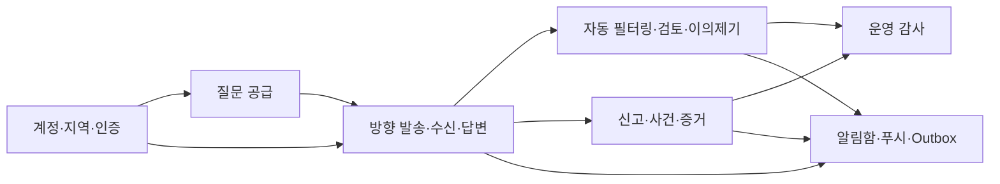
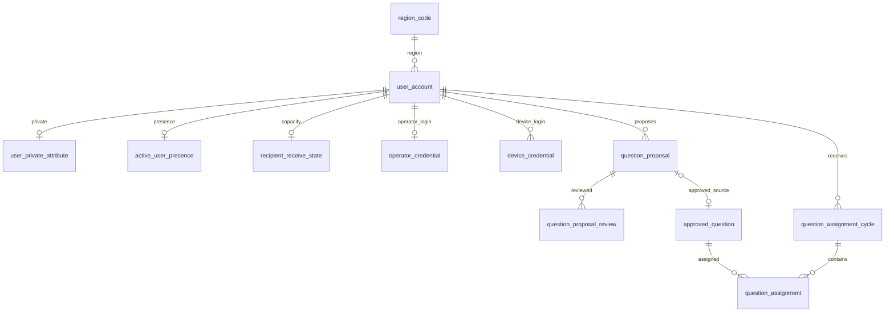
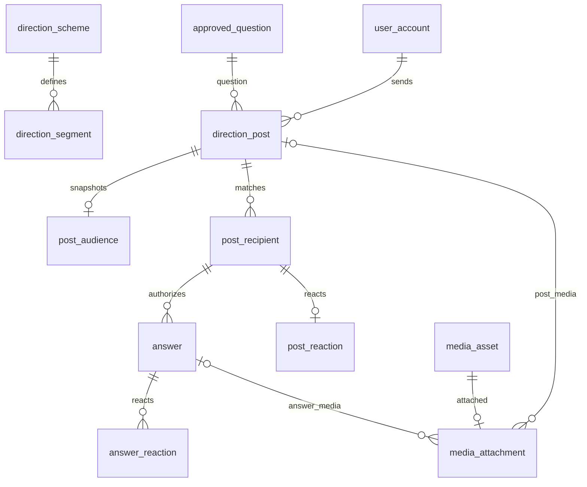
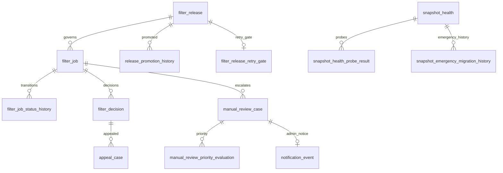
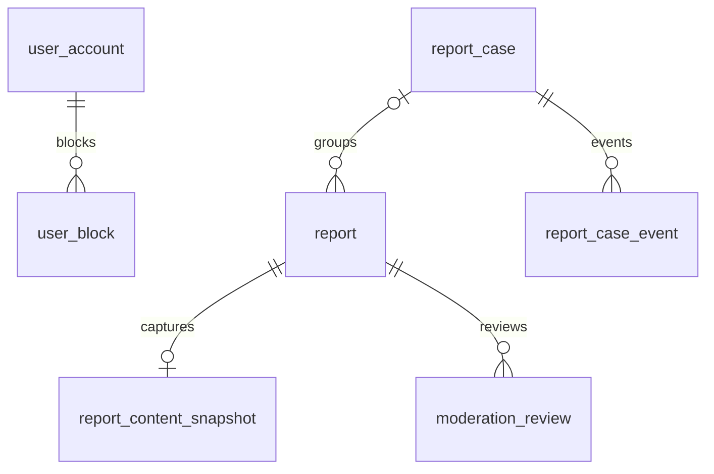
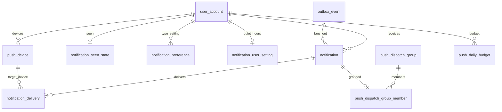
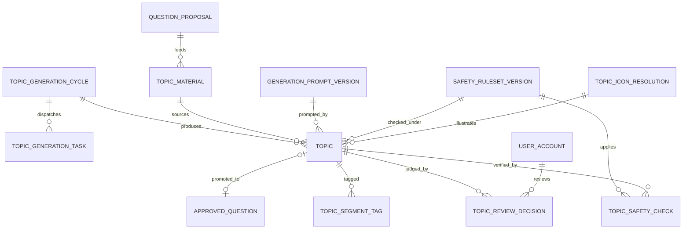

# 방향으로 연결되는 소통 — 데이터 모델·ERD

## 현재 기준과 권위

- 기준: Git commit `b7118f7628813bed86a15f9eb5b46063b4400a1d`의 Flyway V1~V28. 문서 갱신: **2026-09-29** (Issue #288, `TASK-GH-288-ERD-DBML-REFRESH`). 아래의 카탈로그 수치는 이 migration들을 빈 PostgreSQL 16/PostGIS 3.5에 적용한 로컬 검증 결과다. 운영 DB의 현재 상태를 뜻하지 않는다.
- [ADR-0001](../../adr/0001-database-schema-ownership.md)에 따라 **실행 스키마의 권위는 [Flyway migration](../../../src/main/resources/db/migration/)**에 있다. [DBML](direction_communication.dbml)은 현재 백엔드가 유지하는 논리 설계, 이 ERD는 관계와 동작의 설명, [manifest](schema-manifest.md)는 인벤토리와 검증 기록이다. 충돌 시 적용된 migration을 고치지 않고 차이를 검토해 새 migration으로 해결한다.
- 제품·백엔드 테이블 **52개**, Spring Session 프레임워크 테이블 **2개**를 구분한다. DBML은 앞의 52개를 표현하며, 전체 54개 카탈로그와의 대조 결과는 manifest에 기록했다. 이전 vault DBML/독립 DDL은 역사적 외부 출처이며 현행 실행 기준이 아니다.
- 관계도는 핵심 FK만 도메인별로 나눈다. 선의 선택성·최대 개수는 DB의 FK nullable·PK·UNIQUE 기준이며, 서비스가 생성하는 필수 짝은 본문에서 구분한다. 모든 컬럼·제약·부분/표현식 인덱스·트리거의 실행 정의는 migration과 DBML Note, 정량 인벤토리는 manifest를 본다.

## 전체 구조


```mermaid
flowchart LR
  A[계정·지역·인증] --> Q[질문 공급]
  A --> D[방향 발송·수신·답변]
  Q --> D
  D --> F[자동 필터링·검토·이의제기]
  D --> S[신고·사건·증거]
  F --> O[운영 감사]
  S --> O
  D --> N[알림함·푸시·Outbox]
  F --> N
  S --> N
```

정확 좌표의 TTL 읽기 모델은 `active_user_presence`다. 발송 순간의 방향·거리·지역은 `post_audience`, `post_recipient`, `answer`의 필요한 스냅샷으로 남는다. 사용자별 노출과 새 답변 표시는 FK만으로 정해지지 않으며 조회 SQL의 현재 상태·차단·만료 술어를 따른다.

## 계정·질문 공급


```mermaid
erDiagram
  region_code ||--o{ user_account : region
  user_account ||--o| user_private_attribute : private
  user_account ||--o| active_user_presence : presence
  user_account ||--o| recipient_receive_state : capacity
  user_account ||--o| operator_credential : operator_login
  user_account ||--o{ device_credential : device_login
  user_account ||--o{ question_proposal : proposes
  question_proposal ||--o{ question_proposal_review : reviewed
  question_proposal o|--o| approved_question : approved_source
  user_account ||--o{ question_assignment_cycle : receives
  question_assignment_cycle ||--o{ question_assignment : contains
  approved_question ||--o{ question_assignment : assigned
```

`region_code`는 계층 지역 코드와 국가 복합 FK의 기준이다. `user_account`는 공개 계정 상태, `user_private_attribute`는 분리된 민감 속성, `active_user_presence`는 만료 시각을 가진 위치 후보, `recipient_receive_state`는 활성 수신 수를 담는다. 운영자 로그인과 앱 기기 인증은 각각 `operator_credential`, `device_credential`에 분리된다. 제안·검토·승인 질문·배정 cycle은 질문 공급의 연속 단계다. 승인 질문 문구와 제출된 제안 문구의 불변성은 트리거로 보강된다.

## 방향 발송·수신·답변


```mermaid
erDiagram
  direction_scheme ||--o{ direction_segment : defines
  approved_question ||--o{ direction_post : question
  user_account ||--o{ direction_post : sends
  direction_post ||--o| post_audience : snapshots
  direction_post ||--o{ post_recipient : matches
  post_recipient ||--o{ answer : authorizes
  post_recipient ||--o| post_reaction : reacts
  answer ||--o{ answer_reaction : reacts
  media_asset ||--o| media_attachment : attached
  direction_post o|--o{ media_attachment : post_media
  answer o|--o{ media_attachment : answer_media
```

`direction_scheme`/`direction_segment`는 방향 정책이며 `post_audience`는 선택 구간의 발송 시점 스냅샷이다. DB는 글마다 audience를 최대 하나만 허용하고, 현재 [발송 서비스](../../../src/main/java/com/dnd/qello/direction/service/DirectionPostService.java)가 새 글과 audience를 같은 트랜잭션에서 생성한다. `direction_post`는 본문·상태·만료 시각과 멱등 fingerprint를, `post_recipient`는 확정된 수신 자격과 방향·거리·용량 전이 정보를 보관한다. `answer`는 수신 권한을 통해 질문글에 귀속된다. `post_reaction`은 수신 관계를 복합 FK로 참조하고, `answer_reaction`은 답변별 사용자 반응이다. `media_attachment.media_id`가 PK라 하나의 asset은 최대 한 번 첨부되며, nullable `post_id`/`answer_id` 중 정확히 하나만 채우는 CHECK가 글·답변 대상을 구분한다. READY 미디어 또는 본문이 있어야 공개 가능한 조건은 지연 제약 트리거가 검사한다.

[DirectionPostService.sendInTransaction](../../../src/main/java/com/dnd/qello/direction/service/DirectionPostService.java)은 활성 질문·발신 위치·방향 구간을 확인하고 글, audience, 첨부와 `RECIPIENT_MATCH_REQUESTED` Outbox 작업을 한 트랜잭션에 저장한다. 요청 fingerprint에는 본문과 media ID도 반영되며 매칭 payload에는 정확 좌표를 넣지 않는다. 이후 [DirectionMatchingWorker](../../../src/main/java/com/dnd/qello/direction/matching/DirectionMatchingWorker.java)가 due 작업을 claim해 moderation·만료 상태를 확인하고, 후보의 수신 용량을 잠금·예약한 뒤 `post_recipient`, 수신 확정 이벤트, 글 활성화와 claim 완료를 작업별 트랜잭션에서 확정한다. 따라서 글 제출 직후의 수신자 목록이 비어 있을 수 있다.

답변 제출은 [AnswerSubmissionService](../../../src/main/java/com/dnd/qello/answer/service/AnswerSubmissionService.java)가 수신 항목을 잠근 뒤 답변·첨부·moderation intake를 한 트랜잭션에 저장한다. 이 시점에는 수신 용량을 반환하지 않는다. 허용 판정의 공개는 [AnswerNotificationService](../../../src/main/java/com/dnd/qello/answer/service/AnswerNotificationService.java)가 `post_recipient`의 `ANSWERED` 전이와 `recipient_receive_state` 감소를 같은 트랜잭션에서 먼저 확정한 뒤 `answer`를 `PUBLISHED`로 만들고 Outbox를 기록한다. `EXPIRED`·`SKIPPED`·`BLOCKED`가 선점하면 공개하지 않는다. BLOCK 판정은 답변을 거절하되 수신 자격/용량을 건드리지 않는다. [판정 worker](../../../src/main/java/com/dnd/qello/filtering/moderation/AnswerModerationVerdictWorker.java)는 판정 적용과 Outbox claim 완료를 별도 트랜잭션으로 처리하며, [deadline worker](../../../src/main/java/com/dnd/qello/filtering/moderation/AnswerModerationDeadlineWorker.java)는 deadline 이벤트만 발행하고 수신 상태를 직접 바꾸지 않는다. 만료·넘김 확정에서도 상태 전이와 용량 카운터 감소의 원자성은 서비스 트랜잭션이 맡는다. [V1의 `ct_post_recipient_capacity_release`](../../../src/main/resources/db/migration/V1__create_direction_communication_schema.sql)는 커밋 시 `post_recipient`의 종결 상태와 `capacity_released_at` 존재 여부만 대조하며 `recipient_receive_state` 카운터는 검사하지 않는다.

답변 열람은 [PostAnswerQuerySql](../../../src/main/java/com/dnd/qello/feed/repository/jdbc/sql/PostAnswerQuerySql.java)과 [FeedScopeSql](../../../src/main/java/com/dnd/qello/feed/repository/jdbc/sql/FeedScopeSql.java)이 판정한다. 질문 작성자와 현재 자격이 있는 수신자가 볼 수 있다. `ANSWERED` 수신자는 만료 뒤에도 자격을 유지하며, 다른 시간 제한 상태는 만료 전까지만 가능하다. 삭제·양방향 차단은 차단되고, 목록은 `PUBLISHED`이며 삭제되지 않은 답변만 반환한다. 화면의 거리는 답변 작성자의 저장 거리 대신 현재 조회자의 수신 스냅샷을 사용한다. 이 정책은 단순 FK로 보장되지 않는다.

## 자동 필터링·수동 검토·이의제기


```mermaid
erDiagram
  filter_release ||--o{ filter_job : governs
  filter_job ||--o{ filter_job_status_history : transitions
  filter_job ||--o{ filter_decision : decisions
  filter_job ||--o{ manual_review_case : escalates
  manual_review_case ||--o{ manual_review_priority_evaluation : priority
  filter_decision ||--o{ appeal_case : appealed
  filter_release ||--o{ release_promotion_history : promoted
  filter_release ||--o| filter_release_retry_gate : retry_gate
  snapshot_health ||--o{ snapshot_health_probe_result : probes
  snapshot_health ||--o{ snapshot_emergency_migration_history : emergency_history
  manual_review_case ||--o| notification_event : admin_notice
```

`filter_release`는 적용할 정책/스냅샷의 release 경계, `filter_job`은 대상 버전별 처리 단위다. `filter_decision`과 `filter_job_status_history`는 판정과 상태 이력, `manual_review_case`와 우선순위 평가는 사람에게 넘긴 작업, `appeal_case`는 이의제기다. release 승격·재시도 게이트와 snapshot health·probe·긴급 migration 이력은 운영 상태를 분리해 남긴다. 위 관계도의 선은 실제 FK를 나타낸다. 별도로 대상 유형/ID를 사용하는 논리 참조도 있으며, 이는 FK 관계선에 포함하지 않았다. [ManualReviewDecisionService](../../../src/main/java/com/dnd/qello/filtering/moderation/ManualReviewDecisionService.java)는 작업 행을 잠그고 이미 자동 판정된 경우 그 판정을 유지한 채 case를 닫는다. 수동 판정 시 상태 이력·Outbox를 기록한다.

## 신고·사건·감사


```mermaid
erDiagram
  user_account ||--o{ user_block : blocks
  report_case o|--o{ report : groups
  report ||--o| report_content_snapshot : captures
  report_case ||--o{ report_case_event : events
  report ||--o{ moderation_review : reviews
```

`report`는 사용자·질문글·답변 중 한 대상을 가리키는 신고이고, `report_case`는 같은 대상의 열린 신고를 묶는 운영 처리 단위다. `report.case_id`는 legacy 행을 위해 nullable이다. `report_content_snapshot`은 신고 시점 증거이며 DB는 신고당 최대 한 행을 허용한다. `report_case_event`는 사건 이력, `moderation_review`는 신고별 운영 판정 기록이다. 증거·이력의 제한된 변경은 DB 트리거가 강제한다. `user_block`은 사용자 간 활성 차단을 별도 보관한다. `operator_action_audit`은 filtering 권한 변경·수동 결정의 운영 감사 원장으로, 일반 `moderation_review`와 역할이 다르다. 이 감사 행의 운영자 ID에는 사용자 FK가 없다.

[SafetyReportService](../../../src/main/java/com/dnd/qello/safety/service/SafetyReportService.java)는 신고자 잠금, 열린 신고/종결 중복 검사, 사건 병합, 증거 스냅샷을 한 접수 흐름에서 처리한다. 새 접수에서는 case를 연결하고 snapshot을 생성한다. [OperatorReportCaseService](../../../src/main/java/com/dnd/qello/safety/service/OperatorReportCaseService.java)는 사건 잠금·판정과 소속 신고별 review를 기록한다. `report_case`와 filtering의 `manual_review_case`는 서로 다른 대기열이다. [V25 migration](../../../src/main/resources/db/migration/V25__add_report_case_sla_and_manual_review_link.sql)의 `report_case.linked_manual_review_case_id`는 둘을 합치거나 FK로 묶지 않는 nullable opaque ID다. 접수 후 [ReportCaseAutoSuppressionEvaluator](../../../src/main/java/com/dnd/qello/safety/service/ReportCaseAutoSuppressionEvaluator.java)는 설정된 긴급 신고·서로 다른 신고자 임계 경로를 먼저 평가하고, 답변 신고일 때만 해당 답변 대상의 최신 수동 검토 case를 조회한 뒤, 그 항목이 OPEN 또는 RESOLVED+BLOCK인지 확인한다. 해당 항목이 있고 신고 사건이 아직 열려 있으면 ID를 기록하고 사건을 ACTIONED로 종결할 수 있다. RESOLVED+ALLOW는 해당하지 않으며, 모든 신고가 수동 검토 case를 만들거나 연결하는 것은 아니다. [제품 신고 설계](../ANSWER_REPORT_DESIGN.md)는 작성 당시의 계획·미결 판단도 포함하므로 현행 동작은 서비스/SQL과 migration으로 확인한다.

## 알림함·Outbox·푸시


```mermaid
erDiagram
  user_account ||--o{ notification : receives
  user_account ||--o| notification_seen_state : seen
  user_account ||--o{ notification_preference : type_setting
  user_account ||--o| notification_user_setting : quiet_hours
  user_account ||--o{ push_device : devices
  outbox_event ||--o{ notification : fans_out
  notification ||--o{ notification_delivery : delivers
  push_device ||--o{ notification_delivery : target_device
  push_dispatch_group ||--o{ push_dispatch_group_member : members
  notification ||--o| push_dispatch_group_member : grouped
  user_account ||--o{ push_daily_budget : budget
```

`outbox_event`는 매칭·moderation·알림 fan-out 등 비동기 경계의 멱등 작업이다. `notification`은 알림함의 개별 기록이다. 별도 `notification_event`는 `manual_review_case`가 생겼을 때 관리자 채널에 전달할 작업이며 알림함 `notification`의 이력이 아니다. `notification_delivery`는 기기별 푸시 시도, `push_device`는 기기 등록, `notification_preference`/`notification_user_setting`은 종별·시간 설정이다. `push_dispatch_group`과 member는 여러 **푸시 호출**을 묶지만 알림함의 개별 `notification` 행을 합치지 않는다. `push_daily_budget`은 발송 예산 원장이다.

[NotificationInboxService](../../../src/main/java/com/dnd/qello/notification/service/NotificationInboxService.java)의 `markSeen`은 서버 시각으로 `notification_seen_state.seen_at`을 전진시킨다. [JDBC upsert](../../../src/main/java/com/dnd/qello/notification/repository/jdbc/JdbcNotificationSeenStateRepository.java)는 `GREATEST`로 역전을 막는다. 한 줄의 `markRead`는 별도로 `notification.status`/`read_at`을 바꾸며 반복 호출은 멱등이다. [목록 SQL](../../../src/main/java/com/dnd/qello/notification/repository/jdbc/sql/NotificationInboxQuerySql.java)은 `UNREAD`/`READ`만 (created_at,id) 역순 cursor로 보여주고, 버튼 점은 unseen 존재, 미읽음 수는 `UNREAD` 개수로 계산한다. 진입 시 대상 생존 상태를 다시 판정한다. [알림함 설계](../NOTIFICATION_INBOX_DESIGN.md)의 날짜가 붙은 단계별 상태 표는 그 시점의 이력이다.

[PushDeliveryDispatchWorker](../../../src/main/java/com/dnd/qello/notification/service/PushDeliveryDispatchWorker.java)는 due group을 claim한 뒤 member 자격과 suppression/quiet hours를 재평가한다. defer·cancel 후 전송 가능한 기기만 claim하고 group 예산을 예약한 뒤 provider에 보낸다. 예산은 첫 전송 시도 기준으로 소비되며 retry가 다시 소비하지 않도록 group/예산 원장이 연결된다. 기기별 terminal·재시도 결과에는 generation/lease fencing을 사용한다. 알림함 생성과 푸시 성공은 독립이다. 워커의 자동 주기 실행과 실제 provider/운영 설정은 이 ERD의 스키마 검증으로 입증되지 않는다.

## 테이블 범위

아래의 그룹은 DBML의 TableGroup과 같고, 괄호는 빈 DB V1~V28 카탈로그의 열 수다. 총합은 **52개 테이블/444개 컬럼**이다. Spring Session은 뒤에 따로 센다.

| DBML 그룹 | 테이블 (컬럼 수) | 테이블 수 / 컬럼 수 |
| --- | --- | ---: |
| 계정·지역·위치·수신 용량 | `region_code` (5), `user_account` (14), `user_private_attribute` (4), `active_user_presence` (8), `recipient_receive_state` (6) | 5 / 37 |
| 백엔드 인증 | `operator_credential` (10), `device_credential` (9) | 2 / 19 |
| 질문 공급 | `question_proposal` (8), `question_proposal_review` (6), `approved_question` (11), `question_assignment_cycle` (8), `question_assignment` (7) | 5 / 40 |
| 방향 소통 | `direction_scheme` (7), `direction_segment` (7), `media_asset` (11), `direction_post` (14), `post_audience` (10), `media_attachment` (5), `post_recipient` (18), `answer` (16), `post_reaction` (3), `answer_reaction` (3) | 10 / 94 |
| 자동 필터링·검토 | `filter_release` (8), `filter_job` (14), `filter_job_status_history` (6), `filter_decision` (8), `manual_review_case` (15), `manual_review_priority_evaluation` (6), `appeal_case` (14), `release_promotion_history` (6), `filter_release_retry_gate` (6), `snapshot_health` (9), `snapshot_health_probe_result` (5), `snapshot_emergency_migration_history` (7) | 12 / 104 |
| 신고·안전 | `user_block` (4), `report` (12), `report_case` (12), `report_content_snapshot` (12), `report_case_event` (5), `moderation_review` (7) | 6 / 52 |
| 운영 감사 | `operator_action_audit` (9) | 1 / 9 |
| 알림·푸시·Outbox | `push_device` (8), `notification_user_setting` (6), `notification_preference` (4), `outbox_event` (15), `notification` (11), `notification_seen_state` (2), `notification_event` (11), `notification_delivery` (9), `push_dispatch_group` (15), `push_dispatch_group_member` (3), `push_daily_budget` (5) | 11 / 89 |
| 프레임워크 (DBML 밖) | `spring_session` (7), `spring_session_attributes` (3) | 2 / 10 |

## DBML 표현 경계와 검증

DBML은 `@dbml/core` **10.2.0**이 파싱할 수 있는 논리 설계다. 이 파서가 지원하지 않는 `checks {}`와 TableGroup 속성은 쓰지 않는다. CHECK의 정확한 SQL 식은 각 Table/column의 Note에 보존하고 그룹 색상은 주석이다. 실제 DB의 generated column, GiST, partial/expression index, 지연 constraint trigger 및 그 실행 순서는 DBML의 단순 도형만으로 재현되지 않는다. [Flyway migration](../../../src/main/resources/db/migration/)과 [manifest의 카탈로그 인벤토리](schema-manifest.md)가 실행 정의와 차이 판정의 기준이다.

2026-09-29 로컬 검증에서는 V1~V28을 새 임시 PostgreSQL 16/PostGIS 3.5에 적용해 54개 테이블·454개 컬럼을 확인했다. 제품/백엔드 52개와 Spring Session 2개를 분리했고, 전체 354 `pg_constraint` 행 중 8개는 사용자 constraint trigger다. 파서/카탈로그 대조와 테스트 실행 범위·체크섬은 manifest에 기록한다. 외부 vault 동기화나 운영 DB와의 일치는 확인하지 않았다.

## 과거 설계·검증 기록 (현행 지침 아님)

아래 접힌 기록은 2026-08-03~08-11 당시의 설계 변경, 독립 DDL 검증, 폐기된 `sql/001`~`004` 설명을 보존한다. 당시의 "현재", 파일 경로, 미완료 상태, 표의 개수는 **해당 날짜의 기록**이며 위 V28 기준에 적용하지 않는다.

<details>
<summary>2026-08 변경 기록과 이전 검증 기록 펼치기</summary>

#### 폐기된 계보 (`sql/001`~`004`)

`sql/001`~`004`는 팀 1차 ERD를 교정하던 중간 산출물이고, 현재 기준 DDL과 테이블 구성이 다르다. 참고용으로 남겨두되 새 작업의 기준으로 쓰지 않는다. 주요 차이는 다음과 같다.

| 항목 | `sql/001`~`004` 계보 | 현재 기준 (26 테이블) |
|---|---|---|
| 프로필 | `user_profile` 별도 테이블 | 폐지. `user_account.nickname`으로 인라인 |
| 민감 속성 | `user_demographic` (004) | `user_private_attribute` |
| 질문 태그 | `question_tag`, `approved_question_tag` | 제외. MVP 범위 아님 |
| 지역 마스터 | 003에서 뒤늦게 추가 | `region_code`가 기준 DDL에 포함 |
| 미디어 첨부 | `post_media` + `answer_media` | `media_attachment` 한 테이블 |
| 푸시 상태 컬럼 | `push_device.status` | `push_device.device_status` |
| 신고 대상 | 4종(`question_proposal` 포함) | 3종(사용자·질문글·답변) |
| 주제 자동 생성 | 002에 12개 테이블 | 제외. §11·§13 참고 |

### 2026-08-03 스키마 변경

기준 DDL을 PostgreSQL 16.4 + PostGIS 3.4에서 실행하고 검증한 결과에 따라 네 가지를 고쳤다. 상세는 §14.

1. `post_media` + `answer_media` → `media_attachment` 한 테이블로 통합. 기존 count 기반 constraint trigger가 동시 커밋에서 뚫리는 것을 실측으로 확인했다.
2. FK 컬럼 인덱스 일괄 추가.
3. `direction_scheme`에 `status = 'ACTIVE'` partial unique 추가.
4. `post_recipient`에 상태–타임스탬프 CHECK와 용량 해제 constraint trigger 추가.

### 2026-08-04 스키마 변경 (기능 명세서 개정 반영)

기능 명세서가 전면 개정되면서 확정된 규칙 여섯 가지를 스키마에 반영했다. 전부 PostgreSQL 16 + PostGIS 3.4에서 실행·행동 검증했다. 상세는 §14.

| # | 변경 | 왜 |
|---|---|---|
| 1 | **`post_reaction`, `answer_reaction` 신설** | 공감(화면 문구 `좋아요`)이 확정 MVP 기능이 됐다. §11이 `like`를 Non-goal로 제외했던 판단을 뒤집는다 |
| 2 | **`post_recipient.status`에 `SKIP_PENDING` 추가, `skip_requested_at` 컬럼 추가** | 스와이프 넘김에 5초 되돌리기가 생겼다. 되돌릴 수 있는 동안 용량을 해제하면 안 된다 |
| 3 | **`recipient_receive_state`의 상한 5 하드코딩 제거** | 수신 상한이 고정 상수가 아니라 운영 설정값이 됐다 |
| 4 | **`direction_post.answers_read_at` 추가** | `내가 쓴 질문` 카드의 `새로운 답변 n개` 배지 기준선 |
| 5 | **`answer`에 수신 권한당 1건 partial unique 추가** | "한 질문글에 답변은 1회"가 확정됐다. §4가 예고해둔 제약을 실제로 걸었다 |
| 6 | **알림·Outbox 종류 갱신** | `DAILY_QUESTION_ASSIGNED` → `QUESTION_RECOMMENDED`, `ANSWER_REACTED`·`SKIP_CONFIRMATION_DUE` 추가 |

**공감을 두 테이블로 나눈 이유**는 누를 수 있는 사람이 서로 다르고, 그 차이를 **키로 강제할 수 있기** 때문이다.

- `post_reaction`은 `(post_id, reactor_id)`가 `post_recipient(post_id, recipient_id)`를 참조한다. "수신 자격이 있는 사용자만 공감할 수 있다"가 트리거 없이 성립하고, 질문글 작성자는 자기 글의 수신자가 될 수 없으므로(`ct_post_recipient_not_sender`) 자기 글 공감도 함께 막힌다.
- `answer_reaction`은 `answer_id`가 PK다. 공감할 수 있는 사람이 질문자 한 명뿐이라 "답변당 공감 1건"이 키로 성립한다. 다만 `answer`가 `post_id`를 직접 갖지 않고 `post_recipient`를 거쳐 도달하므로, "누른 사람이 질문자인가"만 `ct_answer_reaction_reactor_is_sender` 트리거가 판정한다.

**`SKIP_PENDING`이 용량 해제 트리거를 건드리지 않는 이유**: `ct_post_recipient_capacity_release`는 `ANSWERED`·`SKIPPED`·`EXPIRED`·`BLOCKED`만 해제 대상으로 본다. `SKIP_PENDING`은 그 목록에 없으므로 트리거를 고치지 않고도 되돌릴 수 있는 동안 용량을 자연히 붙잡는다.

**댓글 테이블은 여전히 만들지 않는다.** 이전에는 Non-goal이라 제외했지만, 이제는 답변을 볼 수 있는 사람이 질문자 한 명뿐이라 **댓글이 놓일 자리 자체가 없다.**

> **2026-08-07 주의**: 위 문단의 근거는 폐기됐다. 답변을 볼 수 있는 사람이 수신 자격자 전원으로 늘어났으므로 "자리가 없다"는 논리는 더 이상 성립하지 않는다. **그럼에도 댓글 테이블은 만들지 않는다.** 이유가 구조적 불가능에서 **제품 결정**으로 바뀌었을 뿐이다. 아래 절 참고.

### 2026-08-07 스키마 영향 (답변 격리 폐기)

기능 명세서 2026-08-07 개정으로 **답변이 질문자 전용에서 수신 자격자 전원 공개로 바뀌었다.** 근거는 `docs/adr/0002-답변은-질문글을-받은-사람-모두에게-공개된다.md`.

스키마의 단일 기준은 `dbml/direction_communication.dbml`이므로, 적용할 때는 DBML을 먼저 고치고 DDL과 이 문서를 맞춘다.

#### 반드시 고쳐야 하는 것

| # | 상태 | 대상 | 현재 | 바뀌어야 하는 것 | 왜 |
|---|---|---|---|---|---|
| 1 | **반영됨** | **`answer_reaction`** | ~~`answer_id`가 PK~~ → **`(answer_id, reactor_id)` 복합 PK** | — | 공감할 수 있는 사람이 질문자 한 명뿐이라 "답변당 1건"이 키로 성립했다. 이제 **볼 수 있는 사람 전원**이 누르므로 그대로 두면 두 번째 사람의 공감이 PK 충돌로 실패한다. **이번 개정에서 가장 확실히 깨지는 지점이었다** |
| 2 | **반영됨** | ~~`ct_answer_reaction_reactor_is_sender`~~ → **`ct_answer_reaction_reactor_can_view`** | — | — | 누를 수 있는 사람이 질문자 + 수신 자격자로 넓어졌고, 자기 답변 공감 금지가 새로 생겼다. 넘김·만료로 인한 자격 상실은 시간에 따라 변하므로 트리거가 아니라 조회 계층이 강제한다 |
| 3 | **반영됨** | **`post_recipient.inbound_bearing_deg`** (신설) | — | — | 목록·카드의 방향은 **보는 사람 기준**이다. 구면에서 역방위는 `+180°`가 아니라 별도 계산이므로 매칭 시점에 스냅샷으로 박는다. **구간 키는 저장하지 않는다** — 라벨은 조회 시점에 현재 ACTIVE 스킴으로 파생시켜야 스킴이 8→16으로 바뀔 때 마이그레이션 없이 재분류된다 |
| 4 | **반영됨** | **`post_recipient.answers_read_at`** (신설) | — | — | `direction_post.answers_read_at`은 **질문자용**이다. `답변한` 카테고리의 `새 답변 n개` 배지는 수신자마다 마지막으로 본 시점이 달라 별도 기준선이 필요하다 |
| 5 | **반영됨** | **`post_recipient.distance_m`, `answer.distance_m`** (신설) | ~~`distance_band`만 존재~~ | — | **정확 거리를 표시하기로 했는데 스키마에 정확 거리가 없었다.** 수신자 좌표는 `active_user_presence`에 TTL로만 남아 나중에 재계산할 수 없으므로 방위와 똑같이 스냅샷이 필요하다. `distance_band`는 근거리 하한(10km) 미만 표시용으로 남는다 |
| 6 | **반영됨** | **`answer.edited_at`** (신설) | — | — | 재검토 큐 투입과, 신고 시점의 내용 특정에 필요하다. `수정됨` 표시의 근거이기도 하다 |
| 7 | **반영됨** | **`uq_answer_one_per_recipient`** | ~~`status NOT IN ('REJECTED','DELETED')`~~ → **`status <> 'REJECTED'`** | — | "삭제 후 재작성 불가"가 확정됐다. 열어두면 삭제→재작성이 사실상 무제한 수정이 되어 수정 정책이 무의미해진다. `REJECTED`만 자리를 비켜주는 이유는 운영이 거절한 것은 사용자 잘못이 아니기 때문이다 |
| 8 | **스키마 변경 불필요** | **답변 수정 중 처리** | — | 기존 `status`·`moderation_status`로 충분 | 아래 "답변 수정" 절 참고 |
| 8-1 | **반영됨** | **`answer.edit_count`** (신설) | — | — | 공감이 수정에도 승계되므로 무제한이면 "공감을 모은 뒤 반복 교체"가 기능이 된다. 수정마다 재검토가 돌아가 모더레이션 큐 비용도 늘어난다. **실효 상한 3은 DB에 고정하지 않고** 운영 설정값으로 두며 DB에는 안전 상한 10만 건다 — `recipient_receive_state`의 수신 상한 5를 하드코딩에서 뺀 것과 같은 방식이다 |
| 9 | 미반영 | **`post_recipient` 조회 경로** | 상태 기준 단일 목록 | **`답변 안 한` / `답변한` 두 카테고리 + 방향 집계** | 목록 API가 방향별 개수를 함께 내려줘야 한다. 페이지네이션 때문에 클라이언트가 칩을 만들 수 없다. 스키마 변경은 필요 없다 — 카테고리는 `answer` 존재 여부로 유도되고 방향 집계는 `inbound_bearing_deg`로 계산한다 |

#### 검증

`docs/sql/direction_communication_ddl.sql`을 PostgreSQL 16 + PostGIS 3.4에서 실행하고(테이블 31개 생성) 아래 동작을 확인했다.

| 검증 | 결과 |
|---|---|
| 질문자와 다른 수신자가 같은 답변에 공감 | 둘 다 성공 (구 스키마에서는 PK 충돌) |
| 답변자가 자기 답변에 공감 | 거부 |
| 수신 자격 없는 사용자가 공감 | 거부 |
| 같은 사람이 같은 답변에 두 번 공감 | 거부 (`pk_answer_reaction`) |
| `inbound_bearing_deg = 360` | 거부 |
| `distance_m` 음수 | 거부 |
| `answers_read_at < matched_at` | 거부 |
| 공개되지 않은 답변에 `edited_at` | 거부 |
| 공개 후 수정 → 공감 승계 | 2건 그대로 유지 |
| 삭제 후 같은 수신 권한으로 재작성 | 거부 (`uq_answer_one_per_recipient`) |
| `PUBLISHED → SAFETY_CHECKING` 전이 + 같은 트랜잭션에서 첨부 교체 | 커밋 성공. `published_at` 유지, 공감 2건 유지 |
| 수정 검토 중 같은 수신 권한으로 새 답변 삽입 | 거부 |
| `SAFETY_CHECKING → PUBLISHED` 복귀 | 성공. 본문·첨부 모두 교체된 상태로, 공감 2건 그대로 |
| 질문글 `EXPIRED` 상태에서 답변 수정 → 검토 → 반영 | 성공 (만료는 새 `answer` 행 생성만 막는다) |
| `edit_count`와 `edited_at`이 어긋난 조합 (한쪽만 채움) | 양방향 모두 거부 |
| `edit_count = 11` (안전 상한 초과) | 거부 |
| `edit_count = 10` | 성공 — 실효 상한 3은 DB가 아니라 애플리케이션이 막는다 |

> 만료 후 **새 공감**이 가능한지는 픽스처 중복 때문에 재실행하지 못했다. 다만 `ct_answer_reaction_reactor_can_view`는 작성자 여부와 수신 자격만 판정하고 만료를 보지 않으므로 **DB 레벨에서 막는 제약은 없다.** 실제 차단 여부는 조회·쓰기 계층의 책임이다.

#### 답변 수정 — 새 컬럼 없이 기존 상태로 표현한다

**검토 중인 답변은 다른 사람에게 감춘다.** 따라서 대기 중인 본문을 따로 보관할 필요가 없고, 기존 컬럼만으로 표현된다.

```
수정 제출 → status = 'SAFETY_CHECKING', moderation_status = 'PENDING'
           body_text와 media_attachment를 즉시 교체
           조회 계층은 status = 'PUBLISHED'만 노출 → 다른 사람 화면에서 빠짐
           (작성자 본인에게는 노출하고 `검토 중` 배지를 붙인다)
검토 통과 → status = 'PUBLISHED', edited_at = now()
```

**`pending_body_text`도 `answer_edit` 테이블도 두지 않는다.** 검토 중에 기존 내용을 계속 보여주려면 공개본과 대기본을 동시에 보관해야 하는데, `media_attachment`는 `(answer_id, display_order)` unique이고 대상 컬럼이 `post_id`/`answer_id` 둘 중 하나(`num_nonnulls = 1`)라 **대기 중인 미디어를 붙일 세 번째 대상이 없다.** 그 길로 가면 텍스트만 수정 가능으로 축소되거나 `ck_media_attachment_exactly_one_target`을 손대야 한다.

답변 전체를 감추면 그 동안 `media_attachment`를 떼고 붙여도 중간 상태가 아무에게도 노출되지 않는다. `ct_media_attachment_preserves_content`도 `PUBLISHED` 답변만 검사하므로 `SAFETY_CHECKING` 중에는 걸리지 않는다. **사진 수정이 텍스트 수정과 같은 규칙으로 처리된다.**

기존 제약과의 관계도 확인했다.

| 제약 | 수정 중 상태에서 |
|---|---|
| `ck_answer_published_at` | `status <> 'PUBLISHED'`일 때는 `published_at`을 요구하지 않으므로 값이 남아 있어도 통과 |
| `ck_answer_edited_at` | `published_at`이 남아 있고 `edited_at >= published_at`이면 통과 |
| `ct_answer_has_content` | `PUBLISHED`만 검사하므로 교체 중간에 첨부가 비어도 통과 |
| `uq_answer_one_per_recipient` | `status <> 'REJECTED'`이므로 `SAFETY_CHECKING`도 자리를 점유한다. 수정 중에 새 답변을 끼워 넣을 수 없다 |
| `answer_reaction` | 행이 그대로 남아 있다가 복귀할 때 함께 돌아온다 |

**만료 후에 검토가 끝나도 반영한다.** 만료는 새 `answer` 행 생성만 막지 기존 행의 상태 전이를 막지 않는다.

#### 확인만 하면 되는 것 (구조 변경 불필요)

| 대상 | 판단 |
|---|---|
| `post_recipient.status` 전이 | **그대로 쓴다.** `ANSWERED`·`SKIPPED`·`EXPIRED`는 유지되고, 바뀐 것은 **그 상태를 어느 목록에 태우느냐**뿐이다. 상태 기계를 건드리지 않는다 |
| `ct_post_recipient_capacity_release` | **그대로 쓴다.** 슬롯 해제 조건(답변·넘김·만료)이 바뀌지 않았다. `ANSWERED`가 여전히 해제 대상이고, 다만 해제 후에도 행이 화면에 남을 뿐이다 |
| `direction_scheme` / `direction_segment` | **그대로 쓴다.** `segment_count`와 `start_offset_deg`가 이미 N방향을 수용한다. 8은 구조가 아니라 데이터다 |
| `post_audience.selected_segment_key` | **스냅샷 유지.** 발신자가 고른 구간은 사용자의 의사 표시이자 매칭 판정의 근거라 스킴이 바뀌어도 변하지 않는다. 수신 측만 파생값을 쓴다(의도된 비대칭) |
| `post_reaction` | **키 구조는 그대로 쓴다.** `(post_id, reactor_id)`가 `post_recipient`를 참조하는 구조가 "수신 자격자만 질문글에 공감" + "작성자는 자기 글에 공감 불가"를 이미 키로 강제한다. 다만 **공감 개수를 보는 범위는 바뀐다** — 기능 명세서 08-07판(§F06 공감 표)은 "개수를 보는 사람"을 질문자 한정에서 **볼 수 있는 사람 전원**으로 넓혔다. 이 절을 처음 정리할 때 이 부분을 놓쳐 DBML·DDL·이 문서 모두에 "질문자에게만 노출"이 한동안 남아 있었다(2026-08-08 발견, 정정) |
| `answer.bearing_from_sender_deg`, `answer.distance_band` | **컬럼은 유지하되 답변 거리 노출에는 사용하지 않는다.** 답변 목록의 거리는 현재 보는 사람의 `post_recipient.distance_m`과 질문 원점으로 판정한다. 답변 작성자 기준 거리를 보는 사람마다 재계산하지 않아 답변자 위치를 삼각측량할 수 없게 한다 |
| 댓글 테이블 | **만들지 않는다.** 근거가 "자리가 없다"에서 "제품 결정"으로 바뀌었다 |

#### 불변식 13이 약해진다

> 정확 좌표는 API 응답, 로그, 분석 이벤트, Outbox payload에 넣지 않는다. 외부에는 `distance_band`와 `coarse_region_code`만 나간다.

**기능 명세서 2026-08-07 개정으로 카드와 답변에 `distance_band`가 아닌 정확 거리를 노출하기로 했다.** 좌표 자체를 내보내는 것은 아니므로 불변식의 문자는 지켜지지만, 취지는 약해진다.

이 결정이 성립하는 근거는 **방향 구간이 45°라서 방향 ∩ 거리의 교집합이 점이 아니라 긴 호가 되기 때문**이다. 그리고 이 안전 마진은 두 조건에 의존한다.

1. **구간 폭 45°** — 16방향(22.5°)이 되면 호가 절반, 32방향(11.25°)이면 4분의 1로 짧아진다
2. **근거리 하한 10km** — 호 길이는 거리에 비례하므로 가까울수록 좁아진다. 지역 라벨이 광역권으로 확정되면서 광역권 내부에 하한 위 구간(예: 15km)이 남지만, 그 반경에 실제로 사용자가 들어올 빈도가 낮다고 보아 감수한 값이다. 실사용 데이터에서 근거리 매칭 빈도가 예상보다 높으면 재검토 대상이다

**따라서 불변식 13에 조건을 덧붙여야 한다**: *외부에 정확 거리를 내보내는 것은 방향 구간이 45° 이상이고 근거리 하한이 적용될 때만 허용한다.* 10km 미만은 `10km 이내`만 노출하고, 10km 이상은 현재 보는 사람의 질문 원점까지 정확 거리를 노출한다. `distance_band` 컬럼은 저장 제약과 근거리 표시에 계속 사용한다.

### 2026-08-11 Issue #115 비동기 매칭 계약

Issue #115는 방향글 제출과 수신자 매칭 사이의 경계를 transactional outbox로 고정한다. 별도 `matching_job` 테이블은 만들지 않고 `outbox_event`의 `aggregate_type = 'DIRECTION_POST'`, `event_type = 'RECIPIENT_MATCH_REQUESTED'` 행 자체를 매칭 작업으로 취급한다.

- `direction_post.request_fingerprint`는 정규화된 사용자 의도 입력의 `v1:SHA-256` 결과를 최대 80자로 저장한다. 기존 행은 nullable로 유지하며, 첫 idempotency 재시도에서 `direction_post`와 `post_audience`로 복원할 수 있는 경우에만 lazy backfill한다. 복원할 수 없는 legacy 행은 기존 결과를 반환하고 reconciliation 대상으로 남긴다.
- fingerprint 입력은 `approvedQuestionId`, `schemeId`, `segmentKey`, `minDistanceMeters`, `maxDistanceMeters`, `coarseRegionCode`, `bodyText`다. sender, idempotency key, 서버 소유 시각(`submittedAt`, `expiresAt`)은 입력에 포함하지 않는다. 문자열은 NFC 정규화 후 바깥 Unicode whitespace만 trim하고, body 내부 whitespace와 식별자 대소문자는 보존한다.
- matching event의 `match_round`는 해당 이벤트에만 필수이며 초기 제출은 `1`이다. retry/reclaim은 round를 증가시키지 않는다. `(aggregate_id, match_round, event_type)` partial unique index가 같은 post·round·event의 중복 작업을 막는다. `dedup_key`는 `direction-match:{postId}:{matchRound}:{eventType}`로 서버가 파생한다.
- `outbox_event`의 `lease_owner`, `lease_expires_at`, `lease_generation`은 한 번의 claim/reclaim에서 함께 갱신한다. `lease_generation`은 성공마다 증가하는 fencing token이다. 완료·실패·dead 갱신은 id, `PROCESSING`, owner, generation, 아직 만료되지 않은 lease를 모두 조건으로 사용해 stale worker의 갱신을 거절한다.
- 매칭 payload에는 `postId`, `matchRound`, `eventType`, `requestFingerprint`와 재조회에 필요한 coarse 식별자만 저장한다. `post_audience.origin_position`, `active_user_presence.position`과 위도·경도, geography WKB/GeoJSON처럼 정확 좌표를 복원할 수 있는 값은 payload에 넣지 않는다.
- lease duration과 retry backoff 숫자는 이 데이터 모델에 고정하지 않고 application configuration의 책임으로 남긴다.

### 2026-08-08 문서 정정

두 가지를 뒤늦게 발견해 DBML·DDL·이 문서 세 파일 모두 고쳤다.

1. **`post_reaction` 공감 개수 노출 범위 누락.** 기능 명세서 §F06 공감 표는 "개수를 보는 사람"을 질문글·답변 모두 질문자 한정에서 **볼 수 있는 사람 전원**으로 넓혔는데(2026-08-07), 위 "2026-08-07 스키마 영향" 절을 정리할 때 답변 쪽(`answer_reaction`)만 반영하고 `post_reaction`은 "그대로다"로 잘못 분류했다. 키 구조(`pk_post_reaction`, `fk_post_reaction_recipient`)는 실제로 안 바뀌어 스키마 변경은 없다 — DBML Note, DDL 주석·`COMMENT`, 이 문서 §6·§8·§9·§11의 서술만 정정했다.
2. **`operator_credential`(V5, `#72`)·`device_credential`(V7, `#73`)·`user_account.version`(V4, `#48`) 반영.** 팀원이 DBML에 추가한 뒤 DDL과 이 문서에는 옮기지 않은 상태였다. §12가 미결로 남겨뒀던 "인증·신원 수단" 항목을 이 두 테이블이 실제로 채운다. 제품 논리 테이블 28개와는 출처가 다른 **백엔드 인증 부록**이라 따로 센다 — DBML §"백엔드 인증 부록" 참고. 기준 문서로 적힌 `docs/product/AUTH_DESIGN.md`, `docs/adr/0006-split-operator-and-device-authentication.md`는 **이 저장소에는 없다.** 실제 백엔드 저장소 문서로 추정되며, 이 문서에서는 열어보고 대조하지 못했다. 병합 중 `operator_credential.login_id`에 유니크 인덱스(`uq_operator_credential_login_id`)가 DBML에는 있는데 DDL엔 빠져 있던 것도 발견해 추가했다 — 로그인 시스템에 중복 로그인ID를 막는 제약이 없었던 실제 버그였다. `spring_session`/`spring_session_attributes`(V6)는 프레임워크 소유 테이블이라 애초에 이 문서 범위 밖이다.

### P06 위치 정책 (2026-08-03 확정: 1안)

**짧은 TTL의 정확 좌표를 `active_user_presence`에 저장하고 외부에는 흐린 값만 제공한다.**

- `active_user_presence.position`과 `post_audience.origin_position`은 실제 사용자 좌표를 담는 **운영 컬럼**이다. 더 이상 합성 데이터 전용이 아니다.
- `active_user_presence`가 서비스 전체에서 정확 좌표를 보관하는 유일한 곳이며, 접근 경로를 매칭 워커로 제한한다.
- 정확 좌표는 API 응답, 로그, 분석 이벤트, Outbox payload에 넣지 않는다. 외부에는 `distance_band`와 `coarse_region_code`만 나간다(불변식 13).
- `expires_at`이 지난 좌표는 후보 탐색에서 제외한다. 실제 보존·삭제 기간은 P07에서 확정한다.
- 2안(coarse cell만 저장)과 3안(위치 참조 토큰)은 채택하지 않았다. `coarse_cell_id`와 `origin_cell_id`는 폐기하지 않고 선택적 보조 컬럼으로 남긴다.

이 결정으로 매칭 파이프라인이 정확 좌표를 전제해도 되는 것이 확정됐다. 다만 실제 사용자 좌표를 수집하기 전에 데이터 흐름·접근 권한·로그 제외·암호화·삭제 작업에 대한 Security/Privacy 승인은 여전히 필요하다.

### 용어 정규화

기존 백엔드 설계의 `QUESTION`은 실제로 사용자가 승인 질문을 골라 방향으로 보낸 콘텐츠를 뜻했다. 질문 공급과 발송 콘텐츠를 구분하기 위해 다음 이름을 사용한다.

| 제품 용어 | 테이블 | 의미 |
|---|---|---|
| 승인 질문 | `approved_question` | 검토를 통과해 작성 주제로 쓸 수 있는 질문. 문구는 생성 후 수정하지 않음 |
| 추천 질문 | `question_assignment` | 특정 사용자·추천 주기에 고정된 승인 질문. **배정이 아니라 추천이므로 사용자는 고르지 않아도 된다** |
| 질문 제안 | `question_proposal` | 사용자가 검토를 요청한 질문 후보. 승인 전에는 발행되지 않음 |
| **질문글** | `direction_post` | 승인 질문에 사진·글을 붙여 한 방향으로 보낸 것 |
| 수신 자격 | `post_recipient` | 발송 시점 매칭 결과로 확정한 열람·답변 권한 |
| 수신 용량 | `recipient_receive_state` | 활성 미처리 질문글이 설정된 수신 상한을 넘지 않도록 동시성 아래에서 지키는 사용자별 용량 투영값 |
| 답변 | `answer` | 수신자가 **질문자에게만** 남기는 사진 또는 짧은 글 |
| 공감 | `post_reaction`, `answer_reaction` | 질문글 또는 답변에 남기는 가벼운 반응. 화면 문구는 `좋아요` |

`direction_post`를 단순히 `question`이라고 부르지 않는다. 그래야 질문 검토·추천과 콘텐츠 발송 상태가 섞이지 않는다. 테이블명은 `direction_post`를 유지하되, **제품 문서와 화면에서는 `질문글` 하나로 부른다.** 보낸 것과 받은 것에 서로 다른 이름을 쓰지 않는다.

**폐기된 제품 용어**: `방향 글`(→ `질문글`), `수신 질문`(→ `질문글`), `오늘의 질문`(→ `추천 질문`), `방향 피드`(공동 피드 개념 자체가 폐기), `댓글`(기능 없음).

### 질문 문구 불변 정책 (2026-08-03 확정)

질문은 한번 만들면 수정하지 않는다. 이 결정에 따라 초안에 있던 문구 버전 테이블 두 개를 제거했다.

| 제거한 테이블 | 원래 목적 | 대체 |
|---|---|---|
| `question_proposal_revision` | 검토 반려 후 사용자가 문구를 고쳐 재제출하는 루프 | `question_proposal`이 문구를 직접 보관. 고치려면 새 제안을 만든다 |
| `question_template_version` | 운영자가 승인 질문 문구를 고쳐도 과거 발송 글의 원문을 보존 | `approved_question`이 문구를 직접 보관. 고치려면 `INACTIVE` 처리 후 새 질문을 만든다 |

`question_template`은 버전 테이블과 짝을 이루던 이름이므로 `approved_question`으로 바꿨다. 연쇄 변경은 다음과 같다.

| 이전 | 이후 |
|---|---|
| `question_template` | `approved_question` |
| `question_template_tag` | `approved_question_tag` |
| `question_template_version_id` (in `question_assignment`, `direction_post`, 태그 테이블) | `approved_question_id` |

부수 결정:
- 제안 상태와 리뷰 판정에서 `REVISION_REQUESTED`를 제거했다. 재제출 경로가 없으므로 도달해도 처리할 수 없는 상태다.
- 승인 질문은 다국어를 구분하지 않는다(`language_code` 제거). 다국어가 확정되면 컬럼을 추가한다.
- 버전 참조가 사라져 "비활성 질문으로 새 글을 쓰는" 경로가 열리므로, `direction_post` 생성 시 `approved_question.status = 'ACTIVE'`를 확인하는 제약 트리거를 추가했다.


## 13. 폐기된 증분 계보 (`sql/001`~`004`)

§1~§12는 기준 DDL(`sql/direction_communication_ddl.sql`, 26 테이블)을 설명한다. 아래 네 파일은 팀 1차 ERD(Qello)를 교정하던 중간 산출물이며 **더 이상 기준이 아니다.** 기준 DDL과 함께 실행하면 안 된다. 각 파일의 설계 판단 중 살아남은 것과 버려진 것은 다음과 같다.

| 파일 | 내용 | 현재 상태 |
|---|---|---|
| `001_create_direction_communication_schema.sql` | 초기 MVP 28 테이블 | 기준 DDL로 대체. `user_profile`·`question_tag`·`approved_question_tag` 제거 |
| `002_add_topic_generation_schema.sql` | 주제 자동 생성 라인 12개 테이블 | 미적용. MVP 범위 결정 필요. §11과 충돌 |
| `003_add_region_code_master.sql` | 지역 코드 계층 마스터 | 기준 DDL에 `region_code`로 흡수됨 |
| `004_add_user_demographic.sql` | 성별·연령대 | 기준 DDL에 `user_private_attribute`로 흡수됨(이름 변경). **P10 승인 전 수집 금지** |

### 13.1 주제 자동 생성 라인 (002)


```mermaid
erDiagram
    TOPIC_GENERATION_CYCLE ||--o{ TOPIC_GENERATION_TASK : dispatches
    TOPIC_GENERATION_CYCLE ||--o{ TOPIC : produces
    TOPIC_MATERIAL ||--o{ TOPIC : sources
    QUESTION_PROPOSAL ||--o{ TOPIC_MATERIAL : feeds
    GENERATION_PROMPT_VERSION ||--o{ TOPIC : prompted_by
    SAFETY_RULESET_VERSION ||--o{ TOPIC : checked_under
    SAFETY_RULESET_VERSION ||--o{ TOPIC_SAFETY_CHECK : applies
    TOPIC ||--o{ TOPIC_SAFETY_CHECK : verified_by
    TOPIC ||--o{ TOPIC_REVIEW_DECISION : judged_by
    TOPIC ||--o{ TOPIC_SEGMENT_TAG : tagged
    TOPIC_ICON_RESOLUTION ||--o{ TOPIC : illustrates
    USER_ACCOUNT ||--o{ TOPIC_REVIEW_DECISION : reviews
    TOPIC o|--o| APPROVED_QUESTION : promoted_to
```

핵심 설계 결정은 다음과 같다.

- **`direction_post`는 `topic`을 직접 참조하지 않는다.** 자동 생성 주제도 `approved_question`으로 승격된 뒤에만 배정·발송된다. 기능 명세 F02의 "생성 출처와 관계없이 동일한 승인 단계"를 스키마가 강제한다.
- 승격 경로는 `approved_question.source_topic_id`(UNIQUE)로 표현하고, `source_type`에 따라 `source_proposal_id`와 배타가 되도록 `CHECK`로 묶는다. 한 주제는 최대 하나의 승인 질문만 만든다.
- 승인되지 않은 주제는 승격할 수 없다. 다른 테이블을 읽어야 하므로 `ct_approved_question_topic_approved` 지연 제약 트리거로 강제한다.
- 안전 판정에 `FAIL`이 하나라도 있으면 검토 단계로 전이할 수 없다(`ct_topic_safety_passed`).
- `topic ↔ topic_review_decision`은 원본 ERD에서 단일 컬럼 FK 양방향이라 순환이었다. `UNIQUE(id, topic_id)` 짝 키 + 지연 복합 FK로 교체해 "판정은 반드시 그 주제의 것"을 보장한다.
- 워커 동시성은 `topic_generation_task.lease_owner`/`lease_expires_at` + `FOR UPDATE SKIP LOCKED`로 처리한다. `state ∈ (LEASED, RUNNING)`이면 lease 컬럼이 채워져 있어야 한다.
- 재실행 멱등 키: `topic_generation_cycle.cycle_key`, `topic_generation_task(cycle_id, segment_key, attempt_no)`, `topic(cycle_id, segment_key, attempt_no, ordinal)`.
- 생성 상한은 `topic_generation_budget`이 보관하며 `used_count <= max_count`를 DB가 강제한다. 범위는 `CYCLE`/`DAY`/`SEGMENT` 세 가지다.
- `icon_stock_policy`는 같은 정책 버전·세그먼트 안에서 재고 구간이 겹치지 않도록 `EXCLUDE USING gist`로 막는다(`btree_gist` 확장 필요).
- `topic_icon_resolution`은 원본 ERD에 참조만 있고 정의가 없어 최소 형태로 추정했다. **컬럼 구성은 팀 확인이 필요하다.**

주제 상태 전이는 다음과 같다.

```text
topic
GENERATED → SAFETY_CHECKING → PENDING_REVIEW → APPROVED → PROMOTED
                           └→ SAFETY_FAILED   └→ REJECTED
PROMOTED → EXPIRED | ARCHIVED
```

### 13.2 지역 코드 마스터 (003 → 기준 DDL로 흡수)

003의 설계는 그대로 기준 DDL의 `region_code`가 됐다.

- `region_code(code PK, parent_code FK self, display_name, level, created_at)` 한 테이블로 계층을 표현한다.
- 1차 ERD에서는 코드 타입이 `TEXT` / `VARCHAR(35)` / `VARCHAR(100)` 세 갈래였고 어떤 지역 컬럼과도 연결되지 않았다. `VARCHAR(100)`으로 통일하고 다음 다섯 곳에 FK를 건다.
  - `user_account.coarse_region_code`
  - `active_user_presence.coarse_region_code`
  - `direction_post.coarse_region_code`
  - `answer.coarse_region_code`
  - `post_recipient.matched_region_code`
- `CHECK ((level = 'COUNTRY') = (parent_code IS NULL))`로 최상위만 부모가 없도록 고정한다. 2단계 이상의 순환은 적재 단계에서 차단한다.
- 기준 DDL은 빈 스키마에 한 번에 적용하므로 FK를 바로 건다. 운영 데이터가 있는 DB에 나중에 추가할 때는 `NOT VALID`로 걸고 별도 트랜잭션에서 `VALIDATE CONSTRAINT`를 실행해 잠금 시간을 줄인다.

### 13.3 사용자 인구통계 (004 → `user_private_attribute`)

- 기준 DDL에서는 `user_private_attribute(user_id PK,FK, gender, age_band, updated_at)`라는 이름을 쓴다. `user_account`와 1:1이며 PK가 곧 FK다.
- **P10(연령) 정책이 승인되기 전에는 `age_band`를 실제 사용자에게 수집하지 않는다.** 승인 없이 수집하면 개인정보 최소 수집 원칙에 어긋난다. 테이블 자체는 기준 DDL에 있으므로 별도 실행 금지 대상이 아니라 **수집 금지** 대상이다.
- 생년월일을 저장하지 않고 구간(`10S`~`70S_PLUS`)만 보관한다. 두 컬럼 모두 선택 입력이다.
- 매칭·노출 로직에서 이 값을 사용할지는 별도 정책 결정 사항이다.

## 14. 검증 상태

### 2026-08-04 변경분 (공감·넘김 유예·답변 1회)

개정된 DDL 전체를 PostgreSQL 16 + PostGIS 3.4(Docker `postgis/postgis:16-3.4`) 빈 스키마에 다시 적용해 **오류 없이 실행되는 것**을 확인하고, 새 제약이 의도한 대로 막는지 행동 시나리오로 검증했다.

| # | 시나리오 | 기대 | 결과 | 실제로 막은 것 |
|---|---|---|---|---|
| R1 | 수신자가 질문글에 공감 | 성공 | ✅ | — |
| R2 | 수신자가 아닌 사람이 질문글에 공감 | 거부 | ✅ | `fk_post_reaction_recipient` |
| R3 | 질문자 본인이 자기 질문글에 공감 | 거부 | ✅ | `fk_post_reaction_recipient` |
| R4 | 같은 사람이 같은 질문글에 두 번 공감 | 거부 | ✅ | `pk_post_reaction` |
| R5 | 질문자가 받은 답변에 공감 | 성공 | ✅ | — |
| R6 | 다른 수신자가 남의 답변에 공감 | 거부 | ✅ | `ct_answer_reaction_reactor_is_sender` |
| R7 | 답변자 본인이 자기 답변에 공감 | 거부 | ✅ | `ct_answer_reaction_reactor_is_sender` |
| R8 | 한 답변에 공감 두 건 | 거부 | ✅ | `answer_reaction_pkey` |
| R9 | 같은 수신 권한에 두 번째 답변 | 거부 | ✅ | `uq_answer_one_per_recipient` |
| R10 | 첫 답변을 `DELETED`로 바꾼 뒤 재작성 | 성공 | ✅ | — |
| R11 | `SKIP_PENDING`으로 전이(용량 해제 없음) | 성공 | ✅ | — |
| R12 | `SKIP_PENDING`인데 용량을 해제 | 거부 | ✅ | `ct_post_recipient_capacity_release` |
| R13 | `SKIP_PENDING` → `OPENED` 되돌리기 | 성공 | ✅ | — |
| R14 | `SKIP_PENDING` → `SKIPPED` + 용량 해제 | 성공 | ✅ | — |
| R15 | 용량 해제 없이 `SKIPPED`로만 전이 | 거부 | ✅ | `ct_post_recipient_capacity_release` |
| R16 | `skip_requested_at` 없이 곧바로 `SKIPPED` | 거부 | ✅ | `ck_post_recipient_skip_pending` |

R6과 R9는 1차 시도에서 각각 PK 중복과 identity 시퀀스 충돌에 **먼저** 걸려 검증이 성립하지 않았다. 상태를 정리하고 다시 돌려 의도한 제약이 막는 것을 확인한 결과다.

**아직 검증하지 않은 것**: 되돌리기 시간 경과 후 `SKIP_CONFIRMATION_DUE` 워커가 실제로 `SKIPPED`로 확정하는 경로는 워커 구현이 없어 시뮬레이션하지 않았다. 유예 중 새 질문글이 들어오려 할 때 상한 계산이 `SKIP_PENDING`을 점유로 세는지도 애플리케이션 코드가 있어야 확인할 수 있다.

### 기준 DDL (2026-08-03)

`sql/direction_communication_ddl.sql`을 PostgreSQL 16.4 + PostGIS 3.4(Docker `postgis/postgis:16-3.4`)에 빈 스키마로 적용하고 다음을 확인했다.

- DDL 전체가 오류 없이 실행됐다.
- 오브젝트 수: **테이블 26, FK 45, UNIQUE 제약 18, CHECK 96, 인덱스 92, 트리거 9.**
- 제약 위반 시나리오 11건이 전부 의도대로 거부됐다.

| # | 시나리오 | 막은 제약 |
|---|---|---|
| T1 | 한 미디어를 두 콘텐츠에 첨부 | `media_attachment_pkey` |
| T2 | 남의 미디어를 내 글에 첨부 | `fk_media_attachment_asset_owner` |
| T2b | 내 미디어를 남의 답변에 첨부 | `fk_media_attachment_answer_owner` |
| T3a | `post_id`와 `answer_id` 동시 지정 | `ck_media_attachment_exactly_one_target` |
| T3b | 첨부 대상 없음 | `ck_media_attachment_exactly_one_target` |
| T4 | `SKIPPED`인데 `skipped_at` 비어 있음 | `ck_post_recipient_status_timestamps` |
| T4b | `AVAILABLE`인데 `opened_at` 채워짐 | `ck_post_recipient_status_timestamps` |
| T5 | 용량 해제 없이 종결 상태로 전이 | `ct_post_recipient_capacity_release` |
| T6 | 같은 `code`의 두 버전이 동시에 `ACTIVE` | `uq_direction_scheme_active` |
| T7 | 본문도 미디어도 없는 글을 `ACTIVE`로 | `ct_direction_post_has_content` |
| T7b | `READY`가 아닌 미디어만으로 `ACTIVE`로 | `ct_direction_post_has_content` |

### 트랜잭션 플로우

§8의 T6·T6A·T6B·T7을 문서에 적힌 순서 그대로 실행해 전부 커밋되는 것을 확인했다.

| 플로우 | 확인 내용 |
|---|---|
| T6 답변 제출 | `status = 'ANSWERED'`와 `capacity_released_at` 설정을 **서로 다른 문장**으로 나눠도 커밋된다 |
| T6A 넘기기 | `status`+`skipped_at` 한 문장, 조건부 해제 별도 문장 |
| T6B 만료 | `status`+`expired_at`+`capacity_released_at`을 한 문장으로 일괄 갱신 |
| T6B 재시도 | 이미 해제된 행은 0행 갱신으로 안전하게 재시도된다 |
| T7 차단 | `status`+`blocked_at`+해제를 한 문장으로. 양방향 수신 행 정리 |

최종 상태에서 네 종결 상태(`ANSWERED`·`SKIPPED`·`EXPIRED`·`BLOCKED`)가 모두 `capacity_released_at`과 동치였고, 모든 사용자의 `active_unhandled_count`가 `count(post_recipient WHERE capacity_released_at IS NULL)` 재계산값과 일치했다.

### 동시 첨부 경쟁 조건

두 세션의 커밋 시각을 맞춰 같은 미디어를 서로 다른 콘텐츠에 첨부하는 시도를 25쌍 반복했다.

| 설계 | 불변식 위반 | 결과 |
|---|---|---|
| 기존 (`post_media` + `answer_media` + count 트리거) | **25 / 25** | 모든 쌍이 뚫림 |
| 현재 (`media_attachment`, `media_id` PK) | **0 / 25** | 쌍마다 정확히 하나만 성공 |

### 아직 검증하지 않은 것

- 방향 경계값 8개와 대척점 근방의 매칭 정확도 (PostGIS 데이터 필요).
- 답변–만료, 차단–알림, 중복 발송, 중복 승인 경쟁 조건.
- 실제 데이터 규모에서의 인덱스 효용. 특히 `recipient_receive_selection_idx`는 §7에서 제거 후보로 표시했다.
- `sql/002` 주제 자동 생성 라인. 기준 DDL과 함께 적용해본 적이 없다.

### 트리거 정정 기록

`ct_post_recipient_capacity_release`의 첫 구현은 `NEW`로 판정했고, 그 결과 정상 경로가 실패했다. **지연 `AFTER ROW` 트리거는 실행 시점만 커밋으로 미룰 뿐, 전달받는 튜플은 자신을 큐에 넣은 문장 당시의 버전이다.** 상태 전이 문장이 큐에 넣은 이벤트는 "해제 전" 중간 상태를 그대로 들고 커밋 시점에 실행된다. `post_recipient`를 다시 조회해 최종 상태로 판정하도록 고쳤고, 이는 `assert_post_has_content`가 이미 쓰던 방식과 같다.


</details>
