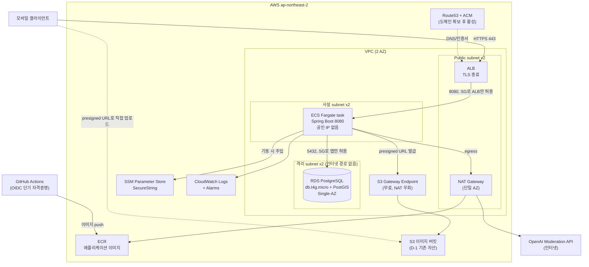

# Infrastructure Design Report: D-2

> Created at: `2026-08-12T10:29:04+09:00`
> GitHub Issue: `#132`
> Status: Design / Plan only — apply disabled
> Design status: `READY_FOR_DESIGN_REVIEW` — 사람이 결정 6건을 확정했다
> (2026-08-12). 선택안은 **Option C**(ECS Fargate + RDS, 사설 서브넷 + NAT
> Gateway), 월 약 125 USD 추정이다. 승인은 별도 절차이며 이 보고서가
> `APPROVED_FOR_BUILD`가 되기 전에는 Terraform 구현을 시작하지 않는다.
>
> **2026-08-12 갱신**: 초판은 필수 입력 미확인으로 `BLOCKED`였다. 사람 결정
> 반영 내역은 §15에 기록한다.

이 보고서는 D-1(GitHub Issue #63, S3 저장소 + Bootstrap)이 만든 기반 위에
MVP 애플리케이션을 실제로 구동할 컴퓨팅·데이터베이스·네트워크·배포·관측
계층을 설계한다.

실제 서버 주소, 계정 ID, IAM ID, 토큰, `.env` 값은 기록하지 않는다.

## 1. Context and constraints

- Product stage: 애플리케이션 코드는 상당 부분 구현되어 있으나(Flyway
  V1~V12, 인증·방향·필터링 도메인) **배포된 AWS 런타임이 없다**. 기존 AWS
  자산은 D-1이 만든 `infra/bootstrap`(Terraform State Backend, GitHub OIDC
  Provider, `infra-plan`/`infra-apply`/`infra-deployer` 역할)과
  `infra/environments/dev/storage`(이미지 버킷, KMS Key, 로그 버킷)뿐이다.
- Expected workload: 구체적 RPS는 여전히 **UNKNOWN**이나, **prod 단일 환경에
  실사용자가 접속**하는 것이 확정되었다(사람 확정 2026-08-12).
- Availability target: 공식 SLA는 없으나 **실사용자 대상 프로덕션**이므로
  best-effort가 아닌 상시 가동을 전제한다. 단일 AZ 구성의 한계는 §8에 기록한다.
- Recovery target: 사람이 수치를 지정하지 않아 §7의 보수적 기본값
  (**RTO 1시간 이내, RPO 5분**)을 설계 기준으로 채택한다. 확정 수치가 아니라
  설계가 제공하는 능력치다.
- Cost ceiling: **CONFIRMED — Option B~C 구간 수용**(사람 확정 2026-08-12).
  상한 금액을 단일 수치로 지정하지는 않았고 아키텍처 선택지로 답했다.
  선택안 Option C의 월 추정은 약 125 USD다(§6.3). D-1의 10 USD 상한은 S3
  저장소 스택 전용이며 이 설계에 적용되지 않는다.
- Region assumption: **CONFIRMED — `ap-northeast-2`(Seoul)**. D-1에서 사람이
  확정했고, `application.properties`의 `qello.media.s3.region`도 같은 값이다.

### 1.1 Intake 상태

| 항목 | 상태 | 근거/가정 |
| --- | --- | --- |
| 대상 환경 | **CONFIRMED** | **prod 단일**, 실사용자 접속 — 사람 확정(2026-08-12). 개발은 로컬 Compose 유지 |
| AWS Region | CONFIRMED | `ap-northeast-2` — D-1에서 사람 확정(2026-08-05), 코드 기본값 일치 |
| 월 예산 상한 | **CONFIRMED** | Option B~C 구간 수용 — 사람 확정(2026-08-12). 선택안 C는 월 약 125 USD |
| 예상 요청량 | UNKNOWN | 동시 사용자·RPS 미확인. §6.2 사용량 가정은 여전히 ASSUMED |
| 예상 동시 사용자 | ASSUMED | 데모 규모로 수십 명 이하 가정. 확정값 아님 |
| 외부 트래픽 | ASSUMED | 모바일 클라이언트의 HTTPS 요청. 이미지는 presigned URL로 S3 직접 접근(앱 대역폭 우회) |
| 저장 용량과 증가율 | ASSUMED | DB 20 GB로 시작 가정. 방향 글·답변 텍스트 위주라 증가 완만, 이미지는 S3 |
| 데이터 민감도 | CONFIRMED | 위치정보(`geography(Point,4326)`), 기기 자격증명, 사용자 생성 콘텐츠 포함. `BACKEND_ROADMAP.md` 5절이 정확 위치·민감 콘텐츠의 로그 기록을 금지 |
| 공개 접근 범위 | ASSUMED | REST API만 인터넷 공개. DB는 비공개 |
| 가용성 목표 | ASSUMED | 실사용자 프로덕션이므로 상시 가동 전제. 공식 SLA 수치는 지정되지 않음 |
| RTO | ASSUMED | 1시간 이내 — 설계가 제공하는 능력치(§7). 사람이 지정한 값 아님 |
| RPO | ASSUMED | 5분(RDS PITR granularity) — 설계 능력치(§7). 사람이 지정한 값 아님 |
| 배포 빈도 | ASSUMED | 잔여 기간(약 2.5주)에 하루 여러 번 가능 — 무중단 롤링 배포 필요성에 영향 |
| 운영 인력 | CONFIRMED | 전담 인프라 인력 없음. 백엔드 2인(`@Byuntil`, `@tkv00`)이 승인·운영 겸임(D-1) |
| 운영 가능 시간 | UNKNOWN | 업무 시간 best-effort 가정 |
| 서비스 예상 수명 | **CONFIRMED** | **2026-08-30 이후에도 계속 운영** — 사람 확정(2026-08-12). 백업 보존·삭제 보호를 프로덕션 수준으로 채택 |
| 기존 AWS 리소스 | CONFIRMED | D-1 산출물만 존재(State Backend, OIDC, S3 3종, KMS Key, IAM 신원) |
| 기존 도메인/인증서 | **CONFIRMED(조건부)** | 도메인 **미보유, 가비아에서 추후 구매 예정** — 사람 확정(2026-08-12). HTTPS는 도메인 확보 전까지 제공 불가(§7.1, RISK) |
| 외부 연동 | CONFIRMED | OpenAI Moderation API(`filtering.moderation.openai`) — **인터넷 egress 필수**. AWS S3(기존 버킷) |
| 법적/보안 제약 | ASSUMED | 명시된 컴플라이언스 요구 없음. 위치정보 취급상 비공개·암호화를 기본값으로 채택 |

### 1.2 코드에서 확인한 런타임 요구사항 (CONFIRMED)

이 값들은 저장소 코드에서 직접 확인했다. `intake.md` 규칙에 따라 승인된
요구사항이 아니라 **구현 사실**로만 취급한다.

| 요구사항 | 근거 | 인프라 영향 |
| --- | --- | --- |
| Java 21 / Spring Boot 3.5.16 단일 모놀리식 | `build.gradle` | 컨테이너 1종. 메모리 최소 1 GB 권장 |
| 컨테이너 이미지 존재, 8080 노출, non-root 실행 | `Dockerfile` | ECS/EC2 어디서든 그대로 사용 가능 |
| **PostgreSQL + PostGIS 확장 필수** | `V1__create_direction_communication_schema.sql:43` `CREATE EXTENSION postgis`, `geography(Point,4326)` | DynamoDB 후보 탈락. RDS PostgreSQL 또는 Aurora PostgreSQL만 가능 |
| Flyway가 **앱 시작 시** 마이그레이션 실행 | `application.properties` `spring.flyway.enabled=true` | 기동 시 DB 연결 필수. 롤링 배포 중 구·신 버전 동시 실행 제약(§8) |
| Hibernate는 스키마 검증만 | `spring.jpa.hibernate.ddl-auto=validate` | 마이그레이션 실패 시 기동 실패 = 안전한 실패 |
| 세션을 DB에 저장(Spring Session JDBC) | `spring.session.store-type=jdbc`, V6 | **sticky session 불필요** — 태스크 수평 확장 가능 |
| OpenAI Moderation API 호출 | `filtering/moderation/openai/*` | **인터넷 egress 필수**. VPC Endpoint로 대체 불가(§2.1) |
| S3 presigned URL 발급 | `software.amazon.awssdk:s3`, `qello.media.*` | 런타임 역할에 D-1 버킷 접근 권한 필요 |
| **health 엔드포인트 없음** | `build.gradle`에 actuator 없음, `/health` 컨트롤러 없음 | ALB/ECS health check 대상 부재. **사람이 actuator 도입을 확정**(2026-08-12)했으나 애플리케이션 변경이라 별도 이슈가 선행되어야 한다(§15-5) |
| OpenAPI UI 비활성 | `springdoc.swagger-ui.enabled=false` | 추가 공개 경로 없음 |

## 2. Proposed baseline

사람이 예산 구간을 **Option B~C**로, 환경을 **prod 단일 실사용자**로,
수명을 **2026-08-30 이후 계속 운영**으로 확정했다(2026-08-12).

**선택안: Option C**(ECS Fargate + RDS, 사설 서브넷 + NAT Gateway) —
월 약 **125.21 USD** 추정(§6.3).

B와 C 중 C를 고른 이유는 다음 세 가지다.

1. 확정된 조건이 **실사용자 프로덕션 + 장기 운영**이다. Option B는 애플리케이션
   태스크에 공인 IP를 부여해 인터넷에서 직접 도달 가능한 ENI를 만든다
   (SEC-B, HIGH). 보안그룹만이 유일한 방어선이며, 이 상태를 몇 달 이상
   유지하는 것은 단기 데모와 위험 성격이 다르다.
2. 이 서비스는 **정확 위치정보**(`geography(Point,4326)`)와 기기 자격증명을
   저장한다. 노출 시 영향이 큰 데이터라 네트워크 경계를 한 겹 더 두는 편이
   합리적이다.
3. 운영 인력이 없다. 보안그룹 오설정 같은 사람 실수를 아키텍처 차원에서
   막아두는 값이 상대적으로 크다.

**비용 차이를 명시한다**: C는 B보다 월 약 44 USD, 연 약 530 USD 비싸다.
이 차액이 부담되면 Option B로 내리는 것은 정당한 판단이며, Terraform에서
`var.app_in_private_subnets` 하나로 전환할 수 있게 설계한다(§9). 다만 그
경우 SEC-B를 만료일·재검토 조건과 함께 승인된 예외로 기록해야 한다.

RDS Multi-AZ(Option D, +20.87 USD)는 사람이 선택 구간에 포함하지 않아
채택하지 않는다. 단일 AZ 장애가 전면 중단으로 이어지는 한계는 §8에 기록하며,
Multi-AZ 전환은 데이터 손실 없는 온라인 변경이므로 이후에 올릴 수 있다.

선택안 구성 요소:

- Network: VPC 1개, 2 AZ. Public subnet ×2(ALB, NAT Gateway),
  사설 subnet ×2(Fargate 태스크), 격리 subnet ×2(RDS 전용, 인터넷 경로 없음).
  NAT Gateway는 **단일 AZ에만** 배치해 고정비를 절반으로 유지한다.
  **S3 Gateway Endpoint**(무료)를 추가해 S3 트래픽을 NAT 데이터 처리 과금에서
  제외한다.
- Application workload: ECS on Fargate, **x86** 0.5 vCPU / 1 GB,
  `desired_count = 1`로 시작. ALB 뒤 사설 subnet에 배치.
- Database: RDS PostgreSQL `db.t4g.micro`, Single-AZ, gp3 20 GB(자동 확장
  상한 지정), PostGIS 확장, 자동 백업 **7일** + PITR, 삭제 보호,
  `rds.force_ssl = 1`.
- Storage: D-1이 만든 기존 S3 이미지 버킷·KMS Key를 재사용한다. 신규 버킷은
  ALB 접근 로그용 1개만 추가한다.
- DNS/TLS: Route53 Hosted Zone + ACM(DNS 검증). **도메인 확보 전까지는
  HTTPS 리스너를 만들 수 없다**(§7.1).
- Observability: CloudWatch Logs(`awslogs` 드라이버, 보존 30일),
  CloudWatch 알람 소수, AWS Budgets 알림.
- Backup: RDS 자동 백업 7일 + PITR. 최종 스냅샷 보존.
- Deployment: GitHub Actions가 OIDC로 ECR에 이미지 push 후 ECS 서비스 갱신.
  Terraform은 인프라를 소유하고 태스크 정의 revision 변경은 무시한다.

### 2.0 이미지 아키텍처: x86 채택 (사람이 판단을 위임)

사람이 "잘 모르겠다"고 답해 오케스트레이터가 **x86**으로 결정했다.

ARM(Graviton)은 Fargate 단가가 약 20% 낮아 월 4.14 USD를 절감한다. 그러나
현재 `Dockerfile`은 빌드 스테이지에서 `./gradlew clean test bootJar`를
실행하는 multi-stage 구조라, `--platform linux/arm64`로 빌드하면 **Gradle
빌드와 테스트 전체가 QEMU 에뮬레이션 위에서 돌아 CI 시간이 크게 늘어난다**.
이를 피하려면 JAR을 러너에서 먼저 빌드하고 런타임 전용 Dockerfile로
분리하거나 ARM 러너를 쓰도록 CI를 재구성해야 한다.

절감액이 선택안 총비용의 약 3.3%인 데 비해 남은 기간(약 2.5주)에 빌드
파이프라인을 건드리는 위험이 커서 채택하지 않는다. ARM 전환은 순수 최적화이며
나중에 태스크 정의의 `runtime_platform`과 이미지 빌드만 바꾸면 되므로 되돌릴
수 없는 결정이 아니다.

### 2.1 NAT Gateway가 선택이 아니라 트레이드오프인 이유

애플리케이션은 OpenAI Moderation API를 호출한다(`OpenAiModerationProviderClient`).
이는 인터넷 대상이므로 **VPC Endpoint로 대체할 수 없다**. 따라서 태스크의
아웃바운드 경로는 두 가지뿐이다.

1. **Option B** — 태스크를 public subnet에 두고 공인 IP를 부여(월 3.65 USD).
   보안그룹으로 인바운드를 ALB에서만 허용한다.
2. **Option C** — 태스크를 사설 subnet에 두고 NAT Gateway 경유(월 43.07 USD
   + 처리량 0.059 USD/GB).

VPC Interface Endpoint(ECR, Logs, SSM)만으로 NAT를 없애는 일반적 절감 기법은
**이 워크로드에서는 성립하지 않는다**. OpenAI 호출이 남기 때문이다. 이 사실이
두 안의 월 40 USD 차이를 만든다.

## 3. Architecture diagram

선택안 Option C 기준이다.



## 4. Alternatives

### 4.1 컴퓨팅

| 후보 | 월 비용(0.5 vCPU/1 GB 상당) | 운영 부담 | 판정 | 사유 |
| --- | --- | --- | --- | --- |
| **ECS on Fargate (ARM)** | 16.58 USD | 낮음 — 서버 패치 없음, 롤링 배포·헬스체크 내장, 태스크 역할로 IAM 분리 | **권고(Option B~D)** | 운영 인력이 없는 조건에 가장 부합. Terraform 성숙도 높음 |
| 단일 EC2 (t4g.small) | 15.18 USD | 높음 — OS 패치, Docker 운영, 배포 스크립트, 단일 장애점 | 조건부(Option A) | 예산 30 USD 이하에서만. 비용 차이는 작은데 운영 부담이 크다 |
| ECS on EC2 | 15.18 USD + 클러스터 관리 | 중간~높음 | 탈락 | Fargate 대비 절감폭이 작고 EC2 운영 부담이 그대로 남는다 |
| App Runner | 25 USD 이상 + VPC Connector | 매우 낮음 | 탈락 | 사설 RDS 접근에 VPC Connector가 추가로 필요해 비용 이점이 사라진다. Terraform 생태계도 상대적으로 얕다 |
| Lambda | 사용량 기반 | 낮음 | 탈락 | JVM 콜드 스타트, DB 커넥션 풀 부적합. 커넥션 폭주를 막으려면 RDS Proxy가 추가로 필요하다 |
| EKS | 컨트롤플레인만 월 73 USD | 매우 높음 | 탈락 | 단일 모놀리식 서비스에 과잉. 예산 전체를 컨트롤플레인이 소진한다 |

ARM(Graviton) 선택 근거: Fargate ARM 단가가 x86 대비 약 20% 낮고
(vCPU 0.03725 vs 0.04656), `Dockerfile`의 `eclipse-temurin:21-jre-alpine`은
multi-arch 이미지라 코드 변경 없이 `linux/arm64` 빌드가 가능하다. 단, 빌드
워크플로에서 대상 플랫폼을 명시해야 한다(§15-6).

> 참고: `README.md`가 기록한 amd64 전용 제약은 **로컬/테스트용 PostGIS 이미지**
> (`postgis/postgis:16-3.5-alpine`)에 대한 것이며 애플리케이션 이미지와 무관하다.
> AWS에서는 PostGIS를 RDS 관리형 확장으로 사용하므로 이 제약이 따라오지 않는다.

### 4.2 데이터베이스

| 후보 | 월 비용 | 운영 부담 | 판정 | 사유 |
| --- | --- | --- | --- | --- |
| **RDS PostgreSQL `db.t4g.micro` Single-AZ** | 18.25 + 스토리지 2.62 = 20.87 USD | 낮음 — 자동 백업·PITR·마이너 패치 | **권고** | PostGIS 확장 지원. 백업·복구를 AWS에 이관해 운영 인력 부재를 보완 |
| RDS PostgreSQL Multi-AZ | 41.74 USD | 낮음 | 조건부(Option D) | AZ 장애 시 자동 페일오버. 예산 140 USD 이상에서만 |
| 자체 운영 PostgreSQL+PostGIS (EC2 동거) | 0 USD 추가 | 높음 — 백업·복구·패치를 직접 수행 | 조건부(Option A) | 예산 30 USD 이하에서만. 위치정보·사용자 콘텐츠를 담기에 복구 보장이 약하다 |
| Aurora Serverless v2 | 최소 ACU 기준 44 USD 이상 | 낮음 | 탈락 | PostGIS는 지원하나 최소 용량 과금이 `db.t4g.micro`보다 비싸다. 0 ACU 축소는 재개 지연을 유발해 데모에 부적합 |
| Aurora PostgreSQL (프로비저닝) | 최소 인스턴스도 t4g.micro보다 고가 | 낮음 | 탈락 | MVP 규모에서 비용 대비 이점 없음 |
| DynamoDB | 사용량 기반 | 낮음 | **탈락(요구사항 불충족)** | PostGIS 공간 질의와 관계형 스키마(마이그레이션 12개, JPA)를 대체할 수 없다 |

### 4.3 네트워크 egress

| 후보 | 월 비용 | 판정 | 사유 |
| --- | --- | --- | --- |
| **Public subnet 태스크 + 공인 IP** | 3.65 USD | 권고(Option B) | SG로 인바운드를 ALB에서만 허용. 보안 트레이드오프는 SEC-B에 기록 |
| NAT Gateway | 43.07 USD + 0.059/GB | 조건부(Option C) | 태스크를 사설 subnet에 둘 수 있어 보안 경계가 명확하다. 예산이 허용되면 우선 |
| VPC Endpoint만 사용(NAT 없음) | 인터페이스당 약 9.2 USD | **탈락(요구사항 불충족)** | OpenAI는 인터넷 대상이라 Endpoint로 도달할 수 없다(§2.1) |

### 4.4 비밀 관리

| 후보 | 월 비용 | 판정 | 사유 |
| --- | --- | --- | --- |
| **SSM Parameter Store SecureString(Standard)** | 0 USD | 권고 | 표준 파라미터는 무료. ECS `secrets`로 직접 주입 가능 |
| Secrets Manager | 비밀당 0.40 USD | 조건부 | RDS 마스터 암호 자동 관리(`manage_master_user_password`)를 쓰면 State 평문 노출을 피할 수 있어 이 용도로는 유리(SEC-C) |

## 5. Security and IAM

- GitHub OIDC trust boundary: D-1이 만든 Provider와 `infra-plan`/`infra-apply`
  역할을 **그대로 재사용**한다. 신뢰 정책(`sub` claim 제한)은 변경하지 않는다.
- Runtime role(신규, ECS **task role**): 애플리케이션이 사용한다.
  - D-1 이미지 버킷 ARN으로 한정한 `s3:GetObject`, `s3:PutObject`,
    `s3:DeleteObject`, `s3:ListBucket`
  - D-1 KMS Key ARN으로 한정한 `kms:Decrypt`, `kms:GenerateDataKey*`
  - 그 외 권한 없음. RDS 접근은 IAM이 아니라 네트워크 경계와 DB 자격증명으로 통제
- Task execution role(신규): ECS 에이전트가 사용한다. ECR pull, CloudWatch
  Logs 쓰기, 이 스택의 SSM 파라미터 경로로 한정한 `ssm:GetParameters`만 허용.
- Deployment role: 기존 `infra-apply` 역할에 **권한 확대가 필요하다**(§5.1).
- Least-privilege actions: 리소스를 `${project_prefix}-*` 접두사와 태그
  (`Project=qello`)로 한정하는 기존 패턴을 유지한다.
- Encryption: RDS 저장 암호화(KMS), ALB TLS 종료(ACM), S3는 D-1의 SSE-KMS를
  승계. DB 연결은 `sslmode=require` 이상을 강제한다.
- Network restrictions: RDS `publicly_accessible = false`, 격리 subnet 배치.
  보안그룹은 계층 간 참조로만 연결하고 `0.0.0.0/0` 인바운드는 ALB의 443에만
  허용한다.
- Audit logging: ALB 접근 로그를 전용 S3 버킷에 저장한다. 애플리케이션 로그는
  CloudWatch Logs.

### 5.1 `infra-apply` 권한 확대 (고위험 변경)

현재 `infra/bootstrap/oidc.tf`의 `infra-apply` 정책은 **S3·KMS·IAM만** 허용한다.
이 설계의 리소스를 만들려면 다음 서비스 권한이 추가로 필요하다.

| 서비스 | 필요 이유 |
| --- | --- |
| `ec2:*`(VPC 범위) | VPC, Subnet, Route Table, IGW, Security Group |
| `ecs:*` | 클러스터, 서비스, 태스크 정의 |
| `elasticloadbalancing:*` | ALB, Target Group, Listener |
| `rds:*` | DB 인스턴스, Subnet Group, Parameter Group |
| `ecr:*` | 이미지 리포지토리 |
| `logs:*` | 로그 그룹 |
| `ssm:*`(경로 한정) | 파라미터 |
| `cloudwatch:*` | 알람 |
| `iam:PassRole` | ECS에 태스크 역할·실행 역할 전달 |
| `acm:*`, `route53:*` | 도메인 확정 시에만(§15-3) |

`iam:PassRole`은 권한 상승 경로이므로 **반드시 조건을 건다**.

```hcl
condition {
  test     = "StringEquals"
  variable = "iam:PassedToService"
  values   = ["ecs-tasks.amazonaws.com"]
}
```

`ec2:*`는 리소스 수준 제한이 어려운 action(예: `ec2:DescribeVpcs`)이 많아
접두사만으로 좁힐 수 없다. 태그 조건과 action 화이트리스트를 병행하고,
기존 `DenyLongLivedCredentials` Deny statement는 유지한다.

`infra-plan` 역할에도 대응하는 **읽기 전용** action을 추가해야 PR에서
`terraform plan`이 동작한다.

### 5.2 보안 검토 결과 (독립 검토)

| id | severity | category | evidence | risk | required_change | exception_allowed |
| --- | --- | --- | --- | --- | --- | --- |
| SEC-A | **HIGH** | IAM | §5.1의 `infra-apply` 확대에 `iam:PassRole` 포함 | 조건 없는 `PassRole`은 임의 역할을 ECS에 전달해 권한을 상승시킬 수 있다 | `iam:PassedToService = ecs-tasks.amazonaws.com` 조건 필수. 대상 역할도 `${project_prefix}-*`로 한정 | 아니오 |
| SEC-B | **HIGH → 완화됨** | Network | Option B는 Fargate 태스크에 공인 IP를 부여한다 | 태스크 ENI가 인터넷에서 직접 도달 가능해지고, SG 오설정 시 8080이 노출된다 | **Option C 채택으로 해소** — 태스크를 사설 서브넷에 배치해 공인 IP를 부여하지 않는다(2026-08-12). 인바운드는 ALB 보안그룹 참조만 허용하고 CIDR 규칙을 두지 않는다 | `app_in_private_subnets = false`로 되돌리는 경우에만 예외로 취급하며, 그때는 소유자·보완 통제·만료일·추적 이슈를 기록해야 한다 |
| SEC-C | **HIGH** | Data protection | Terraform이 RDS 마스터 암호를 생성하면 State에 평문으로 남는다 | State 접근자가 DB 자격증명을 획득한다. `AGENTS.md` 4.6은 State를 민감정보로 규정 | `manage_master_user_password = true`(Secrets Manager 관리)를 사용하거나, 사람이 사전 등록한 SSM SecureString을 data source로 참조한다. **암호를 변수 기본값이나 코드에 쓰지 않는다** | 아니오 |
| SEC-D | MEDIUM | Secret 관리 | OpenAI API Key가 필요하다 | Terraform 변수로 받으면 State와 plan에 남는다 | 사람이 콘솔/CLI로 SSM SecureString에 사전 등록하고, Terraform은 파라미터 **이름만** 참조한다. 값은 소유하지 않는다 | 아니오 |
| SEC-E | MEDIUM | Operations | ALB 접근 로그 미구성 시 요청 수준 감사가 불가능 | 장애·오남용 분석 근거가 없다 | ALB 접근 로그를 전용 S3 버킷에 저장한다. D-1의 `s3-private-bucket` 모듈을 재사용한다 | 아니오 |
| SEC-F | MEDIUM | Data protection | 위치정보(`geography(Point,4326)`)와 기기 자격증명을 다룬다 | CloudWatch Logs에 정확 위치나 토큰이 유입되면 `BACKEND_ROADMAP.md` 5절 위반 | 로그 보존 기간을 명시(30일)하고, 로그 그룹을 KMS로 암호화한다. 애플리케이션 로그 마스킹은 별도 이슈로 추적 | 아니오 |
| SEC-G | **HIGH** | Operations | 애플리케이션에 health 엔드포인트가 없다(§1.2) | health check를 `matcher = "200-499"` 같은 느슨한 설정으로 우회하면 기동 실패한 태스크가 정상으로 판정되어 장애가 은폐된다 | actuator 도입 후 `/actuator/health`를 대상으로 한다. 도입 전에는 이 설계를 빌드하지 않는다(§15-5) | 아니오 |
| SEC-H | MEDIUM | Terraform | RDS는 교체·삭제 시 데이터 손실이 발생한다 | 실수로 인한 `destroy`가 운영 데이터를 삭제 | `deletion_protection = true`, `skip_final_snapshot = false`, `lifecycle { prevent_destroy = true }` | 아니오 |
| SEC-I | LOW | Network | RDS 연결이 평문일 수 있다 | 동일 VPC 내 트래픽이라도 전송 암호화가 없으면 감사 기준 미달 | `rds.force_ssl = 1` 파라미터 그룹으로 TLS를 강제하고 JDBC URL에 `sslmode=require`를 적용 | 아니오 |
| SEC-J | INFO | Operations | CloudTrail Trail이 여전히 없다(D-1에서 범위 밖) | 계정 수준 API 감사가 불가능 | 별도 이슈로 분리. 이 설계에서 신설하지 않는다 | 예 — 추적 이슈 필요 |

## 6. One-month cost estimate

### 6.1 확보한 공식 단가

출처: **AWS Price List API**(`pricing.us-east-1.amazonaws.com`),
리전 `ap-northeast-2`, **조회일 2026-08-12**.
AmazonEC2 오퍼 버전 `20260810215758`.

| 항목 | 단가 | 오퍼 파일 |
| --- | --- | --- |
| EC2 `t4g.small` Linux 온디맨드 | 0.0208 USD / hr | AmazonEC2 |
| EBS gp3 | 0.0912 USD / GB-월 | AmazonEC2 |
| 공인 IPv4 (사용 중) | 0.005 USD / hr | AmazonVPC |
| NAT Gateway 시간 | 0.059 USD / hr | AmazonEC2 |
| NAT Gateway 데이터 처리 | 0.059 USD / GB | AmazonEC2 |
| Fargate vCPU (x86) | 0.04656 USD / vCPU-hr | AmazonECS |
| Fargate 메모리 (x86) | 0.00511 USD / GB-hr | AmazonECS |
| **Fargate vCPU (ARM)** | **0.03725 USD / vCPU-hr** | AmazonECS |
| **Fargate 메모리 (ARM)** | **0.00409 USD / GB-hr** | AmazonECS |
| ALB 시간 | 0.0225 USD / hr | AWSELB |
| ALB LCU | 0.008 USD / LCU-hr | AWSELB |
| RDS `db.t4g.micro` PostgreSQL Single-AZ | 0.025 USD / hr | AmazonRDS |
| RDS gp3 스토리지 (PostgreSQL) | 0.131 USD / GB-월 | AmazonRDS |
| CloudWatch Logs 수집 (Standard) | 0.76 USD / GB | AmazonCloudWatch |
| CloudWatch Logs 저장 | 0.0314 USD / GB-월 | AmazonCloudWatch |
| ECR 스토리지 | 0.10 USD / GB-월 | AmazonECR |
| S3 Standard 스토리지 | 0.025 USD / GB-월 | D-1 §17 (2026-08-05) |
| 데이터 전송 아웃 (최초 10TB) | 0.126 USD / GB | D-1 §17 (2026-08-05) |
| KMS Customer-managed Key | 1.00 USD / key-월 | D-1 §17 (2026-08-05) |

월 시간은 730시간으로 계산한다.

### 6.2 사용량 가정 (모두 `ASSUMED`)

| 항목 | 가정 |
| --- | --- |
| 태스크 사양 | **x86** 0.5 vCPU / 1 GB, `desired_count = 1` 상시(§2.0) |
| RDS 스토리지 | gp3 20 GB |
| ALB LCU | 1 LCU(보수적 상한. 실제 저트래픽에서는 미만) |
| NAT Gateway | **단일 AZ 1개**. 데이터 처리 월 20 GB(S3 트래픽은 Gateway Endpoint로 제외) |
| ECR 저장 | 2 GB |
| CloudWatch Logs | 월 3 GB 수집, 보존 30일 |
| 데이터 전송 아웃 | 월 10 GB |
| Route53 | Hosted Zone 1개(도메인 확보 후) |
| 기존 D-1 S3+KMS 스택 | 월 1.82 USD(D-1 §17 기준 시나리오) |

### 6.3 Option별 월 추정

**Option A — 단일 EC2 all-in-one (약 24.81 USD)**

| Resource | Formula | Monthly |
| --- | --- | --- |
| EC2 t4g.small | 0.0208 × 730 | 15.18 |
| EBS gp3 30 GB | 30 × 0.0912 | 2.74 |
| 공인 IPv4 ×1 | 0.005 × 730 | 3.65 |
| CloudWatch Logs 1 GB | 1 × 0.76 + 저장 | 0.79 |
| 데이터 전송 아웃 5 GB | 5 × 0.126 | 0.63 |
| 기존 S3 + KMS | D-1 §17 | 1.82 |
| **합계** | | **24.81 USD** |

**Option C — Fargate + RDS, 사설 서브넷 + NAT (약 125.21 USD) — 선택안**

| Resource | Formula | Monthly |
| --- | --- | --- |
| Fargate x86 0.5 vCPU / 1 GB | (0.5×0.04656 + 1×0.00511) × 730 | 20.72 |
| ALB 시간 | 0.0225 × 730 | 16.43 |
| ALB LCU 1개 | 0.008 × 730 | 5.84 |
| ALB 공인 IPv4 ×2 (AZ 2개) | 2 × 0.005 × 730 | 7.30 |
| NAT Gateway 시간 (단일 AZ) | 0.059 × 730 | 43.07 |
| NAT Gateway 공인 IPv4 ×1 | 0.005 × 730 | 3.65 |
| NAT 데이터 처리 20 GB | 20 × 0.059 | 1.18 |
| RDS db.t4g.micro Single-AZ | 0.025 × 730 | 18.25 |
| RDS gp3 20 GB | 20 × 0.131 | 2.62 |
| ECR 2 GB | 2 × 0.10 | 0.20 |
| CloudWatch Logs 3 GB | 3 × 0.76 + 저장 | 2.37 |
| 데이터 전송 아웃 10 GB | 10 × 0.126 | 1.26 |
| Route53 Hosted Zone | 0.50 × 1 | 0.50 |
| 기존 S3 + KMS | D-1 §17 | 1.82 |
| **합계** | | **125.21 USD** |

S3 Gateway Endpoint는 요금이 없어 표에 나타나지 않지만, 애플리케이션의 S3
트래픽을 NAT 데이터 처리 과금에서 제외시킨다.

**Option B — 위에서 NAT를 빼고 태스크에 공인 IP (약 80.96 USD)**

NAT 3개 항목(−47.90)을 제거하고 태스크 공인 IPv4(+3.65)를 더한다:
125.21 − 47.90 + 3.65 = **80.96 USD**. 월 약 44 USD, 연 약 530 USD 저렴하지만
SEC-B를 승인된 예외로 남겨야 한다(§2).

**Option A — 단일 EC2 all-in-one (약 24.81 USD)**

위 표 참고. ALB가 없어 ACM 인증서를 붙일 수 없고 자체 운영 DB의 백업 보장이
약해, 확정된 조건(실사용자 프로덕션 + 장기 운영)에는 적합하지 않다.

**Option D — Option C + RDS Multi-AZ (약 146.08 USD)**

RDS 인스턴스·스토리지가 2배가 된다: 125.21 + 18.25 + 2.62 = **146.08 USD**.
사람이 선택 구간에 포함하지 않아 채택하지 않는다.

### 6.4 민감도 분석

| 시나리오 | 선택안(Option C) 증가분 | 증가 후 합계 |
| --- | --- | --- |
| 트래픽 2배 (전송 20 GB, LCU 2, NAT 40 GB) | +8.28 USD | 133.49 USD |
| 저장량 3배 (RDS 60 GB) | +5.24 USD | 130.45 USD |
| 로그량 3배 (9 GB 수집) | +4.65 USD | 129.86 USD |
| **태스크 2개(무중단 배포)** | **+20.72 USD** | **145.93 USD** |
| RDS Multi-AZ 전환 | +20.87 USD | 146.08 USD |

사설 서브넷 구성에서는 태스크를 늘려도 공인 IPv4 비용이 붙지 않아, 무중단
배포로 올리는 비용이 Option B보다 저렴하다(+20.72 vs +24.37).

### 6.5 비용 증가 요인

- **NAT Gateway(43.07 USD)** 가 단일 최대 항목이다. 채택 여부가 Option B/C를
  가른다.
- **ALB 고정비(16.43 + IPv4 7.30 = 23.73 USD)** 는 트래픽과 무관하게 발생한다.
  Option A가 저렴한 주된 이유는 ALB를 쓰지 않기 때문이다.
- **CloudWatch Logs 수집 0.76 USD/GB** 는 단가가 높다. DEBUG 로그를 켜두면
  빠르게 증가하므로 보존 기간과 로그 레벨을 함께 통제해야 한다.
- 공인 IPv4는 2024년부터 전면 과금된다. ALB·NAT·태스크마다 누적된다.
- 위 수치는 **추정치이며 실제 청구액이 아니다**. 세금, 환율, 프리 티어,
  할인 플랜은 반영하지 않았다. 사용량 가정이 바뀌면 결과도 바뀐다.
- D-1 §7 권고에 따라 **AWS Budgets 알림**을 함께 구성해 가정 이탈을 조기에
  탐지한다. 임계값은 §15-1의 예산 확정 후 정한다.

## 7. Operational concerns

- Monitoring and alerting: CloudWatch 알람 최소 구성 — ECS 실행 태스크 수 0,
  ALB 5xx 급증, ALB 대상 비정상, RDS CPU/스토리지/연결 수, AWS Budgets 임계값.
  알람 10개까지는 프리 티어 범위다.
- Backup/restore drill: RDS 자동 백업 7일 + PITR을 활성화한다. **복구 훈련을
  Week 8 안정화 기간에 1회 수행할 것을 권고한다** — 복구 절차를 문서만으로
  두면 실제 장애에서 RTO를 지킬 수 없다.
- Capacity: `db.t4g.micro`는 버스터블이다. CPU 크레딧 소진 시 성능이 급락하므로
  알람을 건다. 스토리지 자동 확장 상한을 설정한다.
- Patching: RDS 마이너 버전 자동 업그레이드를 켜고 유지보수 창을 트래픽이 적은
  시간대로 지정한다. Fargate는 플랫폼 버전을 AWS가 관리한다.
- Certificate/domain: §7.1 참고. 도메인은 가비아에서 추후 구매 예정이다.
- Incident ownership: `@Byuntil`, `@tkv00`.
- RTO/RPO 보수적 기본값(제안, 확정 아님): Single-AZ RDS 기준 **RTO 1시간
  이내**(스냅샷/PITR 복구 + 태스크 재기동), **RPO 5분**(PITR granularity).
  Multi-AZ(Option D)는 RTO를 수 분으로 줄인다.

### 7.1 도메인과 HTTPS — 릴리스 차단 항목

사람이 **도메인 미보유, 가비아에서 추후 구매**로 확정했다(2026-08-12).
이 사실은 단순한 미결정이 아니라 **릴리스 순서를 결정하는 제약**이다.

- ALB의 기본 DNS 이름(`*.elb.amazonaws.com`)에는 **ACM 인증서를 붙일 수 없다.**
  따라서 도메인 확보 전에는 HTTPS 리스너를 만들 수 없고 HTTP만 제공된다.
- 이 애플리케이션은 기기 자격증명과 세션을 다룬다(`spring-session-jdbc`,
  `DeviceAuthApiSpec`). **HTTP로 실사용자를 받으면 자격증명이 평문으로 전송된다.**
  따라서 도메인 확보와 HTTPS 활성화는 **실사용자 공개 전 필수 선행 조건**이다.

권고 순서:

1. Terraform은 `var.domain_name`을 받아 값이 비어 있으면 HTTP 리스너만,
   값이 있으면 ACM 인증서 + HTTPS 리스너 + HTTP→HTTPS 리다이렉트를 만든다.
   도메인 없이도 인프라를 먼저 세워 내부 검증을 진행할 수 있다.
2. 가비아에서 도메인을 구매한다.
3. **Route53 Hosted Zone을 만들고 가비아에서 네임서버를 위임한다**(월 0.50 USD).
   ACM DNS 검증과 ALB Alias 레코드를 자동화할 수 있고, apex 도메인도
   Alias로 지원된다.
   - 대안: DNS를 가비아에 두고 ACM 검증 CNAME을 수동 등록한다. 비용은 0이지만
     수동 작업이 남고 apex 도메인에 Alias를 쓸 수 없어 서브도메인
     (`api.<domain>`)만 사용할 수 있다.
4. `var.domain_name`을 채워 재적용하면 HTTPS가 활성화된다.

Route53 위임 방식을 기본값으로 채택한다. 비용이 미미하고 인증서 갱신 검증이
자동화되어 운영 인력이 없는 조건에 유리하다.

## 8. Risks and mitigations

| Risk | Trigger | Impact | Mitigation | Recovery |
| --- | --- | --- | --- | --- |
| health 엔드포인트 부재로 배포 불가 | ALB target group이 health check 대상을 찾지 못함 | 태스크가 계속 비정상 판정되어 서비스가 뜨지 않는다 | actuator 도입을 빌드 선행 조건으로 지정(§15-5) | 애플리케이션 변경 후 재배포 |
| Flyway 마이그레이션과 롤링 배포 충돌 | `desired_count ≥ 2`에서 구·신 버전이 동시 실행 | 하위 호환되지 않는 마이그레이션이 구버전 태스크를 깨뜨린다 | 마이그레이션을 하위 호환으로 작성한다. 또는 `desired_count = 1` + `minimumHealthyPercent = 0`으로 순차 교체(짧은 다운타임 수용) | 이전 태스크 정의 revision으로 롤백 후 마이그레이션 보정 |
| 마이그레이션 실패로 기동 실패 | 잘못된 SQL, 스키마 검증 실패 | 새 태스크가 health check를 통과하지 못한다 | ECS 배포 서킷 브레이커를 켜 자동 롤백 | 이전 revision 자동 복귀 — 안전한 실패 |
| `infra-apply` 권한 확대 오설정 | §5.1 정책이 과도하게 넓게 작성됨 | CI가 계정 전반을 변경할 수 있다(SEC-A) | `PassRole` 조건, 태그·접두사 한정, `terraform-plan-verifier` 검증 | 정책 수정 후 재적용(사람 승인) |
| RDS 자격증명이 State에 평문 노출 | Terraform이 암호를 생성 | State 접근자가 DB에 접근(SEC-C) | Secrets Manager 관리 암호 또는 사전 등록 SSM 참조 | 암호 교체 + State 접근 감사 |
| 공인 IP 태스크의 SG 오설정 | 인바운드 규칙에 CIDR 허용이 섞임 | 8080이 인터넷에 직접 노출(SEC-B) | SG 참조 기반 규칙만 사용. Checkov로 회귀 검사 | SG 수정 후 재적용 |
| 단일 AZ RDS 장애 | AZ 장애 | 서비스 전면 중단. 복구까지 수십 분 | 예산 허용 시 Option D. 아니면 백업으로 다른 AZ에 복원 | 최신 스냅샷/PITR로 복원 |
| CPU 크레딧 소진 | 데모 중 트래픽 집중 | 응답 지연 급증 | CPU 크레딧 알람. 필요 시 인스턴스 등급 상향 | 인스턴스 클래스 변경(짧은 재시작) |
| 비용 초과 | NAT·로그·전송량 가정 이탈 | 예산 상한 초과 | AWS Budgets 알림, 로그 보존 30일 | 로그 레벨·보존 축소, 태스크 수 축소 |
| OpenAI egress 차단 | 라우팅·SG 오설정 | moderation이 fail-closed로 동작해 닉네임·답변 전체가 거부됨 | 배포 후 egress 연결성 검증을 릴리스 체크리스트에 포함 | 라우팅 수정 후 재배포 |
| **HTTP 상태로 실사용자 공개** | 도메인 구매 전에 서비스를 열람 가능하게 공개 | 기기 자격증명·세션이 평문 전송되어 탈취 가능 | 도메인 확보와 HTTPS 활성화를 실사용자 공개의 선행 조건으로 못박는다(§7.1). 그 전에는 접근을 내부로 제한 | HTTPS 활성화 후 노출된 자격증명 폐기·재발급 |
| 단일 NAT Gateway AZ 장애 | NAT가 배치된 AZ 장애 | 모든 태스크의 인터넷 egress 중단 → moderation fail-closed로 기능 정지 | 고정비 절감을 위한 의도된 트레이드오프. AZ별 NAT는 월 +46.72 USD | AZ별 NAT 추가 또는 다른 AZ로 재배치 후 재적용 |
| 장기 운영 중 비용 누적 | 2026-08-30 이후 계속 운영 | 월 125 USD가 무기한 발생(연 약 1,500 USD) | AWS Budgets 알림 필수. 트래픽이 낮게 유지되면 태스크·인스턴스 등급 하향 검토 | 사용량 재평가 후 리소스 축소 |

### 8.1 변경 위험도

```text
risk_level: HIGH
risk_reasons:
  - 기존 infra-apply IAM 역할의 권한 확대(iam:PassRole 포함)
  - 상태를 가진 신규 데이터베이스 도입(RDS)
  - 인터넷에 공개되는 신규 진입점(ALB) 생성
  - Option B 채택 시 공인 IP를 가진 컴퓨팅 리소스 배치
affected_resources: VPC/Subnet/SG/IGW, ALB, Target Group, ECS Cluster/Service/TaskDefinition, RDS Instance/SubnetGroup/ParameterGroup, ECR, CloudWatch Logs/Alarms, SSM Parameters, IAM Role 3종(신규 2 + 기존 1 수정), S3 ALB 로그 버킷
possible_data_loss: 신규 생성이므로 초기 적용에서는 없음. 이후 RDS 교체를 유발하는 변경(엔진 버전, 스토리지 타입, 식별자)은 데이터 손실 위험이 있어 prevent_destroy로 차단
downtime: 초기 생성에는 없음. 이후 배포는 desired_count 설정에 따라 0~수십 초
rollback_available: 예 — 신규 스택은 destroy 가능(사람 승인 필요). RDS는 삭제 보호와 최종 스냅샷으로 보호
recovery_procedure: §7의 RDS PITR/스냅샷 복구 + 이전 태스크 정의 revision 복귀
required_approvals: "@Byuntil", "@tkv00", GitHub infrastructure-apply Environment
required_tests: terraform fmt/validate, tflint, Checkov, terraform plan 사람 검토
```

HIGH 등급이므로 롤백/복구 절차 확인 없이 승인 가능 상태로 취급하지 않는다.

## 9. IaC plan

- IaC choice: **Terraform** (ADR-0004, `AGENTS.md` 4.1)
- Module/stack boundaries: 상태 수명이 다른 두 계층으로 분리한다.

```text
infra/environments/prod/platform/    VPC, Subnet, NAT, S3 Gateway Endpoint,
                                     SG, RDS, ECR, Route53 Zone,
                                     SSM 파라미터 참조, ALB 로그 버킷
                                     (안정적. RDS에 prevent_destroy)
infra/environments/prod/service/     ALB, ACM, Target Group, Listener, ECS
                                     Cluster/Service/TaskDefinition,
                                     CloudWatch Logs/Alarms
                                     (자주 변경)
infra/modules/                       필요 시 재사용 모듈 추가
infra/bootstrap/                     기존. infra-apply/plan 정책만 수정(§5.1)
```

환경은 `prod` 하나만 만든다(사람 확정). 개발은 로컬 Compose를 유지한다.

주요 변수(값은 CI·`terraform.tfvars`로 주입하며 이 문서에 기록하지 않는다):

| 변수 | 목적 |
| --- | --- |
| `domain_name` | 비어 있으면 HTTP 리스너만, 값이 있으면 ACM + HTTPS 활성화(§7.1) |
| `app_in_private_subnets` | `true`(기본, Option C) / `false`(Option B, NAT 제거·공인 IP 부여) |
| `desired_count` | 태스크 수. 초기 1, 무중단 배포 필요 시 2 |
| `db_backup_retention_days` | RDS 자동 백업 보존. 프로덕션 최소 7 |

분리 이유: 애플리케이션 런타임 변경이 데이터베이스와 같은 plan에 들어가지
않게 해 blast radius를 줄인다. `service`는 `terraform_remote_state`로
`platform`의 출력(VPC ID, subnet ID, SG ID)을 읽는다.

- State storage: D-1이 만든 기존 S3 State Backend를 재사용하고 root마다 별도
  key를 쓴다. 버킷 이름은 변수/CI로 주입하며 이 문서에 기록하지 않는다.
- Locking: Terraform 네이티브 S3 Lockfile(`use_lockfile = true`). D-1과 동일.
- Plan command: `terraform -chdir=<root> init` → `terraform -chdir=<root> plan
  -lock-timeout=5m -out=tfplan`. 이 세션에서는 실행하지 않는다.
- Drift detection: 별도 스케줄 없음. 배포 주체가 태스크 정의 revision을
  갱신하므로 다음 예외를 둔다.

```hcl
lifecycle {
  # 배포 workflow가 Task Definition revision을 갱신한다.
  # 배포 주체가 Terraform으로 전환되면 이 예외를 제거한다.
  ignore_changes = [task_definition]
}
```

- 배포 workflow(신규, 이 설계의 산출물이 아니라 후속 이슈): GitHub Actions가
  OIDC로 ECR에 push하고 ECS 서비스를 갱신한다. 인프라 리소스를 CLI로
  생성·변경하지 않으므로 `AGENTS.md` 4.1과 충돌하지 않는다.

## 10. Apply gate

- [ ] 설계와 IaC가 PR에서 검토됨
- [ ] `@Byuntil` 승인
- [ ] `@tkv00` 승인
- [ ] GitHub `infrastructure-apply` Environment 보호 설정
- [ ] AWS OIDC 단기 권한 사용
- [ ] 사람의 명시적 workflow dispatch 확인
- [ ] 롤백/복구 절차 확인
- [x] **§15의 결정 6건 확정** — 사람 확정(2026-08-12)
- [ ] `infra-apply` 권한 확대 정책을 별도로 리뷰(SEC-A)
- [ ] actuator 도입 이슈 완료(SEC-G, §15.1-1) — health check 구성의 선행 조건
- [ ] 실사용자 공개 전 도메인 확보와 HTTPS 활성화(§7.1)

두 승인과 사람 확인 전에는 apply/deploy하지 않는다.

## 11. Decision

- Recommendation: **Option C** — ECS on Fargate(x86, 0.5 vCPU/1 GB, 사설
  서브넷) + ALB + RDS PostgreSQL `db.t4g.micro` Single-AZ + 단일 AZ NAT
  Gateway + S3 Gateway Endpoint, `prod` 단일 환경. 월 약 **125.21 USD** 추정.
  사람이 확정한 조건(prod 실사용자, 2026-08-30 이후 장기 운영, 예산 B~C
  구간)에 맞춰 보안 경계를 우선했다.
- 오케스트레이터가 위임받아 결정한 항목: 이미지 아키텍처 **x86**(§2.0),
  B와 C 중 **C**(§2), DNS는 **Route53 위임**(§7.1). 모두 근거와 되돌리는
  방법을 함께 기록했다.
- Deferred alternatives: Aurora Serverless v2, EKS, App Runner, Lambda,
  CloudFront 연동, CloudTrail Trail 신설, RDS Multi-AZ(월 +20.87 USD),
  ARM/Graviton 전환(월 −4.14 USD), IAM Identity Center.
- Reviewer comments: (설계 검토 대기)

## 12. Failure modes

- **ALB health check 실패** → 태스크가 대상 그룹에 등록되지 않아 502가 반환된다.
  현재 health 엔드포인트가 없어 이 실패가 기본 상태다(SEC-G).
- **Flyway 마이그레이션 실패** → 앱 기동 실패 → health check 실패 → ECS 서킷
  브레이커가 이전 revision으로 롤백한다. 조용히 넘어가지 않는 안전한 실패다.
- **RDS 연결 실패**(SG·subnet 오설정) → 기동 실패. 위와 동일하게 롤백된다.
- **OpenAI egress 차단** → moderation이 timeout/error → `#103`~`#106`의
  fail-closed 정책에 따라 닉네임 설정과 답변 작성이 전면 거부된다. 인프라
  오설정이 제품 기능 전체를 막는 경로이므로 배포 후 검증이 필수다.
- **NAT/공인 IP 미할당** → ECR pull 실패로 태스크가 시작되지 않는다.
- **State lock 획득 실패** → apply 중단. 부분 반영 가능성이 있어 재적용 전
  사람이 실제 리소스를 확인해야 한다.
- **CPU 크레딧 소진** → 응답 지연. 실패가 아니라 성능 저하로 나타나 탐지가
  늦을 수 있으므로 알람이 필요하다.

## 13. Terraform ownership

```text
infra/environments/<env>/platform/**   (신규)
infra/environments/<env>/service/**    (신규)
infra/modules/**                       (신규 모듈 추가 가능)
infra/bootstrap/oidc.tf                (기존 파일 수정 — infra-apply/plan 권한 확대)
docs/reports/infrastructure/gh-132-D-2.md
```

`infra/environments/dev/storage/**`와 `infra/bootstrap`의 나머지 파일은 D-1
소유이며 이 설계에서 변경하지 않는다.

## 14. Validation plan

빌드 단계(`/harness-infra-build`)에서 다음을 실행한다. 저장소에 이미 구성된
검사를 건너뛰지 않는다(`AGENTS.md` 10절).

```bash
terraform fmt -check -recursive infra
terraform -chdir=<root> init -backend=false && terraform -chdir=<root> validate
tflint --chdir=<root>
checkov --directory infra --framework terraform \
  --skip-check CKV_AWS_144,CKV2_AWS_62,CKV_AWS_145 --compact --quiet
```

- Checkov 제외 목록을 이 설계 때문에 늘리지 않는다. 신규 위반이 나오면
  코드를 고치고, 불가피하면 해당 블록에 `checkov:skip` 주석으로 사유·만료·
  추적 이슈를 좁혀 기록한다.
- `terraform plan`은 자격 증명이 준비된 뒤 실행하고, 원문이 아니라 SHA-256과
  리소스 수·위험도만 PR에 기록한다(`AGENTS.md` 4.7).
- 배포 후 검증: ALB health check 통과, `/actuator/health` 200, DB 마이그레이션
  적용 확인, **OpenAI egress 연결성 확인**, presigned URL 발급·업로드 확인.

## 15. Required human decisions

**6건 모두 2026-08-12에 사람이 확정했다.**

| # | 항목 | 결정 | 반영 위치 |
| --- | --- | --- | --- |
| 1 | 월 예산 구간 | **Option B~C 수용** → C 선택 | §1, §2, §6.3 |
| 2 | 환경 구성 | **prod 단일, 실사용자** | §1.1, §9 |
| 3 | 도메인과 TLS | **미보유, 가비아에서 추후 구매** | §7.1 |
| 4 | 서비스 수명 | **2026-08-30 이후 계속 운영** | §1.1, §7, §8 |
| 5 | health 엔드포인트 | **actuator 도입 확정** | §15.1 |
| 6 | 이미지 아키텍처 | **판단 위임 → x86 채택** | §2.0 |

### 15.1 후속 선행 조건 (이 이슈 범위 밖)

확정된 결정에서 파생된 작업이며, **`/harness-infra-build` 이전 또는 병행으로
별도 이슈가 필요하다**.

1. **actuator 도입 이슈**(애플리케이션 변경) — `spring-boot-starter-actuator`
   추가, `/actuator/health` 노출(liveness/readiness 그룹 분리 권장),
   Spring Security에서 health 경로 허용, 그 외 actuator 엔드포인트는 비공개
   유지. **이것 없이는 ALB health check를 안전하게 구성할 수 없다**(SEC-G).
   이 인프라 이슈는 애플리케이션 코드를 수정하지 않는다.
2. **배포 workflow 이슈** — GitHub Actions가 OIDC로 ECR push 후 ECS 서비스를
   갱신하는 파이프라인. Terraform은 태스크 정의 revision 변경을 무시한다(§9).
3. **도메인 구매와 Route53 위임** — 가비아 구매 후 네임서버 위임(§7.1).
   실사용자 공개 전 완료되어야 한다.
4. **비밀 사전 등록** — OpenAI API Key를 SSM SecureString에 사람이 직접
   등록한다. Terraform은 값을 소유하지 않고 이름만 참조한다(SEC-D).

### 남은 절차

- 이 보고서를 `APPROVED_FOR_BUILD`로 승인하는 명시적 확인.
- `@Byuntil`, `@tkv00`의 PR 승인.
- `infrastructure-apply` GitHub Environment 승인.
- `infra-apply` 권한 확대 정책의 별도 리뷰(SEC-A).

## 16. 최종 상태

```text
status: READY_FOR_DESIGN_REVIEW
issue_number: 132
task_id: GH-132
design_id: D-2
changed_files: docs/reports/infrastructure/gh-132-D-2.md, TASK.md
executed_checks: intake, architecture, security-review, cost-review, change-risk
passed_checks: intake(결정 6건 확정), cost-review(공식 단가 확보), architecture(대안 비교 완료), security-review, change-risk
failed_checks: 없음
blocked_checks: 없음
selected_option: Option C (ECS Fargate x86 + ALB + RDS Single-AZ + 단일 AZ NAT, prod 단일)
assumptions: §6.2 사용량 가정, §1.1의 ASSUMED 항목(요청량, 가용성 수치, RTO/RPO)
risks: §8, §8.1
required_human_decisions: 없음 — 설계 승인과 §15.1 후속 이슈 4건이 남은 절차
terraform_version: 미실행(설계 단계)
plan_sha256: 해당 없음(plan 미실행)
created_resources: 해당 없음(apply 미실행)
cost_delta: 선택안 월 약 125.21 USD 추정(§6.3, 실제 청구액 아님)
security_findings: SEC-A~SEC-J (HIGH 4, MEDIUM 4, LOW 1, INFO 1) — SEC-B는 Option C 채택으로 완화됨
```
