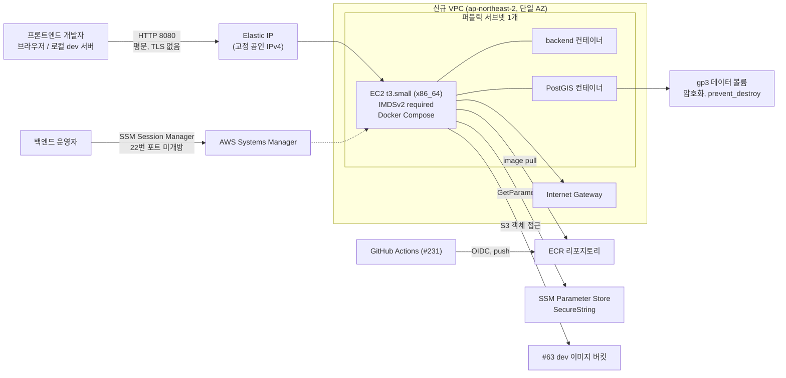

# Infrastructure Design Report: D-3

> Created at: `2026-09-16T00:43:58+09:00`
> GitHub Issue: `#229`
> Status: Design / Plan only — apply disabled
> Design status: `READY_FOR_DESIGN_REVIEW` — 사람이 `APPROVED_FOR_BUILD`로
> 승인하기 전에는 `infra/**`에 `.tf` 파일을 만들지 않는다. 설계 승인은
> `/harness-infra-build` 진행 게이트이며, PR 승인(`@Byuntil`, `@tkv00`)과
> `infrastructure-apply` Environment 승인은 별개로 여전히 필요하다(§10).

## 1. Context and constraints

- Product stage: 백엔드 API와 Flyway 마이그레이션(V1~V27)은 구현되어 있고, AWS에는
  `infra/bootstrap`(Terraform State Backend, GitHub OIDC Provider, IAM Role 3종)과
  #63의 dev 이미지 버킷만 존재한다. 애플리케이션을 구동할 컴퓨트·네트워크·데이터베이스는
  아직 없다. 이 설계는 **프론트엔드 통합 테스트 전용 dev 서버 1대**만 다룬다.
  #132의 MVP 전체 아키텍처와는 범위가 겹치지 않으며 이 설계가 선행한다.
- Expected workload: 프론트엔드 개발자 소수(5명 미만 가정)가 로컬 브라우저에서
  이 서버의 API를 호출한다. 프로덕션 트래픽 없음. 동시 요청 한 자릿수.
- Availability target: 공식 SLA 없음. 단일 AZ best-effort. **상시 가동이 아니다**(§6).
- Recovery target: 공식 RTO/RPO 없음. 테스트 데이터는 재생성 가능하며
  Flyway가 빈 DB에 스키마를 다시 만든다.
- Cost ceiling: **CONFIRMED — 월 10 USD 이내**(Issue #229, TASK.md).
- Region assumption: **CONFIRMED — `ap-northeast-2`(Seoul)**.

실제 서버 주소, 계정 ID, IAM ID, 토큰, `.env` 값은 기록하지 않는다.

### Intake 상태

| 항목 | 상태 | 근거/가정 |
| --- | --- | --- |
| 대상 환경 | CONFIRMED | dev 테스트 전용, production 아님 (Issue #229) |
| AWS Region | CONFIRMED | `ap-northeast-2` (Issue #229, TASK.md) |
| 월 예산 상한 | CONFIRMED | 10 USD (Issue #229, TASK.md) |
| 데이터베이스 구동 방식 | CONFIRMED | EC2 내부 Docker Compose PostGIS 컨테이너 (Issue #229) |
| 외부 공개 범위 | CONFIRMED | 공인 IP + HTTP 8080. TLS·도메인·ALB 없음 (Issue #229) |
| 운영 접근 | CONFIRMED | SSM Session Manager 전용, 22번 포트 미개방 (Issue #229) |
| 이미지 전달 | CONFIRMED | ECR + GitHub Actions 푸시, EC2가 Instance Role로 pull (Issue #229) |
| 비밀값 관리 | CONFIRMED | SSM SecureString, Terraform이 값을 생성하지 않음 (Issue #229) |
| IaC | CONFIRMED | Terraform 단독 (ADR-0004, AGENTS.md 4.1) |
| 인스턴스 타입과 가동 시간 | **DECIDED — §6** | `t3.small` 24시간 구동은 예산을 2.4배 초과한다. 이 설계가 스케줄 구동으로 해소한다 |
| CPU 아키텍처 | **DECIDED — §4** | Graviton(`t4g`)은 PostGIS 이미지 제약으로 탈락. x86_64 확정 |
| 예상 요청량 | ASSUMED | 매우 낮음. 프론트 개발자 5명 미만, 동시 요청 한 자릿수 |
| 데이터 저장량 | ASSUMED | 테스트 데이터 수 GB 미만. 데이터 볼륨 10 GiB로 시작 |
| 가용성 목표 | ASSUMED | SLA 없음, 단일 AZ best-effort |
| RTO / RPO | ASSUMED | 없음. 테스트 데이터는 재생성 가능 |
| 데이터 민감도 | ASSUMED | 테스트 데이터만 저장. 실제 사용자 개인정보·실계정 자격 증명 미사용 |
| 배포 빈도 | ASSUMED | 백엔드 이미지 재배포는 일 1~수회. 인프라 변경은 드묾 |
| 운영 인력 | CONFIRMED | 전담 인프라 인력 없음. 백엔드 2인(`@Byuntil`, `@tkv00`) 겸임 |
| 운영 가능 시간 | ASSUMED | 업무 시간 best-effort |
| 서비스 예상 수명 | ASSUMED | #132 MVP 아키텍처 구축 전까지의 임시 서버 |
| AWS 프리 티어 | ASSUMED | **미적용으로 계산**. 계정이 신규 12개월 구간이 아니라고 가정(보수적) |
| 법적/컴플라이언스 제약 | UNKNOWN | 명시된 요구사항 없음. 테스트 데이터 한정 운용으로 완화 |
| 컨테이너 이미지 arm64 지원 | CONFIRMED | `postgis/postgis`는 amd64 전용 — 검증 결과 §4 |

## 2. Proposed baseline

- Network: 신규 VPC 1개(`10.x.0.0/16` 대역은 변수화), **퍼블릭 서브넷 1개**,
  Internet Gateway, 라우트 테이블 1개. NAT Gateway를 만들지 않는다
  (월 약 40 USD로 예산을 단독으로 초과한다). 인스턴스를 퍼블릭 서브넷에 두고
  공인 IP로 아웃바운드를 처리한다.
- Application workload: **EC2 `t3.small` 1대(x86_64, 2 vCPU / 2 GiB)**.
  `user_data`가 Docker Engine과 compose plugin을 설치하고, Instance Role로
  ECR에 로그인해 백엔드 컨테이너와 PostGIS 컨테이너를 기동한다.
  IMDSv2 필수(`http_tokens = "required"`), 루트 볼륨 암호화.
- Database: **EC2 내부 Docker Compose PostGIS 컨테이너**. 데이터는 별도
  암호화 gp3 EBS 볼륨(10 GiB)에 bind mount 한다. 인스턴스 정지/재기동 후에도
  데이터가 남고, 인스턴스 타입 변경 시 볼륨을 재부착할 수 있다.
- Storage: ECR 리포지토리 1개(백엔드 이미지). 이미지 태그 immutable,
  스캔 on-push, lifecycle policy로 최근 N개만 보존해 저장 비용을 고정한다.
  #63의 dev 이미지 S3 버킷은 그대로 재사용하며 Instance Role에 객체 권한만 준다.
- Observability: EC2 기본 CloudWatch 메트릭(무료 5분 주기). 상세 모니터링은
  비활성. 컨테이너 로그는 Docker `json-file` 드라이버에 로컬 보관하고
  `max-size`/`max-file`로 디스크 포화를 막는다. VPC Flow Logs는 비활성
  (§5 예외 항목). 애플리케이션 로그 조회는 SSM Session Manager 경유.
- Backup: **없음**. 테스트 데이터는 재생성 가능하며 EBS 스냅샷 스케줄을 두지
  않는다(예산). 데이터 볼륨에 `prevent_destroy`를 걸어 Terraform 실수 삭제만 막는다.
- Deployment: `terraform plan`은 PR에서 실행. `apply`는
  `infrastructure-apply` GitHub Environment 보호 workflow에서만 실행하며
  이 세션에서는 실행하지 않는다. 애플리케이션 이미지 배포 workflow는 #231 범위다.

## 3. Architecture diagram



## 4. Alternatives

| Decision | Selected | Alternative | Cost | Operations | Risk | Why |
| --- | --- | --- | --- | --- | --- | --- |
| Compute | **EC2 `t3.small` 1대** | ECS on Fargate (0.5 vCPU / 1 GB × 2 task) | Fargate 24/7 태스크당 약 20.7 USD/월, 2 태스크 약 41 USD (Seoul vCPU 0.04656 USD/h, GB 0.00511 USD/h; `(0.5×0.04656 + 1×0.00511) × 730`) — 예산 4배 초과 | 태스크 정의·서비스·로그 그룹 관리 추가 | DB 컨테이너를 Fargate에 두면 영속 스토리지로 EFS가 필요해 비용·복잡도가 더 증가 | 컨테이너 2개를 한 호스트에 얹는 가장 단순·저렴한 방법이 단일 EC2다. 스케줄 정지로 예산을 맞출 수 있는 유일한 선택지이기도 하다(Fargate는 태스크 단위 과금이라 유사하나 EFS 고정비가 남는다) |
| Compute | **EC2 `t3.small`** | App Runner | 최소 프로비저닝 컨테이너 비용이 상시 발생하고 DB 사이드카를 둘 수 없다 | 낮음 | VPC 커넥터·외부 DB 필수 | DB를 같은 호스트에 둔다는 확정 요구사항(Issue #229)과 맞지 않는다 |
| Compute | **EC2 `t3.small`** | EC2 `t3.micro`(1 GiB) | 24/7 9.49 USD로 더 쌈 | 동일 | **메모리 부족**: JVM(최소 512~768 MiB) + PostGIS(최소 ~256 MiB) + OS/Docker를 1 GiB에 올리면 OOM 위험이 높다 | 2 GiB가 현실적 하한. 대신 가동 시간을 줄여 예산을 맞춘다 |
| CPU 아키텍처 | **x86_64 (`t3`)** | Graviton (`t4g.small`, 시간당 20% 저렴) | t4g가 월 약 3.1 USD 절감 | 동일 | **검증 결과 탈락**: `postgis/postgis:16-3.5-alpine`(로컬 `compose.yaml`이 digest로 고정) 매니페스트에 `linux/amd64`만 존재한다. `16-3.5`, `17-3.5` 태그도 amd64 전용 | arm64로 가려면 서드파티 `imresamu/postgis`(arm64 제공)로 바꾸거나 PostGIS를 직접 빌드해야 한다. 로컬 개발과 이미지가 달라져 dev/test 동등성이 깨지고 공급망 검토가 추가된다. 예산 절감폭보다 위험이 크다고 판단해 **보류**(§15 H-3) |
| Database | **EC2 내부 PostGIS 컨테이너** | RDS PostgreSQL `db.t4g.micro` + PostGIS 확장 | Single-AZ `db.t4g.micro` PostgreSQL 24/7 약 **18.25 USD**(Seoul 0.025 USD/h × 730) + 스토리지 — **단독으로 예산의 1.8배** | 백업·패치·파라미터 그룹을 AWS가 관리(운영 부담 낮음) | 컨테이너 DB는 인스턴스 장애 시 데이터 유실 가능, 백업 없음 | 예산 10 USD 안에서 RDS는 성립하지 않는다. 테스트 데이터는 재생성 가능하고 Flyway가 스키마를 복원하므로 관리형 DB의 이점이 이 환경에서는 비용을 정당화하지 못한다. #132 MVP에서 RDS를 재검토한다 |
| Database | **EC2 내부 PostGIS 컨테이너** | Aurora Serverless v2 | 최소 ACU 상시 과금으로 예산 초과 | 낮음 | — | 동일한 이유로 탈락 |
| 네트워크 | **퍼블릭 서브넷 + 공인 IP** | 프라이빗 서브넷 + NAT Gateway | NAT Gateway 시간당 0.059 USD → 월 약 43.07 USD(`0.059 × 730`) | 낮음 | 공인 IP 직접 노출 | NAT Gateway 하나가 예산의 4배다. dev 테스트 서버에 성립하지 않는다 |
| 공인 IP | **Elastic IP(고정)** | 인스턴스 자동 할당 공인 IP | EIP는 정지 중에도 과금되어 월 3.65 USD 고정. 자동 할당은 구동 시간만 과금 | 자동 할당은 재기동마다 IP가 바뀌어 프론트 설정을 매번 갱신해야 함 | — | 프론트엔드가 붙는 대상이므로 주소 안정성이 우선이다. Issue #229도 Elastic IP를 범위에 명시했다. 비용 비교는 §6 시나리오 B에 남긴다 |
| 이미지 전달 | **ECR private** | Docker Hub / GHCR | ECR 저장 0.10 USD/GB-월 | IAM Role로 인증이 끝나 자격 증명 보관이 없음 | — | Instance Role 기반 pull이 장기 자격 증명을 만들지 않는다(AGENTS.md 4.9) |
| 비밀값 | **SSM Parameter Store SecureString** | Secrets Manager | Parameter Store standard는 무료, Secrets Manager는 비밀당 0.40 USD/월 | 회전 기능 없음(이 환경에 불필요) | — | 예산과 요구사항에 Parameter Store가 충분하다 |

## 5. Security and IAM

- GitHub OIDC trust boundary: 기존 `infra/bootstrap`의 Provider와 역할을 재사용한다.
  신규 신뢰 관계를 만들지 않는다. `qello-infra-plan`(읽기 전용),
  `qello-infra-apply`(보호된 `infrastructure-apply` Environment 전용),
  `qello-infra-deployer`에 **이번 스택이 필요로 하는 액션만 추가**한다.
  현재 세 역할은 S3·KMS·IAM·STS만 허용해 EC2 스택을 plan/apply할 수 없다.
  - plan 역할에 추가: `ec2:Describe*`, `ecr:Describe*`, `ecr:GetRepositoryPolicy`,
    `ecr:ListTagsForResource`, `ssm:GetParameters`(메타데이터 한정),
    `ssm:DescribeParameters`, `iam:ListInstanceProfiles*`.
  - apply/deployer 역할에 추가: VPC·서브넷·IGW·라우트 테이블·보안 그룹·EC2 인스턴스·
    EBS 볼륨·Elastic IP·ECR 리포지토리·SSM 파라미터 생성/변경/삭제 액션과
    인스턴스 Role을 EC2에 넘기기 위한 `iam:PassRole`.
  - `iam:PassRole`은 **이번 인스턴스 Role ARN 하나로 한정**하고
    `iam:PassedToService = ec2.amazonaws.com` 조건을 건다. 와일드카드 PassRole을 쓰지 않는다.
  - 모든 신규 액션은 가능한 곳에서 `aws:ResourceTag/Project = qello` 조건을 유지한다.
    태그 조건을 지원하지 않는 액션(예: 일부 `ec2:Create*`)은
    `aws:RequestTag/Project` 조건 또는 리소스 접두사로 좁히고 예외 사유를 코드 주석에 남긴다.
- Runtime role(인스턴스 Role, 신규): 최소 권한으로 다음만 허용한다.
  - `AmazonSSMManagedInstanceCore`(SSM Session Manager 접속. 22번 포트 대체)
  - 이번 ECR 리포지토리 ARN 한정 `ecr:GetDownloadUrlForLayer`,
    `ecr:BatchGetImage`, `ecr:BatchCheckLayerAvailability` + 계정 범위
    `ecr:GetAuthorizationToken`(리소스 한정이 불가능한 액션)
  - 이번 스택의 SSM 파라미터 경로(`/qello/dev/test-server/*`) 한정 `ssm:GetParameter*`
    와 해당 KMS Key 한정 `kms:Decrypt`
  - #63 dev 이미지 버킷 ARN 한정 `s3:GetObject`, `s3:PutObject`,
    `s3:DeleteObject`, `s3:ListBucket`과 그 버킷 KMS Key 한정
    `kms:Decrypt`, `kms:GenerateDataKey*`
  - 장기 Access Key를 발급하는 IAM User를 만들지 않는다.
- Deployment role: 애플리케이션 이미지 push용 GitHub Actions 역할은 **#231 범위**다.
  이 설계는 ECR 리포지토리만 만들고 push 권한 부여는 #231에서 다룬다.
- Encryption: 루트 EBS와 데이터 EBS 모두 암호화(`encrypted = true`).
  SSM 파라미터는 SecureString. ECR은 기본 암호화. **전송 구간은 평문 HTTP**(아래 예외).
- Network restrictions:
  - 인바운드: TCP 8080 only. 22번 포트를 열지 않는다.
  - 아웃바운드: ECR·SSM·S3 호출을 위해 443 허용. 그 외는 최소화.
  - 기본 보안 그룹에 규칙을 두지 않는다.
- Audit logging: bootstrap의 State 버킷 접근 로그가 Terraform 변경 이력을 남긴다.
  SSM Session Manager 세션 기록은 기본 CloudTrail 관리 이벤트로 남는다.
  VPC Flow Logs는 아래 예외로 비활성.

### 보안 검토 결과 (독립 검토)

| # | 항목 | 판정 | 내용 |
| --- | --- | --- | --- |
| S-1 | **8080 평문 HTTP 전체 공개** | **HIGH — 조건부 수용** | JWT 액세스 토큰과 요청 본문이 평문으로 전송된다. 중간자 도청·토큰 탈취가 가능하다. 완화: ① 테스트 계정·테스트 데이터만 사용하고 실제 개인정보·실계정 비밀번호를 넣지 않는다 ② `QELLO_AUTH_ACCESS_TOKEN_SECRET`을 로컬·프로덕션과 다른 전용 값으로 분리한다 ③ 토큰 만료를 짧게 유지한다 ④ 만료일을 정해 TLS 도입 후속 이슈를 만든다. **이 예외는 `SECURITY-EXCEPTION` 주석으로 만료일·추적 이슈와 함께 코드에 기록한다**(AGENTS.md 5.7) |
| S-2 | 8080 소스 CIDR `0.0.0.0/0` | MEDIUM | 프론트 개발자 IP가 유동이라 고정 허용 목록을 만들기 어렵다. 완화: 가동 시간을 업무 시간으로 제한해 노출 창을 줄인다(§6). checkov `CKV_AWS_260` 계열 위반은 **인라인 `# checkov:skip=` 주석에 사유와 제거 조건**을 적는다. `--skip-check` 전역 목록은 늘리지 않는다(Issue 완료 조건) |
| S-3 | IMDSv2 | PASS | `http_tokens = "required"`, `http_put_response_hop_limit = 1`로 컨테이너에서의 IMDS 크리덴셜 탈취 경로를 좁힌다 |
| S-4 | 22번 포트 | PASS | 열지 않는다. SSM Session Manager만 사용한다. SSH 키 페어를 만들지 않는다 |
| S-5 | 비밀값 | PASS | DB 비밀번호와 토큰 시크릿을 Terraform이 생성하지 않는다. SSM SecureString을 `ignore_changes = [value]`로 선언하고 값은 사람이 넣는다. 변수 기본값·`terraform.tfvars`·State·plan·PR에 값을 쓰지 않는다 |
| S-6 | EBS 암호화 | PASS | 루트·데이터 볼륨 모두 암호화 |
| S-7 | VPC Flow Logs 비활성 | LOW — 예외 | CloudWatch Logs 수집 비용이 razor-thin 예산을 잠식한다. dev 테스트 서버이고 저장 데이터가 테스트 데이터로 한정되어 위험을 수용한다. checkov `CKV2_AWS_11` 인라인 skip에 사유와 제거 조건(프로덕션 전환 또는 #132 MVP 설계 시 재검토)을 적는다 |
| S-8 | 백업 부재 | LOW | 테스트 데이터 재생성 가능. 데이터 볼륨 `prevent_destroy`로 Terraform 실수 삭제만 차단 |
| S-9 | `iam:PassRole` 신규 부여 | MEDIUM — 완화됨 | 리소스를 인스턴스 Role ARN 하나로 한정하고 `iam:PassedToService` 조건을 건다. 와일드카드 금지 |
| S-10 | 공인 IP 직접 노출 | MEDIUM — 수용 | NAT Gateway가 예산의 4배라 대안이 없다. 보안 그룹을 8080/443로 최소화해 완화 |

## 6. One-month cost estimate

가격은 AWS Price List API(`aws pricing get-products`, `ap-northeast-2`)로 조회했다.
**조회일: 2026-09-16.** 아래는 추정이며 실제 청구액이 아니다.
프리 티어는 **미적용**으로 보수적으로 계산했다. 730시간을 1개월로 본다.

조회한 단가:

| 항목 | 단가 (USD) | 공식 출처 |
| --- | --- | --- |
| EC2 `t3.small` Linux on-demand | 0.0260 / 시간 | AWS Price List API, AmazonEC2, ap-northeast-2 |
| EC2 `t3.micro` Linux on-demand | 0.0130 / 시간 | 동일 |
| EC2 `t4g.small` Linux on-demand | 0.0208 / 시간 | 동일 |
| EBS gp3 프로비저닝 스토리지 | 0.0912 / GB-월 | 동일 (`APN2-EBS:VolumeUsage.gp3`) |
| 공인 IPv4 (사용 중·유휴 동일) | 0.0050 / 시간 | AmazonVPC (`APN2-PublicIPv4:InUseAddress` / `:IdleAddress`) |
| ECR 이미지 저장 | 0.10 / GB-월 | AmazonECR (`APN2-TimedStorage-ByteHrs`) |
| 아웃바운드 데이터 전송 (첫 10 TB) | 0.126 / GB | AWSDataTransfer, 월 100 GB 무료 구간 적용 후 |
| Fargate vCPU / 메모리 (x86) | 0.04656 / vCPU-시간, 0.00511 / GB-시간 | AmazonECS (`APN2-Fargate-vCPU-Hours`, `APN2-Fargate-GB-Hours`) |
| RDS `db.t4g.micro` PostgreSQL Single-AZ | 0.0250 / 시간 | AmazonRDS |
| NAT Gateway | 0.0590 / 시간 | AmazonEC2 (`APN2-NatGateway-Hours`) |

### 시나리오 A — 선택안: `t3.small` + Elastic IP + 스케줄 구동 160시간/월

평일 8시간 × 월 20일 = 160시간 가동을 가정한다.

| Resource | Assumption | Formula | Monthly estimate | Official source | Checked at |
| --- | --- | --- | --- | --- | --- |
| Compute | `t3.small`, 160 h | `0.0260 × 160` | **4.16 USD** | Price List API (AmazonEC2) | 2026-09-16 |
| EBS root | gp3 8 GiB, 730 h(정지 중에도 과금) | `8 × 0.0912` | **0.73 USD** | Price List API (AmazonEC2) | 2026-09-16 |
| EBS data | gp3 10 GiB, 730 h | `10 × 0.0912` | **0.91 USD** | Price List API (AmazonEC2) | 2026-09-16 |
| Elastic IP | 1개, 730 h (정지 중 유휴 요금 동일) | `0.0050 × 730` | **3.65 USD** | Price List API (AmazonVPC) | 2026-09-16 |
| ECR | 이미지 1 GB 보존 | `1 × 0.10` | **0.10 USD** | Price List API (AmazonECR) | 2026-09-16 |
| Network (DTO) | 월 100 GB 무료 한도 내 | `0` | **0.00 USD** | AWSDataTransfer | 2026-09-16 |
| Observability | CloudWatch 기본 메트릭, 상세 모니터링 off, Flow Logs off | `0` | **0.00 USD** | — | 2026-09-16 |
| VPC / IGW / 라우트 테이블 / SSM Parameter Store standard / Session Manager | 무료 | `0` | **0.00 USD** | — | 2026-09-16 |
| **Total** | | | **9.55 USD** | | 2026-09-16 |

예산 대비 여유는 **0.45 USD(4.5%)**로 매우 얇다. 가동 시간이 예산의 유일한 조절 변수다.
손익분기 가동 시간은 `(10 − 5.39) ÷ 0.0260 = 약 177시간/월`이며, 이를 넘기면 초과한다.

### 비교 시나리오

| 시나리오 | 구성 | 월 추정 | 예산 10 USD |
| --- | --- | --- | --- |
| **A (선택)** | `t3.small` 160 h + EIP + gp3 18 GiB + ECR | **9.55 USD** | 충족 (여유 4.5%) |
| A′ | 시나리오 A에서 가동 220 h (평일 10 h × 22일) | 11.11 USD | **초과** |
| B | EIP 제거, 자동 할당 공인 IP, 240 h 가동 | `0.0260×240 + 0.0050×240 + 1.64 + 0.10` = 9.18 USD | 충족하나 재기동마다 IP 변경 |
| C | `t4g.small`(Graviton) 200 h + EIP | `0.0208×200 + 3.65 + 1.64 + 0.10` = 9.55 USD | 충족하나 PostGIS arm64 이미지 문제(§4) |
| D | `t3.small` **24시간 상시** + EIP | `0.0260×730 + 3.65 + 1.64 + 0.10` = **24.37 USD** | **2.4배 초과** |
| E | RDS `db.t4g.micro` Single-AZ 상시 + EC2 160 h | `18.25 + 4.16 + 3.65 + 0.73 + 0.10` ≥ 26.9 USD | **2.7배 초과** |

**결론**: 상시 구동은 어떤 조합으로도 10 USD 예산에서 성립하지 않는다.
`t3.small`을 **업무 시간에만 켜는 스케줄 구동**이 예산·메모리·이미지 호환성을
동시에 만족하는 유일한 구성이다.

### 비용 증가 요인

- 가동 시간 초과. 끄는 것을 잊으면 하루 약 0.62 USD씩 누적되고, 상시 구동 시 2.4배 초과한다.
  → **자동 정지 가드레일이 사실상 필수**다(§15 H-1).
- Elastic IP는 예산의 **37%**를 차지하는 최대 고정비이며 인스턴스를 꺼도 줄지 않는다.
- EBS는 정지 중에도 과금된다. 데이터 볼륨을 키우면 고정비가 그대로 증가한다(1 GiB당 0.0912 USD/월).
- ECR 이미지가 쌓이면 저장 비용이 선형 증가한다 → lifecycle policy로 보존 개수를 고정한다.
- 아웃바운드 전송이 월 100 GB 무료 한도를 넘으면 GB당 0.126 USD가 붙는다.
  프론트 테스트 트래픽 규모에서는 초과 가능성이 낮다고 가정한다(ASSUMED).

## 7. Operational concerns

- Monitoring and alerting: 전용 대시보드·알람을 만들지 않는다(예산). 대신
  **AWS Budgets 월 10 USD 알림**을 별도로 설정할 것을 권고한다(Budgets는 알림 2개까지 무료).
  Budgets 설정은 이번 Terraform 범위 밖이며 §15 H-4에서 결정한다.
- Backup/restore drill: 백업이 없다. 복구 절차는 "데이터 볼륨을 새로 만들고
  컨테이너를 다시 올리면 Flyway V1~V27이 스키마를 재생성한다"로 정의하고
  Runbook에 기록한다. 시드 데이터가 필요하면 별도 스크립트로 관리한다.
- Capacity: 2 GiB 메모리가 병목이다. 권장 할당 — JVM `-Xmx768m`,
  PostgreSQL `shared_buffers=256MB`, 나머지는 OS/Docker.
  데이터 볼륨에 **2 GiB 스왑 파일**을 만들어 순간 피크를 흡수한다.
  이 배분은 ASSUMED이며 최초 기동 후 실측으로 조정한다.
- Patching: Amazon Linux 2023 최신 AMI를 SSM Parameter(`/aws/service/ami-al2023/...`)로
  조회한다. AMI ID를 하드코딩하지 않는다. 다만 AMI 변경이 인스턴스 교체를 유발하므로
  `ignore_changes = [ami]`를 걸고 교체는 사람이 의도적으로 수행한다(사유를 주석에 기록).
- Certificate/domain: 없다. IP + HTTP 8080으로만 접근한다.
  프론트엔드는 Elastic IP 주소를 환경 변수로 받는다(주소 값은 이 문서에 기록하지 않는다).
- Incident ownership: `@Byuntil`, `@tkv00`. 업무 시간 best-effort.

## 8. Risks and mitigations

| Risk | Trigger | Impact | Mitigation | Recovery |
| --- | --- | --- | --- | --- |
| 예산 초과 | 인스턴스를 끄지 않고 방치 | 월 청구액이 최대 2.4배(24 USD) | 자동 정지 스케줄(§15 H-1) + AWS Budgets 알림 | 인스턴스 즉시 정지. 청구는 사후 회복 불가 |
| 메모리 부족(OOM) | JVM + PostGIS가 2 GiB 초과 | 컨테이너 강제 종료, 서버 다운 | JVM/PG 메모리 상한 명시, 스왑 2 GiB, Docker `restart: unless-stopped` | 인스턴스 재기동. 반복되면 `t3.medium`으로 상향(예산 재승인 필요) |
| 평문 HTTP 토큰 탈취 | 공용 네트워크에서 API 호출 | 테스트 계정 토큰 노출 | 테스트 데이터·전용 시크릿만 사용, 짧은 토큰 만료 (§5 S-1) | 시크릿 회전(SSM 파라미터 값 교체 후 컨테이너 재기동) |
| 데이터 볼륨 유실 | 인스턴스 종료 시 볼륨 삭제 | 테스트 데이터 소실 | 데이터 볼륨을 인스턴스와 분리된 리소스로 만들고 `prevent_destroy`, 루트 볼륨과 달리 `delete_on_termination` 미적용 | Flyway 재적용으로 스키마 복원, 시드 재실행 |
| 단일 AZ·단일 인스턴스 장애 | AZ 장애 또는 인스턴스 하드웨어 장애 | 테스트 서버 전면 중단 | 수용(dev 전용, SLA 없음) | `terraform apply`로 인스턴스 재생성, 데이터 볼륨 재부착 |
| `user_data` 기동 실패 | ECR 로그인 실패, 이미지 태그 부재, compose 오류 | 서버가 뜨지 않음 | `user_data`를 멱등하게 작성하고 실패 시 로그를 `/var/log/cloud-init-output.log`에 남김 | SSM Session Manager로 접속해 원인 확인 후 수동 재실행 |
| 이미지 아키텍처 불일치 | arm64 인스턴스에 amd64 이미지 | 컨테이너 기동 실패 | x86_64(`t3`)로 확정해 원천 차단(§4) | 해당 없음 |
| bootstrap IAM 확장이 과도해짐 | EC2/VPC 액션을 넓게 부여 | 권한 상승 경로 확대 | 태그 조건·리소스 한정·`PassRole` 조건 유지(§5) | 정책 되돌리기 PR |
| Terraform이 EIP를 교체 | 속성 변경으로 재생성 | 프론트 설정 전면 갱신 필요 | EIP에 `prevent_destroy` 적용, plan에서 replace 발생 시 구현 전 보고(AGENTS.md 6) | 새 IP를 프론트에 공지 |
| SSM 파라미터 값이 비어 있음 | 사람이 값을 넣기 전에 인스턴스 기동 | 컨테이너 기동 실패 | Runbook에 "apply 전에 파라미터 값 입력" 순서를 명시 | 값 입력 후 인스턴스 재기동 |

### 변경 위험도 (Change risk)

| 변경 | 위험도 | 근거 |
| --- | --- | --- |
| 신규 VPC·서브넷·IGW 생성 | LOW | 기존 리소스 없음. 신규 격리 VPC |
| 신규 EC2·EBS·EIP 생성 | LOW | 신규 생성만. 기존 리소스 교체·삭제 없음 |
| 신규 ECR·SSM 파라미터 생성 | LOW | 신규 생성만 |
| **bootstrap IAM 정책 확장** | **MEDIUM** | 기존 3개 Role의 in-place 정책 갱신. 범위를 잘못 넓히면 권한 상승. plan에서 `update in-place`만 나와야 하며 Role 자체의 replace/삭제가 보이면 구현을 중단하고 보고한다 |
| 공개 접근 범위 확대(8080 `0.0.0.0/0`) | **HIGH 분류** | AGENTS.md 6의 고위험 변경. §5 S-1/S-2의 완화책과 사람 승인이 전제다 |
| 기존 #63 S3 버킷 | NONE | 버킷을 변경하지 않는다. 인스턴스 Role에 객체 권한만 부여한다 |

**예상 plan 결과**: 신규 리소스 생성 + bootstrap IAM 정책 3건 in-place 갱신.
**삭제·교체(replace)가 계획되면 구현을 중단하고 `BLOCKED`로 보고한다.**

## 9. IaC plan

- IaC choice: **`Terraform`** (ADR-0004). AWS CDK, CloudFormation, Pulumi,
  AWS SDK/CLI를 이용한 인프라 생성을 추가하지 않는다.
- Module/stack boundaries:
  - `infra/modules/network` — VPC, 퍼블릭 서브넷, IGW, 라우트 테이블
  - `infra/modules/app-server` — EC2, EIP, 보안 그룹, 인스턴스 Role/Instance Profile,
    데이터 EBS 볼륨과 부착
  - `infra/environments/dev/test-server` — 두 모듈 조합 + ECR 리포지토리 +
    SSM SecureString 파라미터
  - `infra/bootstrap` — 기존 스택. IAM 정책 확장만 수행(신규 리소스 없음)
- State storage: 기존 bootstrap S3 State 버킷.
  `key = "environments/dev/test-server/terraform.tfstate"`.
  bootstrap 스택은 자신의 기존 State를 그대로 사용한다.
- Locking: `use_lockfile = true` (S3 lockfile 기반 잠금, AGENTS.md 4.6).
- Plan command:
  ```bash
  terraform -chdir=infra/environments/dev/test-server init \
    -backend-config="bucket=<bootstrap state_bucket_name output>"
  terraform -chdir=infra/environments/dev/test-server plan -lock-timeout=5m -out=tfplan
  ```
  bootstrap IAM 변경도 별도로 plan 한다. plan 원문은 PR에 싣지 않고
  요약과 SHA-256만 `gh-229-D-3-build.md`에 기록한다(AGENTS.md 4.7).
- Drift detection: 정기 자동 검사는 두지 않는다. PR마다 실행하는 plan이
  drift 탐지 역할을 겸한다.
- 버전 고정: Terraform `required_version`, AWS Provider 버전, `.terraform.lock.hcl`을
  기존 스택과 동일한 방식으로 커밋한다(현재 저장소 기준 AWS Provider 6.57.1).
- 명명·태그: 모든 리소스 이름은 `${var.project_prefix}-`로 시작하고
  태그에 `Project = "qello"`를 유지한다. bootstrap IAM 정책의 리소스 태그 조건 전제다.

## 10. Apply gate

- [ ] 설계와 IaC가 PR에서 검토됨
- [ ] `@Byuntil` 승인
- [ ] `@tkv00` 승인
- [ ] GitHub `infrastructure-apply` Environment 보호 설정
- [ ] AWS OIDC 단기 권한 사용
- [ ] 사람의 명시적 workflow dispatch 확인
- [ ] 롤백/복구 절차 확인
- [ ] **apply 전 사람이 SSM SecureString 파라미터 값을 입력**(DB 비밀번호,
      `QELLO_AUTH_ACCESS_TOKEN_SECRET`). Terraform이 값을 만들지 않는다
- [ ] apply 직후 AWS Budgets 월 10 USD 알림이 켜져 있는지 확인

두 승인과 사람 확인 전에는 apply/deploy하지 않는다.
이 설계 문서의 `APPROVED_FOR_BUILD` 승인은 **Terraform 코드 작성 게이트**일 뿐이며
위 apply 게이트를 대체하지 않는다.

## 11. Decision

- Recommendation: **시나리오 A**를 채택한다.
  - `ap-northeast-2` 단일 AZ 퍼블릭 서브넷에 **EC2 `t3.small`(x86_64) 1대**
  - Docker Compose로 백엔드 컨테이너 + PostGIS 컨테이너를 같은 호스트에 구동
  - PostGIS 데이터는 암호화 gp3 10 GiB 볼륨에 분리 보관, `prevent_destroy`
  - Elastic IP로 주소 고정, 인바운드 8080만 개방, 22번 포트 미개방, SSM 접속
  - ECR + Instance Role pull, SSM SecureString 비밀값(값은 사람이 입력)
  - **평일 업무 시간 160시간/월 스케줄 구동**으로 월 약 **9.55 USD**
- Deferred alternatives:
  - Graviton(`t4g`) 전환 — arm64 PostGIS 이미지 확보 후 재검토(월 약 3 USD 절감)
  - RDS PostgreSQL / Aurora — #132 MVP 아키텍처에서 재검토
  - ALB + ACM TLS + 도메인 — 예산 확대 시 별도 이슈
  - VPC Flow Logs, EBS 스냅샷 백업, CloudWatch 알람 — 프로덕션 전환 시 필수
  - Elastic IP 제거(시나리오 B) — 주소 안정성보다 비용이 중요해지면 재검토
- Reviewer comments: *(설계 리뷰 시 작성)*

## 12. Failure modes

| 실패 모드 | 감지 | 영향 | 대응 |
| --- | --- | --- | --- |
| 컨테이너 OOM Kill | API 무응답, `docker ps` 재시작 흔적 | 서버 중단 | 메모리 상한 조정 또는 인스턴스 상향(예산 재승인) |
| 데이터 볼륨 full | Postgres 쓰기 실패 | DB 중단 | 볼륨 확장(gp3 온라인 확장 가능) 또는 데이터 정리 |
| 루트 볼륨 full(컨테이너 로그 누적) | `df` 포화, Docker 오류 | 서버 중단 | 로그 드라이버 `max-size`/`max-file`로 사전 차단. 발생 시 `docker system prune` |
| ECR pull 실패 | `user_data` 로그 오류 | 기동 실패 | Instance Role 권한·리포지토리 정책·이미지 태그 확인 |
| SSM 에이전트 미동작 | Session Manager 접속 불가 | 원격 진단 불가 | 인스턴스 재기동. 반복 시 AMI·Role 확인 |
| EIP 한도 초과 | apply 오류 | 생성 실패 | 계정 EIP 한도 확인 후 사람이 결정 |
| Flyway 마이그레이션 실패 | 백엔드 컨테이너 기동 실패 | API 미제공 | 로그 확인. 데이터 볼륨 초기화 후 재기동 |
| 자동 정지 스케줄 오작동 | 예상보다 높은 청구 | 예산 초과 | Budgets 알림으로 조기 감지, 수동 정지 |

## 13. Terraform ownership

이번 구현이 **소유(생성·수정)**하는 파일:

```text
infra/modules/network/{main,variables,outputs,versions}.tf
infra/modules/app-server/{main,variables,outputs,versions}.tf
infra/modules/app-server/user_data.sh.tftpl
infra/environments/dev/test-server/{main,variables,outputs,versions,provider,backend}.tf
infra/environments/dev/test-server/terraform.tfvars.example
infra/environments/dev/test-server/README.md
infra/bootstrap/oidc.tf        (IAM 정책 statement 추가만)
infra/bootstrap/deployer.tf    (IAM 정책 statement 추가만)
docs/reports/infrastructure/gh-229-D-3.md
docs/reports/infrastructure/gh-229-D-3-build.md
```

**수정하지 않는 파일**:

```text
infra/bootstrap/state_backend.tf, variables.tf, outputs.tf, provider.tf, versions.tf
infra/modules/s3-private-bucket/**
infra/environments/dev/storage/**
CLAUDE.md, AGENTS.md, .claude/**, agents/**, CODEOWNERS
.github/workflows/*apply*, scripts/guard-*
애플리케이션 코드 전체 (#230 범위)
ECR 빌드·푸시 workflow (#231 범위)
```

`terraform.tfvars`와 State/plan 산출물은 커밋하지 않는다.
`.terraform.lock.hcl`은 커밋한다.

## 14. Validation plan

설계 승인 후 구현 단계에서 실행할 검증:

```bash
terraform fmt -check -recursive infra
terraform -chdir=infra/modules/network      init -backend=false && terraform -chdir=infra/modules/network      validate
terraform -chdir=infra/modules/app-server   init -backend=false && terraform -chdir=infra/modules/app-server   validate
terraform -chdir=infra/environments/dev/test-server init -backend=false && terraform -chdir=infra/environments/dev/test-server validate
terraform -chdir=infra/bootstrap            init -backend=false && terraform -chdir=infra/bootstrap            validate
tflint --recursive
checkov -d infra --framework terraform
./harness check
./harness pr-ready --project-tests
npm run hooks:validate
git diff --check
```

승인된 자격 증명이 준비되면 실제 Backend로 plan을 별도 실행하고
요약·SHA-256만 `gh-229-D-3-build.md`에 기록한다. plan 원문은 PR에 싣지 않는다.

**이 세션에서 실행하지 않는 것**: `terraform apply`, `destroy`, `import`,
`state *`, `force-unlock`, `taint`, AWS CLI 리소스 생성·변경·삭제.

## 15. Required human decisions

| ID | 결정 항목 | 선택지 | 권고 | 상태 |
| --- | --- | --- | --- | --- |
| **H-1** | **가동 스케줄과 자동 정지 가드레일** | (a) EventBridge Scheduler로 매일 정해진 시각 자동 정지 + 수동 시작 — 호출 횟수가 무료 구간이라 추가 비용 사실상 0, **단 Issue #229 범위에 없던 리소스(스케줄러 + 전용 IAM Role)를 추가하므로 범위 확장 승인이 필요** (b) 자동화 없이 Runbook 기반 수동 시작/정지 | **(a)** — 끄는 것을 잊으면 예산이 2.4배가 된다. 예산 상한이 얇아 가드레일 없이는 초과가 사실상 예정된 위험이다 | **미결정 — 승인 필요** |
| **H-2** | 월 가동 시간 상한 | 160 h(권고) / 177 h(손익분기) / 그 이상 | **160 h** (평일 8 h × 20일). 예산 여유 4.5% 확보 | 미결정 |
| **H-3** | CPU 아키텍처 | x86_64 `t3.small`(권고) / Graviton `t4g.small` + 서드파티 arm64 PostGIS 이미지 | **x86_64**. 로컬 `compose.yaml`이 쓰는 `postgis/postgis`가 amd64 전용이며, 이미지를 바꾸면 dev 동등성과 공급망 검토 부담이 생긴다 | 미결정 |
| **H-4** | AWS Budgets 알림 | 이번 Terraform 범위에 포함 / 콘솔에서 사람이 수동 설정 / 별도 이슈 | **별도 이슈 또는 수동 설정**. Issue #229 범위 밖이므로 이 설계에 포함하지 않는다 | 미결정 |
| **H-5** | Elastic IP 유지 | 유지(권고, 월 3.65 USD 고정) / 제거하고 자동 할당 IP 사용 | **유지**. 프론트 설정 안정성이 우선이며 Issue #229도 EIP를 명시했다 | 미결정 |
| **H-6** | 데이터 EBS 크기 | 10 GiB(권고) / 그 외 | **10 GiB**(월 0.91 USD). gp3는 온라인 확장이 가능하므로 작게 시작한다 | 미결정 |
| **H-7** | 8080 평문 HTTP 전체 공개 수용 | 수용 + 만료일·후속 TLS 이슈 등록 / 재설계 | **수용**. 단 `SECURITY-EXCEPTION` 주석에 만료일과 추적 이슈를 명시한다(§5 S-1) | **승인 필요 — 고위험 변경** |
| **H-8** | 설계 승인 | `APPROVED_FOR_BUILD` / 수정 요청 / 반려 | — | **미결정 — 이 승인 전에는 `.tf` 파일을 만들지 않는다** |

### 남은 절차

1. `@Byuntil`, `@tkv00`가 이 보고서를 검토하고 H-1~H-7을 확정한다.
2. 확정 결과를 이 문서 §16에 기록하고 상단 Design status를 `APPROVED_FOR_BUILD`로 갱신한다.
3. `TASK.md`의 Design status를 같은 값으로 갱신한다.
4. `/harness-infra-build`로 Terraform을 구현한다.
5. 정적 검증과 plan 증거를 `gh-229-D-3-build.md`에 기록한다.
6. PR 생성 → 2인 승인 → `infrastructure-apply` Environment에서 사람이 apply.

## 16. 설계 변경 이력

| 일시 | 변경 | 사유 |
| --- | --- | --- |
| 2026-09-16T00:43:58+09:00 | 최초 작성 (`READY_FOR_DESIGN_REVIEW`) | Issue #229, TASK.md |
| 2026-09-16 | DESIGN-ID를 `D-2`에서 **`D-3`**으로 변경 | `D-2`는 Issue #132의 MVP 아키텍처 설계(`gh-132-D-2.md`, PR #134 OPEN)가 이미 사용 중이다. 승인 증거가 어느 설계를 가리키는지 특정되도록 번호를 분리했다 |
