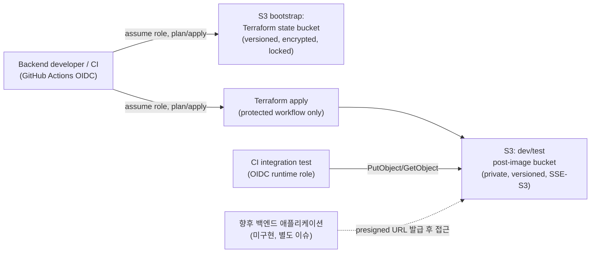

# Infrastructure Design Report: D-1

> Created at: `2026-08-05T16:33:32+09:00`
> GitHub Issue: `#63`
> Status: Design / Plan only — apply disabled
> Design status: `APPROVED_FOR_BUILD` — 사람 승인(tkv00, 2026-08-05). 이 승인은
> `/harness-infra-build` 진행 게이트이며, PR 승인(`@Byuntil`, `@tkv00`)과
> `infrastructure-apply` Environment 승인은 별개로 여전히 필요하다(§10).

## 1. Context and constraints

- Product stage: 사전 구현 단계. 저장소 README 기준 애플리케이션 API, DB 마이그레이션,
  AWS 인프라, 배포가 모두 아직 구현되지 않았다. **이 설계가 이 저장소 최초의
  AWS 인프라 구축**이다 — 기존 Terraform State Backend, GitHub OIDC Provider,
  AWS 계정 내 사전 리소스가 전혀 없다.
- Expected workload: 이미지 업로드 API(별도 이슈) 개발 중 사용하는 dev/test 트래픽.
  소수 백엔드 개발자·CI 통합 테스트가 주 사용자. 프로덕션 트래픽 없음.
- Availability target: 공식 SLA 없음(dev/test 전용, best-effort).
- Recovery target: 공식 RTO/RPO 없음. Versioning으로 실수 삭제/덮어쓰기만 완화.
- Cost ceiling: **CONFIRMED — 월 10 USD 이내**(사람 확인, 2026-08-05).
- Region assumption: **CONFIRMED — `ap-northeast-2`(Seoul)**(사람 확인,
  2026-08-05).

실제 서버 주소, 계정 ID, IAM ID, 토큰, `.env` 값은 기록하지 않는다.

### Intake 상태

| 항목 | 상태 | 근거/가정 |
| --- | --- | --- |
| 대상 환경 | CONFIRMED | Issue #63 범위: dev/test 전용, production 제외 |
| AWS Region | CONFIRMED | `ap-northeast-2`(Seoul) — 사람 확정(2026-08-05) |
| 월 예산 상한 | CONFIRMED | 월 10 USD 이내 — 사람 확정(2026-08-05) |
| 예상 요청량 | ASSUMED | 낮음 — 내부 개발자 + CI 통합 테스트만 사용 |
| 예상 동시 사용자 | ASSUMED | 10명 미만(팀 규모 기준) |
| 외부 트래픽 | ASSUMED | 없음 — 백엔드가 발급한 presigned URL을 통한 간접 접근만 |
| 저장 용량과 증가율 | UNKNOWN | 테스트 이미지 규모 미확정. GB 단위로 낮게 가정 |
| 데이터 민감도 | ASSUMED | 테스터가 실제 사진을 올릴 수 있으므로 비공개로 취급(민감 데이터 아님을 가정하지 않음) |
| 공개 접근 범위 | CONFIRMED | 비공개 — Issue 초안에서 public access block 명시 |
| 가용성 목표 | ASSUMED | Best-effort, SLA 없음(dev/test) |
| RTO | ASSUMED | 없음(재생성 가능, 테스트 데이터) |
| RPO | ASSUMED | 없음 — Versioning은 재해복구가 아닌 실수 방지용 |
| 배포 빈도 | UNKNOWN | 인프라 변경 빈도 미확정. 낮음으로 가정 |
| 운영 인력 | CONFIRMED | 전담 인프라 인력 없음, 백엔드 2인(`@Byuntil`, `@tkv00`)이 승인/운영 겸임 |
| 운영 가능 시간 | UNKNOWN | 업무 시간 best-effort로 가정 |
| 서비스 예상 수명 | UNKNOWN | 제품이 아직 출시 전 |
| 기존 AWS 리소스 | CONFIRMED | 없음(`infra/`에 Terraform 코드 없음, README가 미구현 명시) |
| 기존 도메인/인증서 | N/A | S3 API 직접 접근에 도메인·TLS 인증서 불필요 |
| 외부 연동 | CONFIRMED | AWS S3만, 백엔드 AWS SDK/Presigned URL 경유 |
| 법적/보안 제약 | UNKNOWN | 명시된 컴플라이언스 요구사항 없음. 비공개·암호화를 기본값으로 채택 |
| Terraform State Backend | CONFIRMED | `infra/bootstrap`을 이번 이슈 범위에 포함해 생성 — 사람 확정(2026-08-05), 로컬 State 1회 예외 승인됨(§15) |
| GitHub OIDC Provider | CONFIRMED | `infra/bootstrap`에서 함께 생성 — 사람 확정(2026-08-05) |

## 2. Proposed baseline

- Network: 별도 VPC 불필요. S3는 리전 서비스이며 HTTPS API로만 접근한다.
  컴퓨팅이 아직 없으므로 VPC Gateway Endpoint는 이번 범위에서 제외하고,
  향후 컴퓨팅(ECS 등)이 사설 서브넷에 배치될 때 재검토한다.
- Application workload: 없음(이번 이슈 범위 밖). 현재는 CI 통합 테스트와
  향후 백엔드 애플리케이션이 이 버킷의 클라이언트가 된다.
- Database: 해당 없음(이번 설계 범위 아님).
- Storage: S3 버킷 1개, dev/test 전용, private, versioning, 서버 측 암호화
  (**SSE-KMS, 전용 Customer-managed Key**), Public Access Block 4항목 모두
  활성화, **6개월(약 180일) 후 만료되는 lifecycle 규칙**(테스트 데이터 누적
  방지, 변수로 조정 가능) — 사람 확정(2026-08-05).
- Observability: 기본 S3 요청 메트릭(무료) + **S3 서버 접근 로그**를 전용
  로그 버킷에 저장해 감사 가능성을 확보(사람 확정: 로깅 "포함"). 계정에
  기존 CloudTrail Trail이 없어(BLOCKED, 첫 인프라) 전체 CloudTrail Trail
  신설은 이번 범위에서 제외하고, 비용이 예측 가능한 S3 서버 접근 로그를
  기본값으로 선택했다. 더 강한 API 수준 감사(CloudTrail 데이터 이벤트)가
  필요하면 별도 결정으로 확장한다(§15 갱신 참고).
- Backup: Versioning만 사용. 별도 교차 리전 복제는 비용 대비 실익이 낮아
  제외(dev/test, 재생성 가능한 데이터).
- Deployment: `terraform plan`은 PR에서 정적 검사로 실행. `apply`는
  `infrastructure-apply` GitHub Environment 보호 workflow에서만 실행하며
  이 세션에서는 실행하지 않는다.

## 3. Architecture diagram



## 4. Alternatives

| Decision | Selected | Alternative | Cost | Operations | Risk | Why |
| --- | --- | --- | --- | --- | --- | --- |
| Compute | 해당 없음 | — | — | — | — | 이번 이슈는 저장소(S3)만 다루며 컴퓨팅을 포함하지 않는다 |
| Database | 해당 없음 | — | — | — | — | 이번 이슈는 이미지 저장만 다루며 DB 변경이 없다 |
| Storage | S3 Standard, 단일 버킷 | S3 + CloudFront | 낮음 | 낮음 | 낮음 | 외부 공개·CDN이 필요 없는 dev/test 내부 검증 목적이므로 CloudFront는 과잉이다. 필요해지면 이미지 업로드 API 이슈에서 재검토 |
| Storage | S3 Standard | 로컬 파일 스토리지(컨테이너 볼륨) | 낮음 | 낮음 | 재현성 낮음 | 실제 업로드 흐름(presigned URL, 권한, 만료)을 검증하려면 로컬 파일보다 S3가 운영 환경과 동일한 검증을 제공한다 |
| Encryption | **SSE-KMS(전용 Customer-managed Key)** | SSE-S3(AES256) | KMS는 요청당 소액 추가 비용 발생(월 10 USD 상한 내로 판단) | Key 정책·회전 관리 부담 추가, 최소 권한으로 완화 | 동일 | 사람이 감사 가능한 Key 사용 이력을 요구해 SSE-KMS로 확정(2026-08-05). Key 정책은 plan/apply/runtime 역할로만 `Decrypt`/`GenerateDataKey`를 제한한다 |
| Terraform State | 신규 최소 Bootstrap 모듈로 S3 State Backend 생성 | 기존 Backend 재사용 | — | — | — | 저장소에 기존 Backend가 없어 재사용 불가능. 이번 이슈 범위에 포함하기로 확정(2026-08-05) |

## 5. Security and IAM

- GitHub OIDC trust boundary: AWS 계정에 GitHub Actions OIDC Provider가
  아직 없다. **`infra/bootstrap`을 이번 이슈 범위에 포함하기로 확정**(사람
  결정, 2026-08-05). Bootstrap 모듈에서 Provider와 두 개의 역할
  (`infra-plan`, `infra-apply`)을 생성하고, `sub` claim을 이 저장소·보호된
  branch/`infrastructure-apply` Environment로 제한한다(AGENTS.md 4.9).
- Runtime role: 아직 배포된 컴퓨팅이 없으므로 런타임 역할은 이번 범위에서
  "정책 문서만 설계"하고 실제 attach는 컴퓨팅이 생기는 이슈에서 수행한다.
  최소 권한 예시(리소스는 이 버킷 ARN으로만 한정): `s3:GetObject`,
  `s3:PutObject`, `s3:DeleteObject`, `s3:ListBucket`.
- **팀원 수동 테스트용 Role(`dev-s3-tester`, 신규)**: 사람 결정(2026-08-05)에
  따라 팀원(ksj)이 로컬에서 이 버킷을 직접 테스트할 수 있도록 **고정
  Access Key가 없는 IAM Role**을 Terraform으로 생성한다.
  - 권한: 이 버킷 ARN으로 한정된 `s3:GetObject`, `s3:PutObject`,
    `s3:DeleteObject`, `s3:ListBucket`과 전용 KMS Key ARN으로 한정된
    `kms:Decrypt`, `kms:GenerateDataKey*`만 허용(다른 버킷·Key는 접근 불가).
  - Trust policy: 계정 내 이미 관리자급 권한을 가진 주체(계정 소유자의
    콘솔/CLI 세션 등)만 `sts:AssumeRole`할 수 있고, MFA 필수 조건
    (`aws:MultiFactorAuthPresent = true`)을 건다. 세션은 짧은 유효 기간으로
    발급한다.
  - 장기 Access Key를 발급하는 IAM User는 만들지 않는다(AGENTS.md 4.9,
    12절 공통 금지 행위). ksj는 매 세션마다 `aws sts assume-role`로 단기
    자격 증명을 받아 사용한다.
  - 이 Role을 assume할 관리자급 주체가 계정에 아직 없다면(계정 최초
    부트스트랩 상황), 이는 `infra/bootstrap` 적용을 실행할 주체와 동일한
    선행 조건이며 별도로 새로 만들 필요는 없다.
- Deployment role(`infra-apply`): 이 버킷과 State 버킷 리소스로 한정된
  `s3:*` 관리 action만 허용(`Resource = "*"` 금지). Plan 역할은 읽기 전용
  수준(`s3:GetBucket*`, `s3:ListBucket`, State 버킷 read)으로 더 제한한다.
- Least-privilege actions: 버킷 ARN을 명시적으로 지정하고 와일드카드
  리소스를 사용하지 않는다. 장기 Access Key는 생성하지 않는다(AGENTS.md 4.9).
- Encryption: 저장 데이터 **SSE-KMS(전용 Customer-managed Key, 자동 연간
  키 회전)** 기본 암호화. Key 정책은 Key 관리자(사람 승인 필요한 변경만)와
  Key 사용자(`infra-apply`, 런타임 역할의 `kms:Decrypt`,
  `kms:GenerateDataKey*`만)를 분리한다. 전송 데이터는 버킷 정책으로 TLS
  아닌 요청 거부(`aws:SecureTransport = false` 조건 Deny).
- Network restrictions: Public Access Block 4항목 모두 `true`. 버킷 정책에
  공개 read/write를 허용하는 statement를 두지 않는다.
- Audit logging: **포함**(사람 결정, 2026-08-05) — S3 서버 접근 로그를
  전용 로그 버킷(별도 암호화·수명주기 적용)에 저장한다. 계정에 기존
  CloudTrail Trail이 없어 전체 Trail 신설은 이번 범위 밖으로 두고, 필요시
  후속 결정으로 CloudTrail 데이터 이벤트를 추가한다.

### 보안 검토 결과 (독립 검토)

| id | severity | category | evidence | risk | required_change | exception_allowed | status |
| --- | --- | --- | --- | --- | --- | --- | --- |
| SEC-1 | HIGH | IAM | 계정에 OIDC Provider·역할이 아직 없음 | 잘못된 신뢰 정책으로 광범위한 assume-role 노출 가능 | Bootstrap에서 `sub` claim을 repo+branch/environment로 명시적으로 제한 | 아니오 | 구현 시 반드시 준수(빌드 단계에서 검증) |
| SEC-2 | MEDIUM | Terraform State | Bootstrap 모듈 자체는 첫 apply 시 원격 Backend가 없어 로컬 State로 시작해야 함 | AGENTS.md 4.6(원격 S3 Backend 필수)과 상충하는 일회성 예외 | 이유·영향·제거 조건을 ADR 또는 설계 결정에 기록하고 사람 승인 필요(§9) | 예 — 부트스트랩 1회 | **승인됨(사람, 2026-08-05, "Bootstrap실행")** |
| SEC-3 | LOW | Data protection | 테스트 이미지에 실제 사용자 사진이 포함될 가능성 | 비공개 설정이 누락되면 개인 이미지 노출 | Public Access Block 4항목·버킷 정책 TLS 강제를 Terraform으로 명시(코드 리뷰에서 확인) | 아니오 | 구현 시 반드시 준수 |
| SEC-4 | INFO | Operations | 상세 접근 로그 요구 | 로깅 없이는 감사 불가 | S3 서버 접근 로그를 전용 로그 버킷에 저장 | 해당 없음 | **해결됨 — 사람이 로깅 포함 확정(2026-08-05)** |
| SEC-5 | MEDIUM | Data protection(신규) | SSE-KMS로 전환하며 Key 정책이 새로 생김 | Key 정책이 과도하게 허용되면 암호화 경계가 무력화됨 | Key 관리자/사용자 역할 분리, `kms:Decrypt`·`kms:GenerateDataKey*`를 plan/apply/runtime 역할로만 제한 | 아니오 | 빌드 단계에서 Terraform으로 구현 후 검증 필요 |

## 6. One-month cost estimate

가격은 AWS 공식 가격 페이지 또는 AWS Pricing Calculator를 근거로 한다.

**공식 단가를 이번 세션의 자동 조회로 확정하지 못했다.** `aws.amazon.com/s3/pricing`은
JavaScript로 렌더링되어 정적 조회에 표가 나타나지 않았고, AWS Price List API
JSON(`ap-northeast-2` offer file)은 용량이 커 이번 조회에서 `terms`(단가) 구간을
가져오지 못했다. `cost-review.md` 규칙에 따라 확인되지 않은 단가를 추정해
생성하지 않는다.

| Resource | Assumption | Formula | Monthly estimate | Official source | Checked at |
| --- | --- | --- | --- | --- | --- |
| Compute | 해당 없음 | — | — | — | — |
| RDS | 해당 없음 | — | — | — | — |
| Storage(S3 Standard) | 저장 용량 수 GB, PUT/GET 요청 월 수천 건 수준(ASSUMED, dev/test) | 용량 × 단가 + 요청 수 × 단가 | **BLOCKED — 공식 단가 미확인** | `https://aws.amazon.com/s3/pricing/`, `calculator.aws` | 2026-08-05 (조회 시도, 단가 미확보) |
| Network | S3 API 응답은 인터넷 아웃바운드 요금 대상(소량) | 전송량 × 단가 | **BLOCKED — 공식 단가 미확인** | 상동 | 상동 |
| Observability | 기본 메트릭만 사용(무료 티어) | — | $0 | AWS S3 문서(요청 메트릭은 CloudWatch 기본 지표 무료) | 2026-08-05 |
| **Total** | — | — | **미확정 — 사람이 Pricing Calculator로 확정 필요** | — | — |

**월 예산 상한: CONFIRMED 10 USD**(사람 확정, 2026-08-05). 정성적 판단으로는
이번 설계의 사용 규모(수 GB, 월 수천 건 요청, dev/test 전용, SSE-KMS 요청당
소액 추가, 서버 접근 로그 저장)가 10 USD 이내일 가능성이 높으나, 이는
공식 단가로 검증된 수치가 아니므로 확정 근거로 사용하지 않는다. **빌드
단계에서 사람이 AWS Pricing Calculator로 실제 단가를 확인해 10 USD 상한
준수 여부를 재검증해야 한다.** 실제 사용량, 세금, 환율, 프리 티어, 할인
플랜에 따라 청구액이 달라질 수 있다.

### 비용 증가 요인

- 저장량 3배 시: 여전히 GB 단가 기준 선형 증가, 절대 금액은 낮게 유지될 것으로
  예상(정성적 판단, 공식 단가 미확인).
- 요청 수 3배 시: PUT 계열 요청 단가가 GET보다 높아 업로드가 많은 테스트
  시나리오(반복 업로드 자동화 테스트 등)에서 상대적으로 더 크게 증가.
- **lifecycle 보존 기간을 30일에서 6개월(약 180일)로 확정**하면서 동일
  업로드 페이스 기준 저장량이 최대 약 6배까지 누적될 수 있다 — 30일 가정
  대비 비용 증가 요인이 커졌으므로 10 USD 상한을 벗어나지 않는지 빌드
  단계에서 재확인이 필요하다.
- SSE-KMS는 요청당 소액 과금이 추가되며(`kms:Decrypt`/`GenerateDataKey`
  호출당), S3 서버 접근 로그 저장도 별도 저장 비용을 발생시킨다. 두 항목
  모두 10 USD 상한 재검증에 포함해야 한다.
- 예산 안전장치로 AWS Budgets 알림(예: 8 USD 도달 시 알림)을 함께 구성하는
  것을 권고한다(§7 갱신).

## 7. Operational concerns

- Monitoring and alerting: 월 10 USD 예산 상한 준수를 위해 **AWS Budgets
  알림(권고: 8 USD 도달 시 알림)** 구성을 권고한다. 그 외 요청량·오류율
  알람은 이번 범위에서는 없음(dev/test, 낮은 위험). 향후 실사용자 데이터가
  저장되면 재검토한다.
- Backup/restore drill: Versioning 복구 절차만 있으며 별도 복구 훈련은
  이번 범위에서 수행하지 않는다(테스트 데이터, 재생성 가능).
- Capacity: lifecycle 만료 규칙(30일, ASSUMED)으로 무기한 누적을 방지한다.
- Patching: 해당 없음(관리형 서비스).
- Certificate/domain: 해당 없음.
- Incident ownership: `@Byuntil`, `@tkv00` (Ownership, CODEOWNERS 기준).

## 8. Risks and mitigations

| Risk | Trigger | Impact | Mitigation | Recovery |
| --- | --- | --- | --- | --- |
| State Backend 부트스트랩 실패/오설정 | 첫 apply 시 로컬 State 사용, 계정에 사전 리소스 없음 | 이후 모든 Terraform 작업의 기반이 잘못될 수 있음 | 최소 리소스로 범위를 좁히고 사람이 plan을 직접 검토 | 재현 가능한 Terraform 코드로 재부트스트랩(운영 데이터 없음) |
| IAM 신뢰 정책 과도 허용 | OIDC `sub` claim 조건 누락 | 의도치 않은 principal이 role을 assume | `sub`를 repo+ref로 명시 제한, `terraform-plan-verifier`가 검증 | 신뢰 정책 수정 후 재적용(사람 승인 필요) |
| 버킷 이름 전역 충돌 | S3 버킷명은 전역 유일 필요 | apply 실패 | 계정/환경별 접미사를 변수로 주입(빌드 시 결정, 실제 값은 State/변수에만 존재) | 이름 변수만 조정 후 재시도 |
| 테스트 이미지에 실사용자 식별 정보 포함 | 테스터가 실제 사진 업로드 | 개인정보 노출 위험(공개 시) | 비공개 기본값, Public Access Block, 접근 로그 재검토 조건(SEC-4) | 버킷 정책 재확인, 필요 시 객체 즉시 삭제(사람 승인) |
| lifecycle 6개월 보존으로 저장량 누적 | 예상보다 업로드 빈도가 높음 | 10 USD 예산 상한 초과 가능 | AWS Budgets 알림(8 USD) 구성, 빌드 단계에서 실제 단가 재검증 | 상한 초과 시 lifecycle 기간 단축(사람 승인 후 변경) |
| KMS Key 정책 오설정 | Key 사용자 범위를 과도하게 허용 | 암호화 경계 무력화(SEC-5) | Key 관리자/사용자 역할 분리, 최소 action만 허용 | Key 정책 수정 후 재적용(사람 승인 필요) |

### 변경 위험도 (Change risk)

```text
risk_level: HIGH
risk_reasons:
  - 신규 IAM Role/OIDC Trust Policy 생성(권한 확대에 해당)
  - 저장소 최초의 Terraform State Backend 부트스트랩(기반 인프라)
affected_resources: S3 버킷 2개(state, 이미지), IAM Role/Policy, OIDC Provider
possible_data_loss: 없음(신규 생성, 기존 운영 데이터 없음)
downtime: 없음(신규 생성)
rollback_available: 예 — 신규 리소스이므로 보호된 workflow에서 terraform destroy로 롤백 가능(사람 승인 필요, 이 세션에서는 미실행)
recovery_procedure: State 버킷 Versioning으로 이전 State 복원 가능(값 자체는 기록하지 않음)
required_approvals: "@Byuntil", "@tkv00", GitHub infrastructure-apply Environment
required_tests: terraform fmt/validate, tflint(가능 시), Checkov(가능 시), terraform plan 사람 검토
```

HIGH 등급이므로 롤백/복구 절차 확인 없이 승인 가능 상태로 취급하지 않는다.

## 9. IaC plan

- IaC choice: `Terraform` (ADR-0004, AGENTS.md 4.1)
- Module/stack boundaries:
  - `infra/bootstrap/` — Terraform State Backend(S3) + GitHub OIDC Provider +
    `infra-plan`/`infra-apply` Role. **이번 이슈 범위에 포함하기로 확정**
    (사람 결정, 2026-08-05).
  - `infra/modules/s3-private-bucket/` — 재사용 가능한 private S3 버킷 모듈
    (versioning, SSE-KMS encryption, public access block, 6개월 lifecycle,
    서버 접근 로그 대상 버킷 연결을 변수화).
  - `infra/environments/dev/storage/` — 위 모듈을 사용해 실제 dev/test
    이미지 버킷, 전용 KMS Key, 로그 버킷을 선언.
- State storage: `infra/environments/dev/storage`는 `infra/bootstrap`이
  생성한 S3 Backend를 사용한다(AGENTS.md 4.6: Versioning, 암호화, Public
  Access 차단, TLS 강제, 최소 권한 IAM).
- Locking: Terraform 네이티브 S3 Lockfile(`use_lockfile = true`, Terraform
  >= 1.10)을 우선 사용한다. `infra/bootstrap` 자체는 최초 1회에 한해
  로컬 State로 적용해야 하며, 이는 명시적 예외로 기록하고 사람 승인을
  받는다(SEC-2, AGENTS.md 4.1 예외 기록 요건: 이유/대안 불가/영향/보완
  통제/제거 조건/추적 Issue/승인).
- Plan command: `terraform -chdir=<root> init` → `terraform -chdir=<root>
  plan`. 이번 세션에서는 `-backend=false init`과 `validate`만 대상이며
  실제 `plan`/`apply`는 실행하지 않는다.
- Drift detection: 별도 스케줄 없음(이번 범위 밖). 향후 운영 전환 시
  주기적 `terraform plan` 스케줄을 검토한다.

## 10. Apply gate

- [ ] 설계와 IaC가 PR에서 검토됨
- [ ] `@Byuntil` 승인
- [ ] `@tkv00` 승인
- [ ] GitHub `infrastructure-apply` Environment 보호 설정
- [ ] AWS OIDC 단기 권한 사용
- [ ] 사람의 명시적 workflow dispatch 확인
- [ ] 롤백/복구 절차 확인
- [x] Region(`ap-northeast-2`) 사람 확정 — 2026-08-05
- [x] `infra/bootstrap` 범위 포함 여부 사람 결정 — 포함 확정, 2026-08-05
- [ ] 빌드 단계에서 실제 단가로 10 USD 상한 재검증

두 승인과 사람 확인 전에는 apply/deploy하지 않는다. 위 두 항목의 체크는
설계 파라미터 확정일 뿐이며, `@Byuntil`·`@tkv00`의 PR 승인 및 Environment
승인과는 별개다.

## 11. Decision

- Recommendation: `infra/bootstrap`(State Backend + OIDC)과
  `infra/environments/dev/storage`(이미지 버킷, SSE-KMS, 6개월 lifecycle,
  서버 접근 로그)를 함께 빌드한다. 사람이 Region(`ap-northeast-2`), 예산
  상한(10 USD), 암호화(SSE-KMS), 로깅 포함, lifecycle(6개월), Bootstrap
  로컬 State 1회 예외를 모두 확정했다(2026-08-05). 남은 조건은
  `@Byuntil`·`@tkv00` PR 승인과 `infrastructure-apply` Environment
  승인이다.
- Deferred alternatives: CloudFront 연동, CloudTrail 데이터 이벤트(전체
  Trail 신설), 교차 리전 복제 — 모두 현재 dev/test 단계에서는 비용·운영
  부담 대비 실익이 낮아 보류.
- Reviewer comments: tkv00 — "APPROVED_FOR_BUILD로 승인" (2026-08-05). 설계
  단계 승인이며, PR 코드 승인·Environment 승인은 `/harness-infra-build`
  산출물에 대해 별도로 받는다.

## 12. Failure modes

- Bootstrap apply 중단(state lock 획득 실패, 네트워크 오류) → 부분 반영 상태로
  남을 수 있음. 재적용 전에 사람이 실제 생성된 리소스를 확인해야 한다.
- 버킷 이름 충돌로 apply 실패 → 이름 변수만 조정 후 재시도(사이드이펙트 없음).
- OIDC 신뢰 정책 오설정으로 CI에서 role assume 실패 → plan/apply workflow가
  실패하며 조용히 넘어가지 않는다(안전한 실패).
- Public Access Block 설정이 코드 리뷰에서 누락되고 병합될 위험 → Checkov/
  tflint 등 정적 정책 검사를 CI에 추가해 사람 리뷰를 보완하도록 권고(§9).

## 13. Terraform ownership

```text
infra/bootstrap/**                  (신규, 범위 포함 확정됨)
infra/modules/s3-private-bucket/**  (신규)
infra/environments/dev/storage/**   (신규 — 이미지 버킷, KMS Key, 로그 버킷,
                                      dev-s3-tester Role)
```

**범위 제외**: 계정 전체 권한을 갖는 IAM(요청 시 "IAM1-root")은 이 이슈
#63에서 제외한다(사람 결정, 2026-08-05). 필요해지면 최소 권한 원칙에 맞는
대안(콘솔 전용 break-glass 관리자, 키 없음 등)을 별도 이슈·ADR로 설계한다.

> **2026-08-05 갱신**: 사람이 사용자 IAM 2종을 이 이슈 범위에 포함하기로
> 결정했다. Administrator급 권한은 여전히 채택하지 않으며, 최소 권한
> 형태로만 구현한다. 상세는 §16을 따른다. 위 "범위 제외" 문단은 이력으로
> 남기고, 현재 유효한 범위는 §16이다.

## 14. Validation plan

- `terraform fmt -check -recursive infra`
- `terraform -chdir=<root> init -backend=false` + `terraform -chdir=<root>
  validate` (기존 `.github/workflows/infrastructure-static.yml`과 동일 절차)
- `tflint`, `Checkov`: 저장소에 아직 설정되어 있지 않음(확인됨, 파일 없음).
  구성 여부는 `/harness-infra-build` 단계에서 결정하고, 구성한다면
  `AGENTS.md` 10절에 따라 건너뛰지 않는다.
- `terraform plan`: 실제 Backend·자격 증명이 준비된 뒤 빌드 단계에서 실행,
  plan 원문은 PR 본문에 기록하지 않고 SHA-256만 기록한다.

## 15. Required human decisions

전체 7건이 사람에 의해 확정되었다(2026-08-05).

1. ✅ **AWS Region** → `ap-northeast-2` 확정.
2. ✅ **`infra/bootstrap`(State Backend + OIDC) 범위 포함 여부** → 이 이슈
   #63의 빌드에 포함하기로 확정.
3. ✅ **Bootstrap의 로컬 State 1회 예외 승인** → 승인됨("Bootstrap실행").
   AGENTS.md 4.1 예외 기록 요건 중 이유/영향/제거 조건은 §9·SEC-2에 기록;
   추적 Issue는 #63.
4. ✅ **월 예산 상한** → 10 USD/월 확정. **단, 공식 단가를 아직 확인하지
   못했으므로 빌드 단계에서 실제 단가로 재검증 필요(§6, §10 체크리스트).**
5. ✅ **암호화 방식** → SSE-KMS(전용 Customer-managed Key) 확정.
6. ✅ **상세 접근 로깅 포함 여부** → 포함 확정. 방식은 **S3 서버 접근 로그
   이벤트 수집만**으로 확정(사람 재확인, 2026-08-05). CloudTrail 데이터
   이벤트는 포함하지 않는다.
7. ✅ **lifecycle 만료 기간** → 6개월(약 180일) 확정.

8. ✅ **팀원 S3 테스트 접근 방식** → 고정 Access Key IAM User 대신, 이
   버킷·KMS Key로만 범위를 좁힌 `dev-s3-tester` IAM Role(단기 자격증명,
   MFA 필수)로 설계 확정(2026-08-05, §5).
9. ✅ **계정 전체 권한 IAM("IAM1-root")** → 이 이슈 #63 범위에서 **제외**
   확정(2026-08-05). 최소 권한 원칙(AGENTS.md 4.5, 6절 고위험 변경 기준)과
   충돌해 별도 이슈·ADR로 분리하기로 했다.

### 남은 절차(설계 파라미터 확정과는 별개)

- 이 보고서의 설계 상태를 `APPROVED_FOR_BUILD`로 최종 승인하는 명시적 확인
  (파라미터 확정과 별개의 절차).
- `@Byuntil`, `@tkv00`의 PR 승인.
- `infrastructure-apply` GitHub Environment 승인.
- 빌드 단계에서 AWS Pricing Calculator로 10 USD 상한 재검증.

## 16. 설계 변경 이력

### 2026-08-05 — 사용자 IAM 2종을 범위에 추가

사람이 빌드 단계에서 사용자 IAM 2종을 이 이슈에 포함하기로 결정했다. §13의
기존 "범위 제외" 결정을 이 항목이 대체한다. §15-9의 Administrator급 권한
채택은 **여전히 하지 않는다** — 요청된 두 IAM 모두 최소 권한으로 구현한다.

**변경 사유**: 계정에 사람이 사용할 수 있는 IAM 신원이 하나도 없어 두 가지
작업이 막혀 있었다.

1. `infra/bootstrap`의 최초 적용은 원격 State와 OIDC 역할이 존재하기 전에
   수행해야 하므로 사람이 직접 실행해야 한다. 현재는 계정 root 자격 증명
   외에 방법이 없다.
2. `dev-s3-tester` Role은 이미 존재하지만, 팀원이 이 Role을 assume하려면
   먼저 계정에 로그인할 신원이 필요하다. 그 신원이 없어 Role을 실제로 쓸 수
   없었다.

**추가 리소스**

| 리소스 | 위치 | 형태 | 권한 |
| --- | --- | --- | --- |
| `${project_prefix}-infra-deployer` | `infra/bootstrap` | IAM Role | 인프라 배포에 필요한 S3·KMS·IAM·OIDC action으로 한정. 계정 root가 MFA 조건으로 assume |
| `${project_prefix}-s3-tester`(User) | `infra/environments/dev/storage` | IAM User | 권한 없음. 그룹 멤버십으로만 권한을 받는다 |
| `${project_prefix}-s3-testers`(Group) | `infra/environments/dev/storage` | IAM Group | 자기 MFA 등록·비밀번호 변경과 `dev-s3-tester` Role assume만 허용 |

권한을 User가 아니라 Group에 붙인 이유는 두 가지다. 테스터가 늘어도 그룹에
추가하기만 하면 되고, 개별 User에 권한이 흩어지지 않는다. 그룹 정책은
`aws:username` 정책 변수로 각자 자기 MFA·비밀번호만 다루도록 제한한다.

**AGENTS.md 4.9·12절 준수 방법**

- 두 신원 모두 **장기 Access Key를 발급하지 않는다**. IAM User에는
  `aws_iam_access_key` 리소스를 만들지 않고, 사용자 정책에서
  `iam:CreateAccessKey`를 명시적으로 `Deny`해 우회 생성을 차단한다.
- 콘솔 비밀번호(`aws_iam_user_login_profile`)를 Terraform으로 만들지 않는다.
  State에 비밀번호가 남는 것을 피하기 위해 계정 소유자가 콘솔에서 직접
  설정하고 최초 로그인 시 변경하게 한다.
- 실제 작업 권한은 IAM User가 아니라 **assume한 Role의 단기 자격 증명**에서
  나온다. 두 Role 모두 `aws:MultiFactorAuthPresent = true`를 요구한다.

**대안과 탈락 이유**

| 대안 | 탈락 이유 |
| --- | --- |
| Access Key를 가진 IAM User 2개 | AGENTS.md 4.9·12절이 장기 Access Key 생성을 금지한다. 키 유출 시 탐지·회수가 어렵다 |
| AdministratorAccess 부착 | AGENTS.md 4.5 최소 권한 원칙과 충돌한다. 이 이슈의 리소스는 S3·KMS·IAM·OIDC로 한정되어 있어 넓은 권한이 필요하지 않다 |
| IAM Identity Center(SSO) | 조직 단위 설정과 별도 설계가 필요하다. 계정 1개·인원 소수 규모에서는 과잉이며 별도 이슈로 분리하는 편이 낫다 |
| 신원 없이 Role만 유지 | 현재 상태. 팀원이 로그인할 수단이 없어 `dev-s3-tester` Role이 사용 불가 상태로 남는다 |

**남은 위험**

- IAM User는 사람이 콘솔에서 MFA를 등록하기 전까지 Role을 assume할 수 없다.
  등록 전까지는 사실상 아무 권한이 없으므로 안전한 실패다.
- `infra-deployer` Role은 IAM Role·User를 만들 수 있어 권한 상승 경로가 될
  수 있다. 대상을 `${project_prefix}-*` 접두사로 한정하고 `iam:*Policy*`
  전역 부착 권한은 부여하지 않는다.

## 17. 비용 재검증 (2026-08-05)

§6에서 `BLOCKED`로 남았던 공식 단가를 AWS Price List API의
`ap-northeast-2` 오퍼 파일에서 확보했다. §10 체크리스트의 "실제 단가로
10 USD 상한 재검증" 항목을 이 절이 대체한다.

**확보한 공식 단가** (출처: `pricing.us-east-1.amazonaws.com` Price List API,
조회 2026-08-05, S3 오퍼 버전 `20260728131000`)

| 항목 | 단가 |
| --- | --- |
| S3 Standard 스토리지 (최초 50TB) | 0.025 USD / GB-월 |
| Tier1 요청 (PUT/COPY/POST/LIST) | 0.0045 USD / 1,000건 |
| Tier2 요청 (GET 등) | 0.00035 USD / 1,000건 |
| KMS Customer-managed Key | 1.00 USD / key version-월 |
| KMS 대칭 요청 | 0.03 USD / 10,000건 |
| 데이터 전송 아웃 (최초 10TB) | 0.126 USD / GB |

**추정**

| 시나리오 | 스토리지 | 요청 | KMS | 전송 아웃 | 합계 |
| --- | --- | --- | --- | --- | --- |
| 기준(저장 5GB, PUT 3천, GET 1만, 전송 5GB) | 0.13 | 0.02 | 1.04 | 0.63 | **약 1.82 USD** |
| 보수적(6개월 누적 40GB, 요청 3배, 전송 15GB) | 1.00 | 0.07 | 1.12 | 1.89 | **약 4.08 USD** |

**판정: 월 10 USD 상한 이내.** 보수적 시나리오에서도 약 6 USD의 여유가 있다.

**해석 시 주의**

- 최대 고정비는 스토리지가 아니라 **KMS Key 1.00 USD/월**이다. 기준
  시나리오에서 전체 S3 스토리지 비용의 약 8배다.
- `enable_key_rotation = true`이므로 회전이 누적되면 key version이 늘어
  월 1 USD씩 증가할 수 있다. 12개월 이후 재검토가 필요하다.
- 데이터 전송 아웃이 두 번째로 큰 항목이다. 위 추정에는 월 100GB 무료
  구간을 반영하지 않았으므로 실제 청구액은 더 낮을 가능성이 높다.
- 세금, 환율, 프리 티어, 할인 플랜은 반영하지 않았다.
- 사용량 가정(저장량·요청 수·전송량)은 여전히 `ASSUMED`다. 단가는 공식
  값이지만 가정이 바뀌면 결과도 바뀐다.
- §7 권고대로 AWS Budgets 알림(8 USD)을 구성하면 가정 이탈을 조기에
  탐지할 수 있다.
