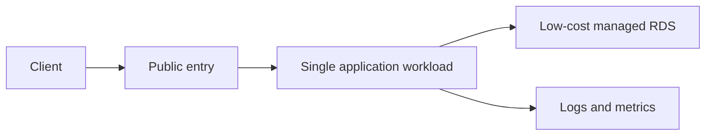

# Infrastructure Design Report: <DESIGN-ID>

> Created at: `<CREATED-AT>`
> Jira: `<JIRA-KEY>`
> GitHub Issue: `#<GITHUB-ISSUE>`
> Status: Design / Plan only — apply disabled

## 1. Context and constraints

- Product stage:
- Expected workload:
- Availability target:
- Recovery target:
- Cost ceiling:
- Region assumption:

실제 서버 주소, 계정 ID, IAM ID, 토큰, `.env` 값은 기록하지 않는다.

## 2. Proposed baseline

- Network:
- Application workload:
- Database:
- Storage:
- Observability:
- Backup:
- Deployment:

## 3. Architecture diagram

## 4. Alternatives

| Decision | Selected | Alternative | Cost | Operations | Risk | Why |
| --- | --- | --- | --- | --- | --- | --- |
| Compute | | EC2 vs ECS | | | | |
| Database | | RDS vs self-hosted | | | | |

## 5. Security and IAM

- GitHub OIDC trust boundary:
- Runtime role:
- Deployment role:
- Least-privilege actions:
- Encryption:
- Network restrictions:
- Audit logging:

## 6. One-month cost estimate

가격은 AWS 공식 가격 페이지 또는 AWS Pricing Calculator를 근거로 한다.

| Resource | Assumption | Formula | Monthly estimate | Official source | Checked at |
| --- | --- | --- | --- | --- | --- |
| Compute | | | | | |
| RDS | | | | | |
| Storage | | | | | |
| Network | | | | | |
| Observability | | | | | |
| **Total** | | | | | |

실제 사용량, 세금, 환율, 프리 티어, 할인 플랜에 따라 청구액이 달라질 수 있다.

## 7. Operational concerns

- Monitoring and alerting:
- Backup/restore drill:
- Capacity:
- Patching:
- Certificate/domain:
- Incident ownership:

## 8. Risks and mitigations

| Risk | Trigger | Impact | Mitigation | Recovery |
| --- | --- | --- | --- | --- |
| | | | | |

## 9. IaC plan

- IaC choice: `Terraform | AWS CDK`
- Module/stack boundaries:
- State storage:
- Locking:
- Plan command:
- Drift detection:

## 10. Apply gate

- [ ] 설계와 IaC가 PR에서 검토됨
- [ ] `@Byuntil` 승인
- [ ] `@tkv00` 승인
- [ ] GitHub `infrastructure-apply` Environment 보호 설정
- [ ] AWS OIDC 단기 권한 사용
- [ ] 사람의 명시적 workflow dispatch 확인
- [ ] 롤백/복구 절차 확인

두 승인과 사람 확인 전에는 apply/deploy하지 않는다.

## 11. Decision

- Recommendation:
- Deferred alternatives:
- Reviewer comments:
